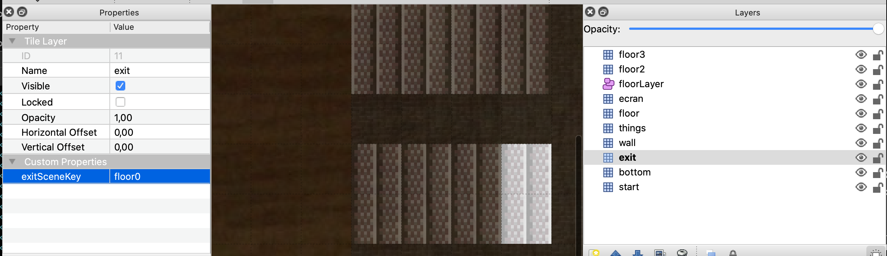

# Work Adventure

## Work in progress

Work Adventure is a web-based collaborative workspace for small to medium teams (2-100 people) presented in the form of a
16-bit video game.

In Work Adventure, you can move around your office and talk to your colleagues (using a video-chat feature that is
triggered when you move next to a colleague).


## Getting started

Install Docker.

Run:

```
docker-compose up
```

The environment will start.

You should now be able to browse to http://workadventure.localhost/ and see the application.

Note: on some OSes, you will need to add this line to your `/etc/hosts` file:

**/etc/hosts**
```
workadventure.localhost 127.0.0.1
```

## Designing a map

If you want to design your own map, you can use [Tiled](https://www.mapeditor.org/).

A few things to notice:

- your map can have as many layers as you want
- your map MUST contain a layer named "floorLayer" of type "objectgroup" that represents the layer on which characters will be drawn.
- the tilesets in your map MUST be embedded. You cannot refer to an external typeset in a TSX file. Click the "embed tileset" button in the tileset tab to embed tileset data.
- your map MUST be exported in JSON format. You need to use a recent version of Tiled to get JSON format export (1.3+)
- WorkAdventure doesn't support object layers and will ignore them
- If you are starting from a blank map, your map MUST be orthogonal and tiles size should be 32x32. 


### Defining a default entry point

In order to define a default start position, you MUST create a layer named "start" on your map.
This layer MUST contain at least one tile. The players will start on the tile of this layer.
If the layer contains many tiles selected, the players will start randomly on one of those tiles.

### Defining exits

In order to place an exit on your scene that leads to another scene:

- You must create a specific layer. When a character reaches ANY tile of that layer, it will exit the scene.
- In layer properties, you MUST add "exitSceneUrl" property. It represents the map URL of the next scene. For example : `/<map folder>/<map>.json`. Be careful, if you want the next map to be correctly loaded, you must check that the map files are in folder `back/src/Assets/Maps/<your map folder>`. The files will be accessible by url `<HOST>/map/files/<your map folder>/...`.
- In layer properties, you CAN add an "exitInstance" property. If set, you will join the map of the specified instance. Otherwise, you will stay on the same instance.
- If you want to have multiple exits, you can create many layers with name "exit". Each layer has a different key `exitSceneUrl` and have tiles that represent exits to another scene.



### Defining several entry points

Often your map will have several exits, and therefore, several entry points. For instance, if there
is an exit by a door that leads to the garden map, when you come back from the garden you expect to
come back by the same door. Therefore, a map can have several entry points.
Those entry points are "named" (they have a name).

In order to create a named entry point:

- You must create a specific layer. When a character enters the map by this entry point, it will enter the map randomly on ANY tile of that layer.
- In layer properties, you MUST add a boolean "startLayer" property. It should be set to true.
- The name of the entry point is the name of the layer
- To enter via this entry point, simply add a hash with the entry point name to the URL ("#[*startLayerName*]"). For instance: "https://workadventu.re/_/global/mymap.com/path/map.json#my-entry-point".
- You can of course use the "#" notation in an exit scene URL (so an exit scene URL will point to a given entry scene URL)


### MacOS developers, your environment with Vagrant

If you are using MacOS, you can increase Docker performance using Vagrant. If you want more explanations, you can read [this medium article](https://medium.com/better-programming/vagrant-to-increase-docker-performance-with-macos-25b354b0c65c).

#### Prerequisites

- VirtualBox*	5.x	Latest version	https://www.virtualbox.org/wiki/Downloads
- Vagrant	2.2.7	Latest version	https://www.vagrantup.com/downloads.html

#### First steps

Create a config file `Vagrantfile` from `Vagrantfile.template`

```bash
cp Vagrantfile.template Vagrantfile
```

In `Vagrantfile`, update `VM_HOST_PATH` with the local project path of your machine.

```
#VM_HOST_PATH# => your local machine path to the project

```

(run `pwd` and copy the path in this variable)

To start your VM Vagrant, run:

```bash
Vagrant up
```

To connect to your VM, run:


```bash
Vagrant ssh
```

To start project environment, run

```bash
docker-compose up
```

You environment runs in you VM Vagrant. When you want stop your VM, you can run:

````bash
Vagrant halt
````

If you want to destroy, you can run

````bash
Vagrant destroy
````

#### Available commands

* `Vagrant up`: start your VM Vagrant.
* `Vagrant reload`: reload your VM Vagrant when you change Vagrantfile.
* `Vagrant ssh`: connect on your VM Vagrant.
* `Vagrant halt`: stop your VM Vagrant.
* `Vagrant destroy`: delete your VM Vagrant.

## Features developed
You have more details of features developed in back [README.md](./back/README.md).
