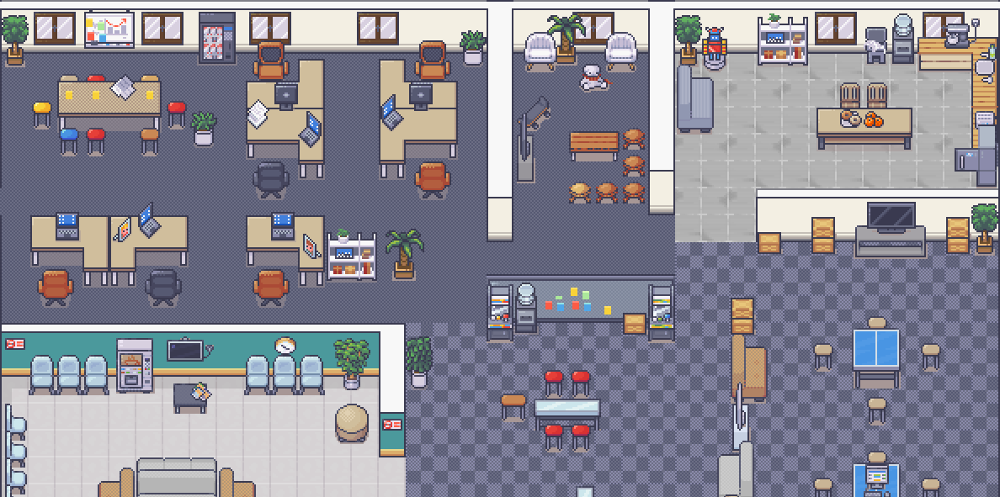

 [](https://discord.gg/G6Xh9ZM9aR)




Live demo [here](https://play.staging.workadventu.re/@/tcm/workadventure/wa-village).

# WorkAdventure

WorkAdventure is a web-based collaborative workspace presented in the form of a
16-bit video game.

In WorkAdventure you can move around your office and talk to your colleagues (using a video-chat system, triggered when you approach someone).

See more features for your virtual office: https://workadventu.re/virtual-office

## Community resources

Check out resources developed by the WorkAdventure community at [awesome-workadventure](https://github.com/workadventure/awesome-workadventure)

## Setting up a production environment

We provide a [reference installation method](https://github.com/thecodingmachine/workadventure/tree/master/contrib/docker): 
a production-ready `docker-compose` file that you can use out-of-the-box in the [contrib/docker](https://github.com/thecodingmachine/workadventure/tree/master/contrib/docker) directory.
The way you set up your production environment will ultimately depend on your servers. Feel free to adapt the `docker-compose` file to your needs.

> **Note**
> WorkAdventure also provides a [hosted version](https://workadventu.re) of the application. Using the hosted version is 
> the easiest way to get started and helps us to keep the project alive.

## Setting up a development environment

> **Note**
> These installation instructions are for local development only. They will not work on
> remote servers as local environments do not have HTTPS certificates.

Install Docker and clone this repository.

> **Warning**
> If you are using Windows, make sure the End-Of-Line character is not modified by the cloning process by setting
> the `core.autocrlf` setting to false: `git config --global core.autocrlf false`

Run:

```
cp .env.template .env
docker-compose up
```

The environment will start.

You should now be able to browse to http://play.workadventure.localhost/ and see the application.
You can view the Traefik dashboard at http://traefik.workadventure.localhost

Note: on some OSes, you will need to add this line to your `/etc/hosts` file:

**/etc/hosts**
```
127.0.0.1 oidc.workadventure.localhost redis.workadventure.localhost play.workadventure.localhost chat.workadventure.localhost traefik.workadventure.localhost xmpp.workadventure.localhost extra.workadventure.localhost icon.workadventure.localhost map-storage.workadventure.localhost uploader.workadventure.localhost maps.workadventure.localhost api.workadventure.localhost front.workadventure.localhost
```

You can also start WorkAdventure + a test OpenID connect server using:

```console
$ docker-compose -f docker-compose.yaml -f docker-compose-oidc.yaml up
```

(Test user is "User1" and his password is "pwd")


### Troubleshooting

See our [troubleshooting guide](docs/dev/troubleshooting.md).
