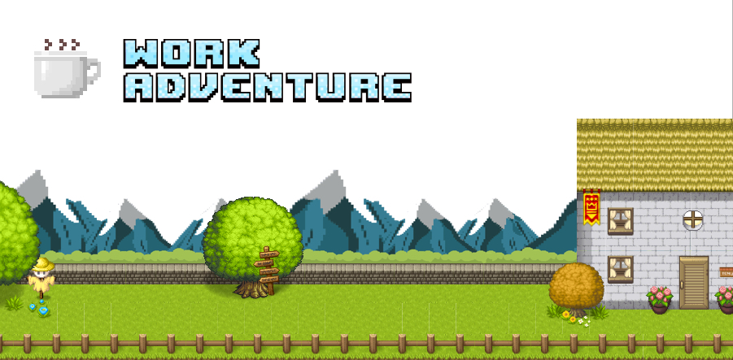

Demo here : [https://workadventu.re/](https://workadventu.re/).

# Work Adventure

Work Adventure is a web-based collaborative workspace for small to medium teams (2-100 people) presented in the form of a
16-bit video game.

In Work Adventure, you can move around your office and talk to your colleagues (using a video-chat feature that is
triggered when you move next to a colleague).


## Setting up a development environment

Install Docker.

Run:

```
docker-compose up
```

The environment will start.

You should now be able to browse to http://workadventure.localhost/ and see the application.

Note: on some OSes, you will need to add this line to your `/etc/hosts` file:

**/etc/hosts**
```
workadventure.localhost 127.0.0.1
```

### MacOS developers, your environment with Vagrant

If you are using MacOS, you can increase Docker performance using Vagrant. If you want more explanations, you can read [this medium article](https://medium.com/better-programming/vagrant-to-increase-docker-performance-with-macos-25b354b0c65c).

#### Prerequisites

- VirtualBox*	5.x	Latest version	https://www.virtualbox.org/wiki/Downloads
- Vagrant	2.2.7	Latest version	https://www.vagrantup.com/downloads.html

#### First steps

Create a config file `Vagrantfile` from `Vagrantfile.template`

```bash
cp Vagrantfile.template Vagrantfile
```

In `Vagrantfile`, update `VM_HOST_PATH` with the local project path of your machine.

```
#VM_HOST_PATH# => your local machine path to the project

```

(run `pwd` and copy the path in this variable)

To start your VM Vagrant, run:

```bash
Vagrant up
```

To connect to your VM, run:


```bash
Vagrant ssh
```

To start project environment, run

```bash
docker-compose up
```

You environment runs in you VM Vagrant. When you want stop your VM, you can run:

````bash
Vagrant halt
````

If you want to destroy, you can run

````bash
Vagrant destroy
````

#### Available commands

* `Vagrant up`: start your VM Vagrant.
* `Vagrant reload`: reload your VM Vagrant when you change Vagrantfile.
* `Vagrant ssh`: connect on your VM Vagrant.
* `Vagrant halt`: stop your VM Vagrant.
* `Vagrant destroy`: delete your VM Vagrant.

## Setting up a production environment

The way you set up your production environment will highly depend on your servers.
We provide a production ready `docker-compose` file that you can use as a good starting point in the [contrib/docker](https://github.com/thecodingmachine/workadventure/tree/master/contrib/docker) directory.
