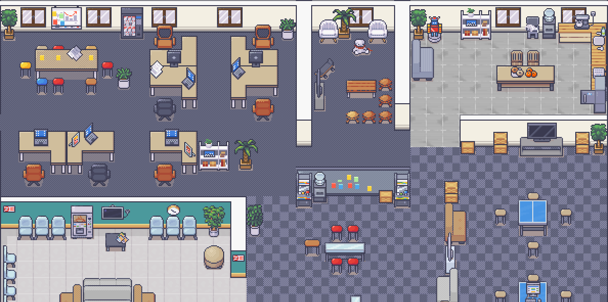

 [](https://discord.gg/G6Xh9ZM9aR) 



# WorkAdventure


WorkAdventure is a platform that allows you to design **fully customizable collaborative virtual worlds** (metaverse). 

With your own avatar, you can **interact spontaneously** with your colleagues, clients, partners (using a **video-chat system**, triggered when you approach someone).
Imagine **all types of immersive experiences** (recruitments, onboarding, trainings, digital workplace, internal/external events) on desktop, mobile or tablet.

_The little plus? The platform is **GDPR** and **open source**!_

**See more features for your [virtual office](https://workadventu.re/virtual-offices/virtual-meetings/?utm_source=github)!**

**Pricing for our [SaaS version](https://workadventu.re/pricing/?utm_source=github)!**


[](https://play.staging.workadventu.re/@/tcm/workadventure/wa-village/?utm_source=github)
[](https://workadventu.re/?utm_source=github)


###### Support our team!
[](https://discord.com/invite/G6Xh9ZM9aR)
[](https://twitter.com/Workadventure_)
[](https://www.linkedin.com/company/workadventu-re/)


## Contributors

Thanks to everyone who contributes to WorkAdventure!

<!-- contributors:start -->
<a href="https://github.com/moufmouf"></a> <a href="https://github.com/gparant"></a> <a href="https://github.com/Waclaw-I"></a> <a href="https://github.com/Kharhamel"></a> <a href="https://github.com/nolway"></a> <a href="https://github.com/matthintosh"></a> <a href="https://github.com/Maison-hub"></a> <a href="https://github.com/alexarts74"></a> <a href="https://github.com/angerenage"></a> <a href="https://github.com/cesar-cardinale"></a>
<a href="https://github.com/HugoAverty"></a> <a href="https://github.com/lukashass"></a> <a href="https://github.com/jadekeina"></a> <a href="https://github.com/Lurkars"></a> <a href="https://github.com/apps/dependabot"></a> <a href="https://github.com/HimeShaman"></a> <a href="https://github.com/npeguin"></a> <a href="https://github.com/Powopaf"></a> <a href="https://github.com/pizkaz"></a> <a href="https://github.com/jonnytest1"></a>
<a href="https://github.com/tabascoeye"></a> <a href="https://github.com/anbraten"></a> <a href="https://github.com/ValdoTR"></a> <a href="https://github.com/apps/copilot-swe-agent"></a> <a href="https://github.com/taksan"></a> <a href="https://github.com/EvaVillarroya"></a> <a href="https://github.com/albanbruder"></a> <a href="https://github.com/klauserber"></a> <a href="https://github.com/Arata1202"></a> <a href="https://github.com/Informatic"></a>
<a href="https://github.com/Lithimlin"></a> <a href="https://github.com/mktn87"></a> <a href="https://github.com/MaximilianoVeiga"></a> <a href="https://github.com/nguyenk"></a> <a href="https://github.com/bestian"></a> <a href="https://github.com/RaimeXLP"></a> <a href="https://github.com/fcecagno"></a> <a href="https://github.com/ercanucan"></a> <a href="https://github.com/psy"></a> <a href="https://github.com/mvanhorn"></a>
<a href="https://github.com/ZacharyJia"></a> <a href="https://github.com/fvztdk"></a> <a href="https://github.com/ThomasPerez91"></a> <a href="https://github.com/MisterErwin"></a> <a href="https://github.com/klinshy"></a> <a href="https://github.com/joberthel"></a> <a href="https://github.com/fetsorn"></a> <a href="https://github.com/LindezaGrey"></a> <a href="https://github.com/Eyramds"></a> <a href="https://github.com/wpramio"></a>
<a href="https://github.com/Palid"></a> <a href="https://github.com/beingeek"></a> <a href="https://github.com/mo8it"></a> <a href="https://github.com/Harikesh04"></a> <a href="https://github.com/cbluoss"></a> <a href="https://github.com/Moini"></a> <a href="https://github.com/restray"></a> <a href="https://github.com/oliverlorenz"></a> <a href="https://github.com/ozraru"></a> <a href="https://github.com/x0rp01s0n"></a>
<a href="https://github.com/lbehm"></a> <a href="https://github.com/malteriechmann"></a> <a href="https://github.com/Wikinaut"></a> <a href="https://github.com/kaeff"></a> <a href="https://github.com/piitaya"></a> <a href="https://github.com/lryjnks"></a> <a href="https://github.com/niklasarnitz"></a> <a href="https://github.com/DexAsHisH"></a> <a href="https://github.com/guysoft"></a> <a href="https://github.com/matzegebbe"></a>
<a href="https://github.com/tbnobody"></a> <a href="https://github.com/felixilgatto"></a> <a href="https://github.com/izeau"></a> <a href="https://github.com/spiccinini"></a> <a href="https://github.com/bufferoverflow"></a> <a href="https://github.com/campey"></a> <a href="https://github.com/dsavina"></a> <a href="https://github.com/emmanuel-ferdman"></a> <a href="https://github.com/Floupp"></a> <a href="https://github.com/gscariott"></a>
<a href="https://github.com/JH220"></a> <a href="https://github.com/kidager"></a> <a href="https://github.com/lotfiidir"></a> <a href="https://github.com/mpauly-exnaton"></a> <a href="https://github.com/rlespinasse"></a> <a href="https://github.com/s00500"></a> <a href="https://github.com/sharkwouter"></a> <a href="https://github.com/swiesend"></a> <a href="https://github.com/ttefke"></a> <a href="https://github.com/Amirault"></a>
<a href="https://github.com/BAWES"></a> <a href="https://github.com/davidprzzz"></a> <a href="https://github.com/dmaechler"></a> <a href="https://github.com/kaelsky"></a> <a href="https://github.com/Mewp"></a> <a href="https://github.com/shug0"></a> <a href="https://github.com/souzaramon"></a> <a href="https://github.com/Zilliq11"></a> <a href="https://github.com/apps/github-actions"></a> <a href="https://github.com/heyjuvi"></a>
<!-- contributors:end -->
<!-- contributors:hidden:start
default-avatar-cache: hidden from the rendered wall because these users still use GitHub's default avatar
abestanis
chasethechicken
clementderre
clementvieilly
clementvieilly75
datalog-mindhack
evrardjp
felixdoerre
greenyolong
grl78
jozzzzzz
mlima95
mstock
nekkah-rabah
nonopotter
qlouis1
stweil
t10r
tcm-ran
wesetaca
ydiarra
znerol
zobadaniel
contributors:hidden:end -->

## Community resources

1. Want to build your own map, check out our **[map building documentation](https://docs.workadventu.re/map-building/)**
2. Check out resources developed by the WorkAdventure community at **[awesome-workadventure](https://github.com/workadventure/awesome-workadventure)**

## Setting up a production environment

We support 2 ways to set up a production environment:

- using Docker Compose
- or using a Helm chart for Kubernetes

Please check the [Setting up a production environment](docs/others/self-hosting/install.md) guide for more information.

> [!NOTE]
> WorkAdventure also provides a [hosted version](https://workadventu.re/?utm_source=github) of the application. Using the hosted version is
> the easiest way to get started and helps us to keep the project alive.

## Setting up a development environment

> [!NOTE]
> These installation instructions are for local development only. They will not work on
> remote servers as local environments do not have HTTPS certificates.

Install Docker and clone this repository.

> [!WARNING]
> If you are using Windows, make sure the End-Of-Line character is not modified by the cloning process by setting
> the `core.autocrlf` setting to false: `git config --global core.autocrlf false`

Run:

```
cp .env.template .env
docker-compose up
```

The environment will start with the OIDC mock server enabled by default.

You should now be able to browse to http://play.workadventure.localhost/ and see the application.
You can view the Traefik dashboard at http://traefik.workadventure.localhost

(Test user is "User1" and password is "pwd")

If you want to disable the OIDC mock server (for anonymous access), you can run:

```console
$ docker-compose -f docker-compose.yaml -f docker-compose-no-oidc.yaml up
```

Note: on some OSes, you will need to add this line to your `/etc/hosts` file:

**/etc/hosts**
```
127.0.0.1 oidc.workadventure.localhost redis.workadventure.localhost play.workadventure.localhost traefik.workadventure.localhost matrix.workadventure.localhost extra.workadventure.localhost icon.workadventure.localhost map-storage.workadventure.localhost uploader.workadventure.localhost maps.workadventure.localhost api.workadventure.localhost front.workadventure.localhost
```


### Troubleshooting

See our [troubleshooting guide](docs/others/troubleshooting.md). 
