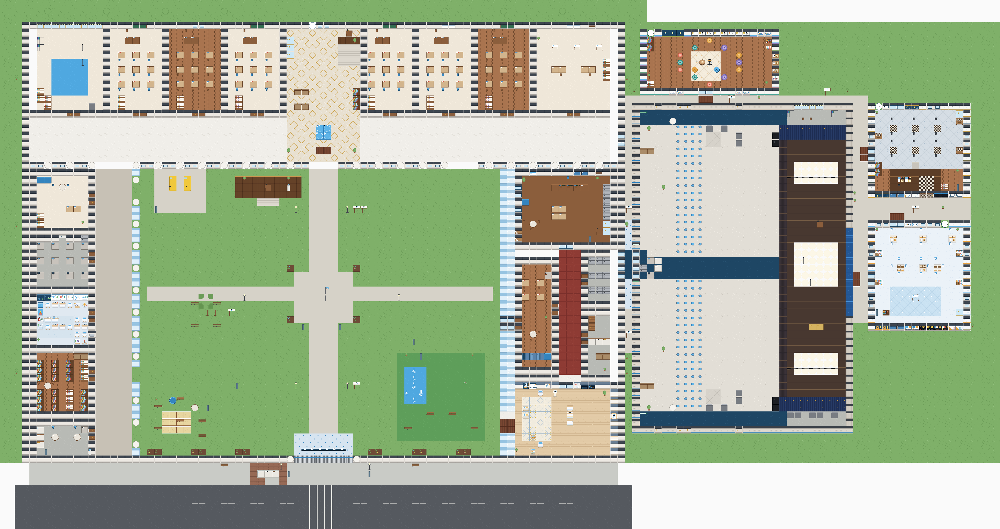

# 🎓 NG Academy — أكاديمية NG

**مدرسة افتراضية عربية كاملة، مبنية على [WorkAdventure](https://github.com/thecodingmachine/workadventure).**
خريطة مدرسة واحدة بعقودها وفصولها وقاعاتها — والشخصيات فيها **تعيش**: تتنفس، تلتفت، تجلس،
تستمع… ودور كل طالب/معلم يتحدد **من مكانه** لا من أي سكربت.



> هذا المستودع هو fork من [WorkAdventure](https://github.com/thecodingmachine/workadventure)
> (الترخيص: AGPL-3.0) مع إضافة كاملة: خريطة المدرسة + نظام حياة الشخصيات + التشغيل بدون Docker.
> كل الشكر لفريق WorkAdventure الأصلي.

---

## 🗺️ خريطة المدرسة (`maps/school/`)

خريطة 136×72 بلاطة (32px) بواجهة U حول فناء مركزي:

| المنطقة | المحتوى |
|---|---|
| 🧑‍🏫 **6 فصول دراسية** | سبورة + مقاعد معلَّمة (جلوس حقيقي) + طاولة المعلم |
| 🔬 **فصل العلوم** | مختبر المبدعين الصغار: سبورة تفاعلية، 3 طاولات عمل، ركن استكشاف |
| 🧠 **الحساب الذهني** | جناح العقول: لوحة قابلة للتغيير، 12 مقعدًا |
| ♟️ **فصل الشطرنج** | طاولات شطرنج حقيقية + منصّة تدريب منفصلة |
| 🖥️ **غرفة الحاسوب** · 📚 **المكتبة** · 🍔 **المقصف** · 🎨 **الفنون** · 🎤 **قاعة العروض** | أنشطة |
| ⭐ **قاعة النجوم** | قاعة الاحتفالات والعروض |
| 🛎️ **الاستقبال** · 🏢 **الجناح الإداري** | الواجهة والمكاتب |

**أدوات الخريطة:** `tools/build_map.py` يبني `map.json` + معاينة `preview.png`
(يتطلب `python3` + `Pillow`). التصميم الكامل موثّق في **`DESIGN.md`** (20 فصلًا).

---

## 🧍 نظام حياة الشخصيات (`play/src/front/Phaser/Player/Life/`)

الشخصيات ليست دمى ولا روبوتات مبرمجة — سلوكيات خفيفة **حدّية بالاسم** (كل العملاء يرون
نفس «الشخصية الحية» لكل لاعب، بلا مزامنة خادم):

**المرحلة 1 — السلوكيات الأساسية**
- 🫁 تنفّس: تمايل 1px أثناء السكون (دورة 0.9–1.7s)
- 👀 نظر حول: التفت يسار/يمين كل 10–26s
- 🚶‍♂️ استقرار التوقف: المشي→السكون بلا قطع مفاجئ (إطار آخر + 150ms استرخاء)
- 🗣️ انتباه للمتحدث: من يقرب من متحدث (≤96px) يستدير نحوه فورًا
- 💺 **جلوس حقيقي**: 15 مقعدًا معلَّمًا بخاصية `sit` في الخريطة — الوقوف 350ms فوق
  المقعد = الجلوس بوضعية تتكيف مع نوعه (كرسي/مقعد/أريكة/مكتب)، والوقوف سلس.
  **أي مقعد جديد = سطر واحد في `build_map.py`.**

**المرحلة 2 — الدور بالموقع (لا NPC إطلاقًا)**
- أي **مستخدم حقيقي** يقف في **منطقة تدريس** (`zones_teacher`: أمام السبورات، منصّة
  التدريب، مقدمة العلوم…) يصبح **معلّم الغرفة**: يمسح الصف بإلتفاتات طبيعية كل 6–14s
  (55% باتجاه طلابه).
- أي **طالب** في **منطقة الفصل** (`zones_class`) يستدير ل**أقرب معلّم** (≤14 بلاطة)
  ويبقي نظره 4–7.5s.
- مغادر المنطقة يعود طالبًا فورًا — بلا خادم، بلا جدولة، بلا بوتات.
- الأولويات: الجلوس > المشي > المتحدث > الدور > النظر العادي.
- **قابلية التوسع:** كل الأزمنة في `LifeConfig.ts` (`ZONE_LIFE`) — غرفة جديدة = بلاطات
  خريطة فقط، وسلوك جديد = مدخل + طريقة.

---

## 🚀 التشغيل بدون Docker

```bash
npm install          # مرة واحدة (monorepo)
node no-docker/start.mjs --map=school
# للتشغيل عبر نفق عام (معاينة خارجية):
node no-docker/start.mjs --tunnel --map=school
```

الـ script يولّد كود protobuf + i18n تلقائيًا ثم يشغّل كل الخدمات خلف
`no-docker/gateway.mjs` (يستبدل Traefik). التفاصيل الكاملة في **`no-docker/README.md`**.

المرجع الأساسي: `http://play.workadventure.localhost` (أو منفذ البوابة).

---

## 📁 أهم المسارات

| المسار | المحتوى |
|---|---|
| `maps/school/` | الخريطة + الأدوات + معاينات |
| `maps/school/tools/build_map.py` | بنّاء الخريطة (طبقات الفصول/المنغ/المقاعد/مناطق الدور) |
| `maps/school/DESIGN.md` | وثيقة التصميم الكاملة (20 فصلًا) |
| `play/src/front/Phaser/Player/Life/` | نظام الحياة: `LifeConfig` · `CharacterLife` · `LifeRegistry` · `SitManager` |
| `play/src/front/Phaser/Entity/Character.ts` | هوكات الحياة (خفيفة) |
| `no-docker/` | التشغيل الكامل بدون Docker |

---

## ⚖️ الترخيص

- الشفرة الأصلية: [WorkAdventure](https://github.com/thecodingmachine/workadventure) — AGPL-3.0
- إضافات NG Academy (الخريطة، نظام الحياة، أدوات no-docker): جزء من نفس المستودع
  تحت نفس الترخيص.
