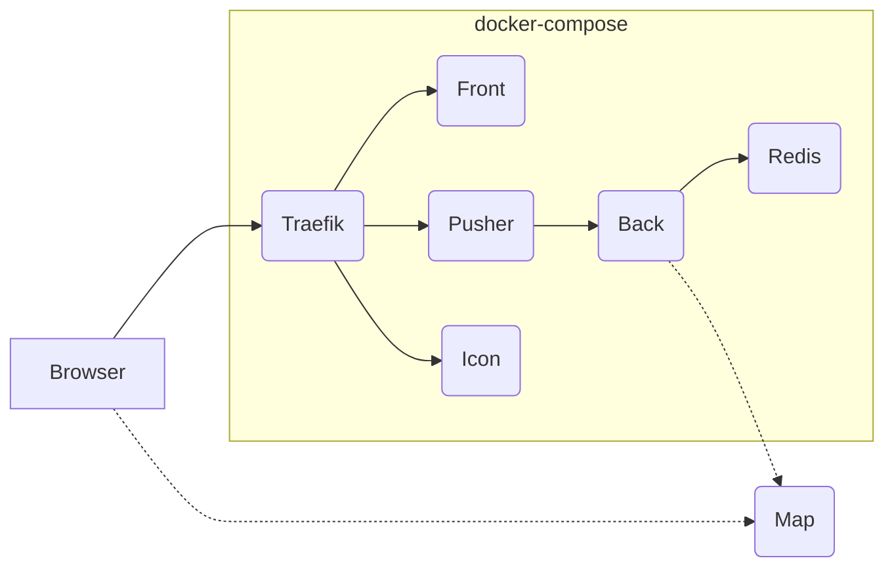

# Deploying WorkAdventure in production

This directory contains a sample production deployment of WorkAdventure using docker-compose.

Every production environment is different and this docker-compose file will not
fit all use cases. But it is intended to be a good starting point for you 
to build your own deployment.

In this docker-compose file, you will find:

- A reverse-proxy (Traefik) that dispatches requests to the WorkAdventure containers and handles HTTPS certificates using LetsEncrypt
- A front container (nginx) that servers static files (HTML/JS/CSS)
- A pusher container (NodeJS) that is the point of entry for users (you can start many if you want to increase performance)
- A back container (NodeJS) that shares your rooms information
- An icon container to fetch the favicon of sites imported in iframes
- A Redis server to store values from variables originating from the Scripting API

**Important**: the default docker-compose file does **not** contain a container dedicated to hosting maps. The documentation and
tutorials are relying on GitHub Pages to host the maps. If you want to self-host your maps, you will need to add a simple 
HTTP server (nginx / Apache, ...) and properly configure the [CORS settings as explained in the documentation](../../docs/maps/hosting.md).
