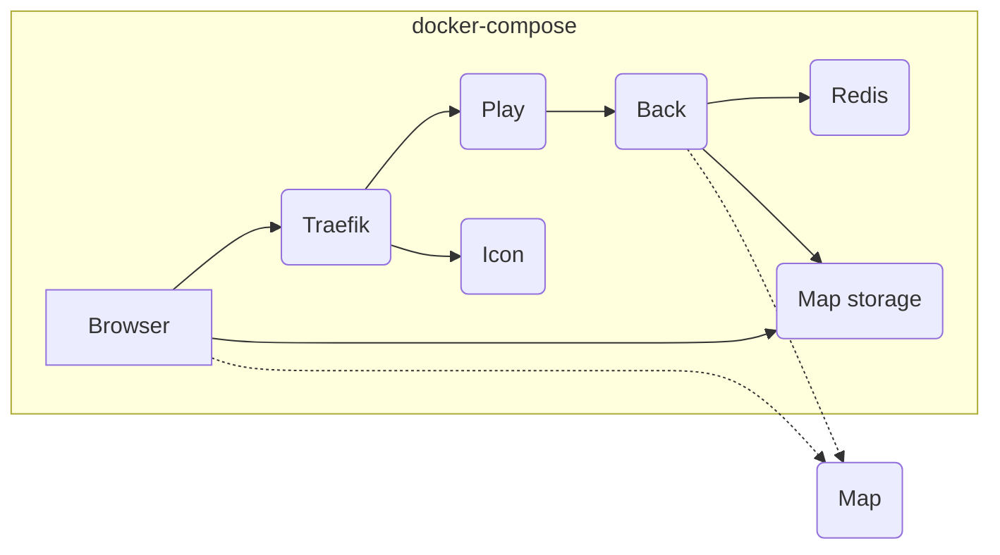

# Self-hosting WorkAdventure using Docker Compose

> [!WARNING]
> If you haven't already, please check the [Setting up a self-hosted production environment](../../docs/others/self-hosting/install.md) guide
> before getting started.

## Hardware requirements

In order to perform the install, you will need a server, with a domain name pointing to the server.

A relatively small server (2 CPUs, 4GB RAM) will allow you to host meetings with up to 300 concurrent users.

The WorkAdventure server itself does not need many resources. However, the Coturn and Jitsi servers will need to be
much more powerful, as they are handling the video streams. See the Jitsi and Coturn documentation for correctly
sizing those servers.

> [!WARNING]  
> WorkAdventure uses WebRTC for audio/video connections. WebRTC in turns, require an HTTPS connection with a valid
> certificate. As a result, you need a domain name pointing on your server. You cannot access WorkAdventure directly
> by the server IP address, as the HTTPS certificate can only be issued for a domain name.

## The default install structure

The default docker-compose file is available here: [`docker-compose.prod.yaml`](docker-compose.prod.yaml).

In this docker-compose file, you will find:

- A reverse-proxy (Traefik) that dispatches requests to the WorkAdventure containers and handles HTTPS termination. HTTPS certificates will be automatically generated using LetsEncrypt.
- A play container (NodeJS) that serves static files for the "game" (HTML/JS/CSS) and is the point of entry for users (you can start many if you want to increase performance)
- A back container (NodeJS) that shares your rooms information
- A map-storage container (NodeJS) that serves your maps and provides map-editing features
- An icon container to fetch the favicon of sites imported in iframes
- A Redis server to store values from variables originating from the Scripting API



> **Note**
> You can host your maps on the WorkAdventure server itself (using the dedicated map-storage container), or outside
> of the WorkAdventure server, on any [properly configured HTTP server](../../docs/maps/hosting.md) (Nginx, Apache...). 
> The default docker-compose file does **not** contain a container dedicated to hosting maps. The documentation and

## Getting started

> **Note**
> These installation instructions are for production only. If you are looking to install WorkAdventure
> on you local development machine, head over to the [main README](../../README.md).

### 1. Install Docker

On your server, install the latest Docker version, along docker-compose.

### 2. Copy deployment files 

Copy the [`.env.prod.template`](.env.prod.template) file on your server, and rename it to `.env`.
Copy the [`docker-compose.prod.yaml`](docker-compose.prod.yaml) file on your server, and rename it to `docker-compose.yaml`.

### 3. Configure your environment

Edit the `.env` file.

For your environment to start, you will need to at least configure:

- **VERSION**: the version of WorkAdventure to install. See below for more information.
- **SECRET_KEY**: a random key used to generate JWT secrets
- **DOMAIN**: your domain name (without any "https://" prefix)
- **MAP_STORAGE_AUTHENTICATION_USER**: the username for the map-storage container 
- **MAP_STORAGE_AUTHENTICATION_PASSWORD**: the password for the map-storage container

Fill free to look the other environment variables and modify them according to your preferences.

**Selecting the right version:**

By default, the `VERSION` in the `.env` file is set to "master". It means we are targeting the most recent stable version.

It is important **to change this**.

Indeed, the "master" tag is evolving over time and at some point, new environment variables might be required, or new
containers might be needed. If you keep the VERSION pinned to "master", at some point, your `docker-compose.yaml` file
will be out of sync with the images.

In order to avoid this issue, use a valid tag for the `VERSION`.

The list of tags is available in the [releases page](https://github.com/thecodingmachine/workadventure/releases/).

> **Warning**
> The VERSION used in the `.env` file must match the `docker-compose.prod.yaml` used.
> So if you downloaded the `docker-compose.prod.yaml` from the "v1.15.3" release, then please use `VERSION=v1.15.3`
> in the `.env` file.

### 4. Starting the environment

In the directory containing your `docker-compose.yaml` file and your `.env` file, simply use:

```console
docker-compose up -d
```

You can check the logs with:

```console
docker-compose logs -f
```

### 5. Uploading your first map

Before starting using WorkAdventure, you will need to upload your first map.

#### Uploading from the map starter kit

Design your own map using the [map starter kit](https://github.com/workadventure/map-starter-kit).
When you are happy with the result, [follow the steps in the "upload your map documentation"](https://docs.workadventu.re/map-building/tiled-editor/publish/wa-hosted)

#### Checking everything worked

Open your browser and go to `https://<your-domain>/map-storage/`.

You will be asked to authenticate. Use the credentials you configured in the `.env` file.

> **Note**
> Right now, authentication is limited to a single user credential in the map-storage container, 
> hard coded in the `.env` file. This is not ideal, but works for now (the map-storage container
> is quite new). Contributions are welcome if you want to improve this.

You should see a link to the map you just uploaded.

Are you connected? Congratulations! Share the URL with your friends and start using WorkAdventure!

Not working? Jump to the [troubleshooting section](#troubleshooting).

### Post-installation steps

You can now customize your WorkAdventure instance by modifying the `.env` file.

Please be sure to configure Jitsi, as it is the default video conferencing solution for large room,
and Turn settings to ensure video is correctly relayed, even if your clients are in a restricted network.

Keeping your server secure is also important. You can configure the `SECURITY_EMAIL` environment variable
to receive security notifications from the WorkAdventure core team.
You will be notified if your WorkAdventure version contains a known security flaw.

#### Adding authentication

WorkAdventure does not provide its own authentication system. Instead, you can connect WorkAdventure to an OpenID Connect
authentication provider (like Google, GitHub, or any other provider).

If you want to connect WorkAdventure to an authentication provider, you can follow the [OpenID Connect documentation](../../docs/others/self-hosting/openid.md).

When OpenID is configured, you should set up a list of restricted users [allowed to access the inline map editor](../../docs/map-building/inline-editor/index.md).

> [!NOTE]
> We highly recommend configuring OpenID Connect. Authenticating users is mandatory to gain access to the inline map editor.
> The inline map-editor will help you customize your maps really easily. You don't want to miss this feature.

#### Connecting to a chat server

WorkAdventure can connect to a [Matrix server](https://matrix.org/) to provide chat features.
Matrix is a decentralized chat protocol that allows you to host your own chat server.

With Matrix integration configured, you can chat with other users, even when they are not connected to WorkAdventure.
For instance, a user can chat with you from a Matrix client like Element on his mobile phone, while you are in WorkAdventure.

You can follow the [Matrix documentation](../../docs/others/self-hosting/matrix.md) to learn how to configure your Matrix server
and connect it to WorkAdventure.

## Upgrading WorkAdventure

The upgrade path will depend on the installation of WorkAdventure you are using.

#### If you are using the `docker-compose.prod.yaml` file without any changes:

- Download the `docker-compose.prod.yaml` for the version you want to upgrade to and replace it on your server
- Now, edit the `.env` file and change the `VERSION` to the matching version.
- Read the upgrade notes for the version you are upgrading to (see the [releases page](https://github.com/thecodingmachine/workadventure/releases/)), 
  and apply any changes if needed (this might often be an additional variable to add to the `.env` file)

Then, simply run:

```console
docker-compose up -d --force-recreate
```

#### If you are using a custom deployment method:

The upgrade path will of course depend on your deployment method. Here are some tips to make it easy:

- Download the `docker-compose.prod.yaml` for the version you want to upgrade to.
- Download the `docker-compose.prod.yaml` for your current version.
- Compare the two files. The differences will be the changes you need to apply to your deployment method.

## Troubleshooting

In case of troubles, check if all your containers are started with:

```console
docker-compose ps
```

All containers should be running. If one is not, check the logs of the container with:

```console
docker-compose logs [container-name]
```

You can also with the logs of all containers with:

```console
docker-compose logs -f
```
