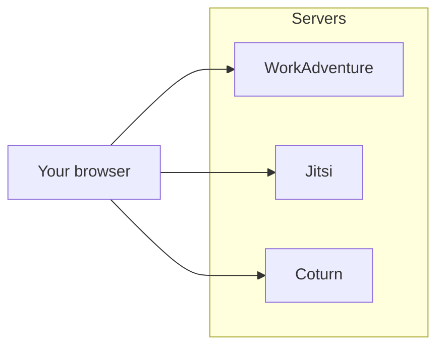
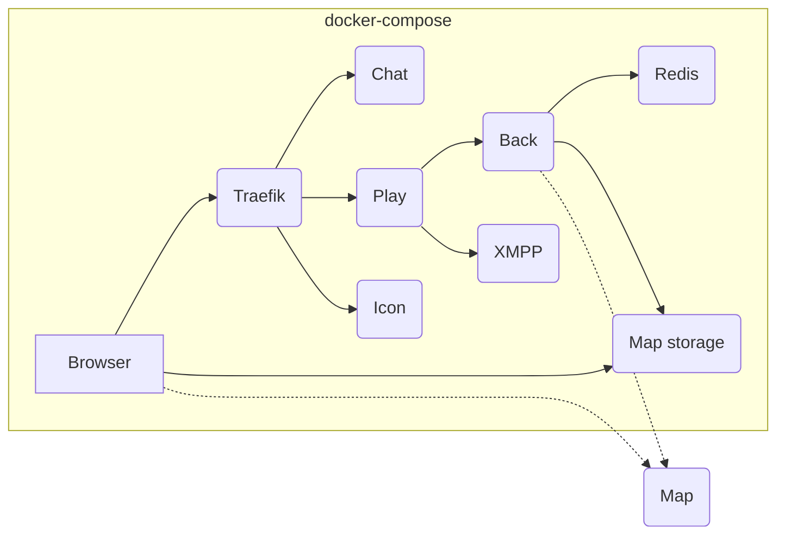

# Self-hosting WorkAdventure

## Do you need self-hosting?

WorkAdventure is a powerful and versatile platform that enables users to create immersive and interactive virtual 
environments for remote collaboration, events, and games. As an open project, WorkAdventure offers users the flexibility 
and freedom to host the platform on their own servers. However, self-hosting WorkAdventure requires technical expertise, 
infrastructure, and maintenance, which may not be feasible or practical for all users.

In order to self-host WorkAdventure, you will need:

- at least one server for WorkAdventure, with a public facing IP and a DNS name
- in addition, WorkAdventure requires to have 2 additional services: Jitsi and Coturn. In a typical setup, those services will be hosted on 2 additional servers (both with a public facing IP address and a DNS name)
- a strong technical expertise regarding Docker and containers
- a good understanding of networking concepts
- ... and time (!), to keep up with the updates (about once a month)

Depending on your use-case, you might want to check the SAAS (i.e. hosted) version of WorkAdventure.
It provides:

- **Fast and easy setup**: with just a few clicks, you can sign up, create your first virtual space, invite your team or friends, and start exploring and collaborating in real-time
- **Automatic upgrades**: you don't have to worry about upgrading the platform yourself. WorkAdventure is a fast-evolving 
  technology, with frequent updates, bug fixes, and new features. The SAAS version takes care of all the upgrades and ensures that you always have access to the latest and greatest version of the platform.
- **An advanced dashboard**: you can manage your virtual spaces, users, and get fine-grained access rights from the dashboard. 
  You can also create and manage your own custom domains and logos.
- **Lower costs and resources**: While self-hosting WorkAdventure may seem like a cost-effective option at first glance, 
  it can quickly become expensive and resource-intensive in the long run. Self-hosting requires not only server hardware 
  but also bandwidth, storage, and maintenance costs. Moreover, self-hosting requires technical expertise, time, and 
  effort to set up, configure, and troubleshoot the infrastructure. The SAAS version of WorkAdventure, on the other hand,
  offers a pay-as-you-go pricing model that scales with your usage and needs. You only pay for what you use (no need for those costly video servers),
  and you don't have to worry about upfront investments, hidden fees, or unpredictable costs. And most importantly,
  you contribute to making WorkAdventure a sustainable product 👍

Also, the WorkAdventure SAAS version provides a generous free-plan. Head over at https://workadventu.re to start right away.

Still interested in self-hosting? All right! Read below.

## A high level view of a WorkAdventure environment

In order to host WorkAdventure you will need to host:

- **WorkAdventure** itself
- **Coturn**: this is a service that proxies the WebRTC video signal in case a user is on a network that does not allow
  peer-to-peer connections. Coturn is optional, but without Coturn, approximately 15% of the users will fail to establish 
  a audio/video connection.
- **Jitsi**: in large meeting rooms, Jitsi is used to broadcast video streams to all users.



> [!WARNING]  
> In the rest of this document, we will describe how to install the WorkAdventure server. We will leave Jitsi
> and Coturn installs out of scope.

Jitsi install guide: https://jitsi.github.io/handbook/docs/devops-guide/  
Coturn install guide: https://meetrix.io/blog/webrtc/coturn/installation.html

## Installation method for the WorkAdventure server

WorkAdventure is a set of different programs. There are countless ways of hosting WorkAdventure. In the past, we have
seen people using Ansible, NixOS or Kubernetes to host WorkAdventure. You can host each component on a different
domain name or run a "single-domain" install. The core maintainers of this project cannot possibly support all possible 
installation methods.

So we are maintaining ONE installation method:

- **WorkAdventure works as a set of Docker containers.**
- **We provide Docker images for each container in the Docker hub registry, and a docker-compose file to easily start the containers.**
- **The proposed install runs on a single domain (you will still need 2 additional domain names for Jitsi and Coturn).**
- **We assume you have one physical server with root access and Docker installed. The server has a public IP address.**

The installation below is well tested on each release and is known to work.

Of course, every production environment is different and this docker-compose file will not
fit all use cases. The file is yours. Fill free to modify it. Fill free to use it as a starting point to host the 
solution on Kubernetes if you want.

If you have specific needs for a custom deployment, the WorkAdventure company can offer paid support. Don't hesitate to
contact us at hello@workadventu.re. We also provide support to integrate WorkAdventure in your existing application.

### Alternative installation methods

Below is a list of alternative installation methods contributed by the community. Please note that the core team does not 
provide support for those methods.

- Helm chart by @klauserber: https://github.com/klauserber/workadventure-k8s.

For any question related to non-standard deployments, you can ask the community on the "self-hosting" Discord
channel: [](https://discord.gg/G6Xh9ZM9aR)

## Hardware requirements

In order to perform the install, you will need a server, with a domain name pointing to the server.

A relatively small server (2 CPUs, 4GB RAM) will allow you to host meetings with up to 300 concurrent users.

The WorkAdventure server itself does not need many resources. However, the Coturn and Jitsi servers will need to be
much more powerful, as they are handling the video streams. See the Jitsi and Coturn documentation for correctly
sizing those servers.

> [!WARNING]  
> WorkAdventure uses WebRTC for audio/video connections. WebRTC in turns, require an HTTPS connection with a valid
> certificate. As a result, you need a domain name pointing on your server. You cannot access WorkAdventure directly
> by the server IP address, as the HTTPS certificate can only be issued for a domain name.

## The default install structure

The default docker-compose file is available here: [`docker-compose.prod.yaml`](docker-compose.prod.yaml).

In this docker-compose file, you will find:

- A reverse-proxy (Traefik) that dispatches requests to the WorkAdventure containers and handles HTTPS termination. HTTPS certificates will be automatically generated using LetsEncrypt.
- A play container (NodeJS) that serves static files for the "game" (HTML/JS/CSS) and is the point of entry for users (you can start many if you want to increase performance)
- A chat container (nginx) that serves static files for the chat bar (HTML/JS/CSS)
- A back container (NodeJS) that shares your rooms information
- A map-storage container (NodeJS) that serves your maps and provides map-editing features
- An icon container to fetch the favicon of sites imported in iframes
- A Redis server to store values from variables originating from the Scripting API
- A XMPP container that runs an Ejabberd server in charge of the chat / user list



> **Note**
> You can host your maps on the WorkAdventure server itself (using the dedicated map-storage container), or outside
> of the WorkAdventure server, on any [properly configured HTTP server](../../docs/maps/hosting.md) (Nginx, Apache...). 
> The default docker-compose file does **not** contain a container dedicated to hosting maps. The documentation and

> **Note**
> The Ejabberd server is used to list all the users connected to your environment and also
> to transmit chat messages. The Ejabberd server proposed in this install comes almost
> unconfigured. There is a basic system set up to authenticate users using JWT. Because
> authentications are using JWT, nothing will be saved.
> If you want to persist messages and use "real accounts", you will need to implement the
> "admin API" (it is the role of the Admin API to give valid credentials to Ejabberd),
> and you will need to modify the Ejabberd configuration to persist messages the way you want
> (using Mnesia or any other supported database)


## Getting started

> **Note**
> These installation instructions are for production only. If you are looking to install WorkAdventure
> on you local development machine, head over to the [main README](../../README.md).

### 1. Install Docker

On your server, install the latest Docker version, along docker-compose.

### 2. Copy deployment files 

Copy the [`.env.prod.template`](.env.prod.template) file on your server, and rename it to `.env`.
Copy the [`docker-compose.prod.yaml`](docker-compose.prod.yaml) file on your server, and rename it to `docker-compose.yaml`.

### 3. Configure your environment

Edit the `.env` file.

For your environment to start, you will need to at least configure:

- **VERSION**: the version of WorkAdventure to install. See below for more information.
- **SECRET_KEY**: a random key used to generate JWT secrets
- **DOMAIN**: your domain name (without any "https://" prefix)
- **MAP_STORAGE_AUTHENTICATION_USER**: the username for the map-storage container 
- **MAP_STORAGE_AUTHENTICATION_PASSWORD**: the password for the map-storage container

Fill free to look the other environment variables and modify them according to your preferences.

**Selecting the right version:**

By default, the `VERSION` in the `.env` file is set to "master". It means we are targeting the most recent stable version.

It is important **to change this**.

Indeed, the "master" tag is evolving over time and at some point, new environment variables might be required, or new
containers might be needed. If you keep the VERSION pinned to "master", at some point, your `docker-compose.yaml` file
will be out of sync with the images.

In order to avoid this issue, use a valid tag for the `VERSION`.

The list of tags is available in the [releases page](https://github.com/thecodingmachine/workadventure/releases/).

> **Warning**
> The VERSION used in the `.env` file must match the `docker-compose.prod.yaml` used.
> So if you downloaded the `docker-compose.prod.yaml` from the "v1.15.3" release, then please use `VERSION=v1.15.3`
> in the `.env` file.

### 4. Starting the environment

In the directory containing your `docker-compose.yaml` file and your `.env` file, simply use:

```console
docker-compose up -d
```

You can check the logs with:

```console
docker-compose logs -f
```

### 5. Uploading your first map

Before starting using WorkAdventure, you will need to upload your first map.

Open your browser and go to `https://<your-domain>/map-storage/`.

You will be asked to authenticate. Use the credentials you configured in the `.env` file.

> **Note**
> Right now, authentication is limited to a single user credential in the map-storage container, 
> hard coded in the `.env` file. This is not ideal, but works for now (the map-storage container
> is quite new). Contributions are welcome if you want to improve this.

From the map-storage interface, you can upload your first map.

It should be a ZIP file, containing maps stored with the `.tmj` extension.

### 6. Testing

Now, you need to find out the URL of the map you just uploaded.

Assuming your ZIP file contains a map named `somedir/my-map.tmj`, you can connect to the map by going to:

`https://<your-domain>/~/somedir/my-map.tmj`

Are you connected? Congratulations! Share the URL with your friends and start using WorkAdventure!

Not working? Jump to the [troubleshooting section](#troubleshooting).

### Post-installation steps

You can now customize your WorkAdventure instance by modifying the `.env` file.

Please be sure to configure Jitsi, as it is the default video conferencing solution for large room,
and Turn settings to ensure video is correctly relayed, even if your clients are in a restricted network.

Keeping your server secure is also important. You can configure the `SECURITY_EMAIL` environment variable
to receive security notifications from the WorkAdventure core team.
You will be notified if your WorkAdventure version contains a known security flaw.

If you want to connect WorkAdventure to an authentication provider, you can follow the [OpenID Connect documentation](../../docs/dev/openid.md).

Finally, you can set up a list of restricted users [allowed to access the inline map editor](../../docs/dev/inline-map-editor.md).

## Upgrading WorkAdventure

The upgrade path will depend on the installation of WorkAdventure you are using.

#### If you are using the `docker-compose.prod.yaml` file without any changes:

- Download the `docker-compose.prod.yaml` for the version you want to upgrade to and replace it on your server
- Now, edit the `.env` file and change the `VERSION` to the matching version.
- Read the upgrade notes for the version you are upgrading to (see the [releases page](https://github.com/thecodingmachine/workadventure/releases/)), 
  and apply any changes if needed (this might often be an additional variable to add to the `.env` file)

Then, simply run:

```console
docker-compose up -d --force-recreate
```

#### If you are using a custom deployment method:

The upgrade path will of course depend on your deployment method. Here are some tips to make it easy:

- Download the `docker-compose.prod.yaml` for the version you want to upgrade to.
- Download the `docker-compose.prod.yaml` for your current version.
- Compare the two files. The differences will be the changes you need to apply to your deployment method.

## Troubleshooting

In case of troubles, check if all your containers are started with:

```console
docker-compose ps
```

All containers should be running. If one is not, check the logs of the container with:

```console
docker-compose logs [container-name]
```

You can also with the logs of all containers with:

```console
docker-compose logs -f
```
