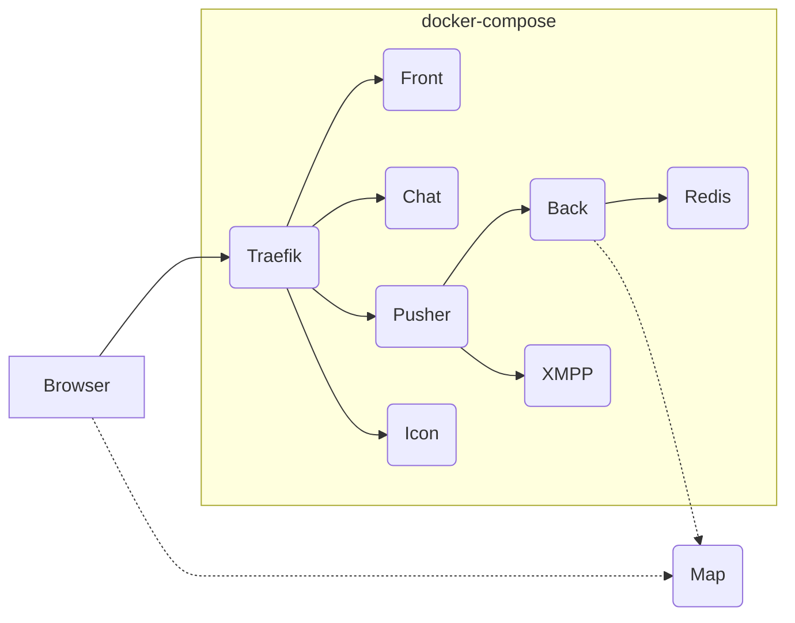

# Deploying WorkAdventure in production

This directory contains a sample production deployment of WorkAdventure using docker-compose.

Every production environment is different and this docker-compose file will not
fit all use cases. But it is intended to be a good starting point for you
to build your own deployment.

In this docker-compose file, you will find:

- A reverse-proxy (Traefik) that dispatches requests to the WorkAdventure containers and handles HTTPS certificates using LetsEncrypt
- A play container (NodeJS) that serves static files for the "game" (HTML/JS/CSS) and is the point of entry for users (you can start many if you want to increase performance)
- A chat container (nginx) that serves static files for the chat bar (HTML/JS/CSS)
- A back container (NodeJS) that shares your rooms information
- An icon container to fetch the favicon of sites imported in iframes
- A Redis server to store values from variables originating from the Scripting API
- A XMPP container that runs a Ejabberd server in charge of the chat / user list

> **Warning**
> The default docker-compose file does **not** contain a container dedicated to hosting maps. The documentation and
tutorials are relying on GitHub Pages to host the maps. If you want to self-host your maps, you will need to add a simple
HTTP server (nginx / Apache, ...) and properly configure the [CORS settings as explained in the documentation](../../docs/maps/hosting.md).

> **Note**
> The Ejabberd server is used to list all the users connected to your environment and also
> to transmit chat messages. The Ejabberd server proposed in this install comes almost
> unconfigured. There is no authentication system set up so all logins are anonymous. This
> is OK because the server is not exposed to the outside and only the "play" container will
> connect to it. Because authentications are anonymous, nothing will be saved.
> If you want to persist messages and use "real accounts", you will need to implement the
> "admin API" (it is the role of the Admin API to give valid credentials to Ejabberd),
> and you will need to modify the Ejabberd configuration to persist messages the way you want
> (using Mnesia or any other supported database)

