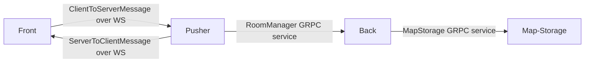

# Communication between services

This document explains the communication between the different components of WorkAdventure.

```mermaid
graph LR
    A[Front] -->|ClientToServerMessage over WS| B[Pusher]
    B -->|ServerToClientMessage over WS| A
    B -->|RoomManager GRPC service| C[Back]
    C -->|MapStorage GRPC service| D[Map-Storage]
```
