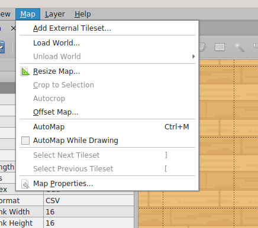
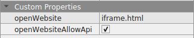

# Map Scripting API

Do you want to add a bit of intelligence to your map? Scripts allow you to create maps with special features.

You can for instance:

*   Create FTUE (First Time User Experience) scenarios where a first-time user will be displayed a notification popup.
*   Create NPC (non playing characters) and interact with those characters using the chat.
*   Organize interactions between an iframe and your map (for instance, walking on a special zone might add a product in the cart of an eCommerce website...)
*   etc...

Please note that scripting in WorkAdventure is evolving with each release.
More features might be added in the future. When a feature is marked as "experimental", it means the signature of the functions may 
evolve in the future versions of WorkAdventure. Use those with caution. You can actually voice your opinion about useful features by adding [an issue on GitHub](https://github.com/thecodingmachine/workadventure/issues).

:::caution
**Beware:** Scripts are executed in the browser of the current user only. Generally speaking, scripts cannot be used to trigger a change that will be displayed on other users screen...
unless you explicitly use "variables" or "events" to share a state between players.
:::

## Scripting language

Client-side scripting is done in **Javascript** (or any language that transpile to Javascript like _Typescript_).

There are 2 ways you can use the scripting language:

*   **In the map**: By directly referring a Javascript file inside your map, in the `script` property of your map.
*   **In an iFrame**: By placing your Javascript script into an iFrame, your script can communicate with the WorkAdventure game

## Adding a script in the map

Create a `script` property in your map.

In Tiled, in order to access your map properties, you can click on _"Map > Map properties"_.



Create a `script` property (a "string"), and put the URL of your script.

You can put relative URLs. If your script file is next to your map, you can simply write the name of the script file here.


:::info Default script loaded
If you are using the map-starter-kit to build your map, the default map that comes with the map starter kit loads
a script from the `src/main.ts` file.
:::

:::info Script types
WorkAdventure supports two types of scripts:

1. **JavaScript files (`.js` or `.ts`)**: The script will be automatically wrapped in an HTML page with the WorkAdventure API (`iframe_api.js`) included. You should use this most of the time.
2. **HTML files (`.html`)**: The HTML file will be loaded directly as-is. You need to manually include the WorkAdventure API if you want to use it:
   ```html
   <script src="https://play.workadventu.re/iframe_api.js"></script>
   ```
   
The HTML page is hidden, so don't expect to see it somewhere. If you want to display custom HTML elements within WorkAdventure, take a look at the dedicated functions
in the scripting API (in the [`WA.ui`](references/api-ui.md) object).
:::

Start by testing this with a simple message sent to the chat.

**script.js**
```javascript
WA.chat.sendChatMessage('Hello world', 'Mr Robot');
```

The `WA` objects contains a number of useful methods enabling you to interact with the WorkAdventure game. For instance, `WA.chat.sendChatMessage` opens the chat and adds a message in it.

The message should be displayed in the chat history as soon as you enter the room.

To learn more about the way scripts are loaded by WorkAdventure (and in particular if you are facing) CORS issues,
please read the [scripting internals](./scripting-internals) guide that dives into the specifics of how WorkAdventure
loads your scripts in a secure way.

## Adding a script in an iFrame

In WorkAdventure, you can easily [open an iFrame using the `openWebsite` property on a layer](../../map-building/tiled-editor/special-zones). However, by default, the iFrame is not allowed to communicate with WorkAdventure.

This is done to improve security. In order to be able to execute a script that communicates with WorkAdventure inside an iFrame, you have to **explicitly allow the iFrame to use the "iFrame API"**.

In order to allow communication with WorkAdventure, you need to add an additional property: `openWebsiteAllowApi`. This property must be _boolean_ and you must set it to "true".



In your iFrame HTML page, you now need to import the _WorkAdventure client API Javascript library_. This library contains the `WA` object that you can use to communicate with WorkAdventure.

The library is available at `https://play.workadventu.re/iframe_api.js`.

_Note:_ if you are using a self-hosted version of WorkAdventure, use `https://[front_domain]/iframe_api.js`

**iframe.html**
```html
<!doctype html>
<html lang="en">
    <head>
        <script src="https://play.workadventu.re/iframe_api.js"></script>
    </head>
    <body>
    </body>
</html>
```

You can now start by testing this with a simple message sent to the chat.

**iframe.html**
```html
...
<script>
WA.chat.sendChatMessage('Hello world', 'Mr Robot');
</script>
...
```

Let's now review the complete list of methods available in this `WA` object.

## Using Typescript

View the dedicated page about [using Typescript with the scripting API](using-typescript).

## Available features in the client API

The list of available functions and features is [available in the API Reference page, with examples](references/).
