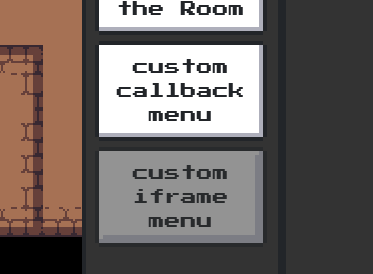
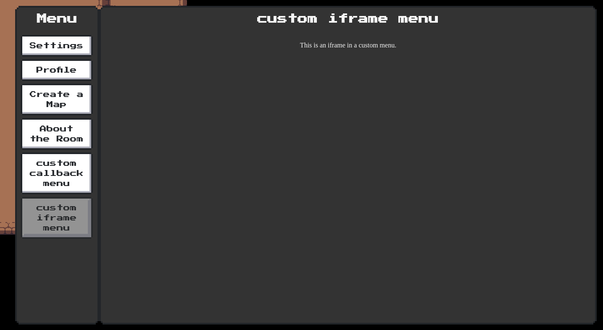
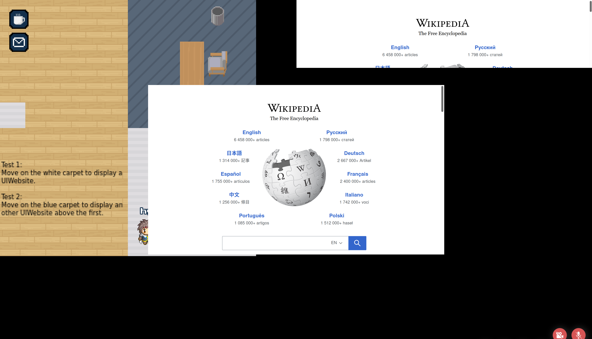
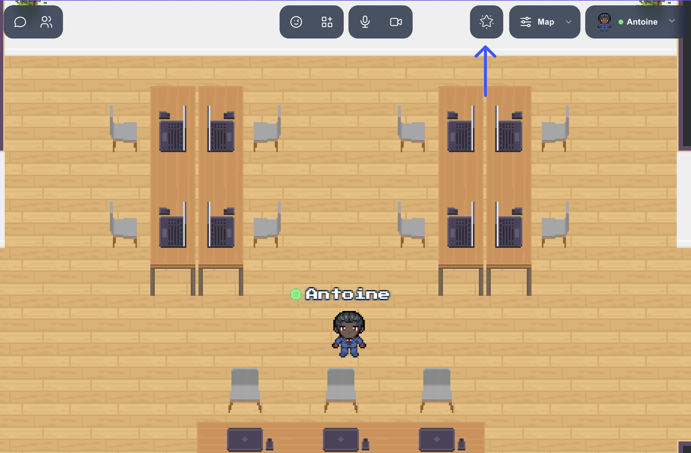
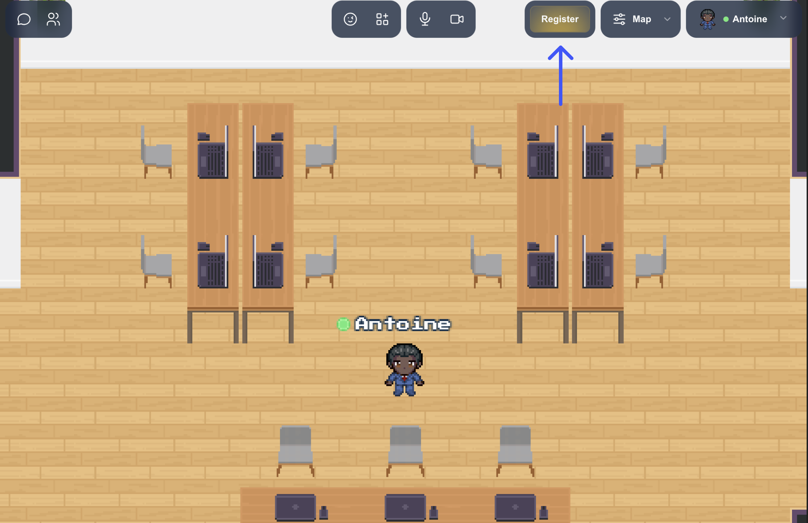
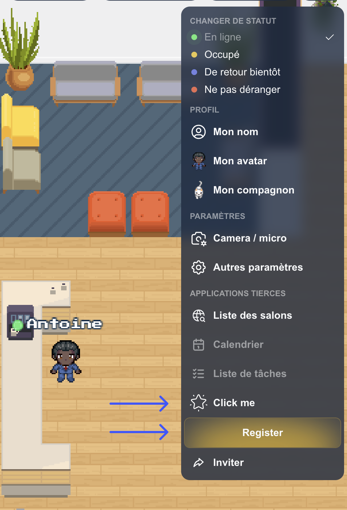
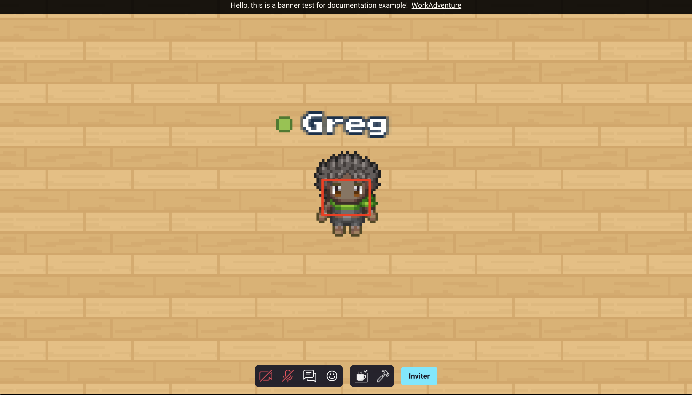

# UI

### Opening a popup

In order to open a popup window, you must first define the position of the popup on your map.

You can position this popup by using a "rectangle" object in Tiled that you will place on an "object" layer.


```
WA.ui.openPopup(targetObject: string, message: string, buttons: ButtonDescriptor[]): Popup
```

*   **targetObject**: the name of the rectangle object defined in Tiled.
*   **message**: the message to display in the popup.
*   **buttons**: an array of action buttons defined underneath the popup.

Action buttons are `ButtonDescriptor` objects containing these properties.

*   **label (_string_)**: The label of the button.
*   **className (_string_)**: The visual type of the button. Can be one of "normal", "primary", "success", "warning", "error", "disabled".
*   **callback (_(popup: Popup)=>void_)**: Callback called when the button is pressed.

Please note that `openPopup` returns an object of the `Popup` class. Also, the callback called when a button is clicked is passed a `Popup` object.

The `Popup` class that represents an open popup contains a single method: `close()`. This will obviously close the popup when called.

```ts
class Popup {
    /**
     * Closes the popup
     */
    close() {};
}
```

Example:

```ts
let helloWorldPopup;

// Open the popup when we enter a given zone
WA.room.onEnterLayer("myZone").subscribe(() => {
    helloWorldPopup = WA.ui.openPopup("popupRectangle", 'Hello world!', [{
        label: "Close",
        className: "primary",
        callback: (popup) => {
            // Close the popup when the "Close" button is pressed.
            popup.close();
        }
    }]);
});

// Close the popup when we leave the zone.
WA.room.onLeaveLayer("myZone").subscribe(() => {
    helloWorldPopup.close();
})
```

### Add custom menu

```
WA.ui.registerMenuCommand(commandDescriptor: string, options: MenuOptions): Menu
```
Add a custom menu item containing the text `commandDescriptor` in the navbar of the menu.
`options` attribute accepts an object with three properties :
- `callback : (commandDescriptor: string) => void` : A click on the custom menu will trigger the `callback`.
- `iframe: string` : A click on the custom menu will open the `iframe` inside the menu.
- `key?: string` : A unique identifier for your menu item.
- `allowApi?: boolean` : Allow the iframe of the custom menu to use the Scripting API.
- `allow?: string` : The `allow` attribute used by the iframe.

Important : `options` accepts only `callback` or `iframe` not both.

Custom menu exist only until the map is unloaded, or you leave the iframe zone of the script.




Example:
```ts
const menu = WA.ui.registerMenuCommand('menu test',
    {
        callback: () => {
            WA.chat.sendChatMessage('test');
        }
    })

// Some time later, if you want to remove the menu:
menu.remove();
```

Please note that `registerMenuCommand` returns an object of the `Menu` class.

The `Menu` class contains two methods: `remove(): void` and `open(): void`.

`remove` will remove the menu when called.
`open` will programmatically open the menu.

```ts
class Menu {
  /**
   * Remove the menu
   */
  public remove(): void {/*...*/};

  /**
   * Programmatically open the menu
   */
  public open(): void {/*...*/};
}
```

## Fetching a custom menu

```
WA.ui.getMenuCommand(key: string): Promise<Menu>
```

You can retrieve a menu by its key using `WA.ui.getMenuCommand`.
You can also access the list of default menu items provided by WA.

Here is the full list of pre-registered keys: "settings", "profile", "invite", "credit", "globalMessages", "contact", "report".

Example: open the "invite" page from a script:

```ts
const menu = await WA.ui.getMenuCommand("invite");
menu.open();
```

### Awaiting User Confirmation (with space bar)

```ts
WA.ui.displayActionMessage({
    message: string,
    callback: () => void,
    type?: "message"|"warning",
}): ActionMessage
```

Displays a message at the bottom of the screen (that will disappear when space bar is pressed).


Example:

```ts
const triggerMessage = WA.ui.displayActionMessage({
    message: "press 'space' to confirm",
    callback: () => {
        WA.chat.sendChatMessage("confirmed", "trigger message logic")
    }
});

setTimeout(() => {
    // later
    triggerMessage.remove();
}, 1000)
```

Please note that `displayActionMessage` returns an object of the `ActionMessage` class.

The `ActionMessage` class contains a single method: `remove(): Promise<void>`. This will obviously remove the message when called.

```ts
class ActionMessage {
    /**
     * Hides the message
     */
    remove() {};
}
```

### Adding custom ActionsMenu Action

When clicking on other player's WOKA, the contextual menu (we call it ActionsMenu) is displayed with some default Actions. It is possible to add custom actions right when player is clicked:


To do that, we need to listen for the `onRemotePlayerClicked` stream and make use of the `remotePlayer` object that is passed by as a payload.

```ts
WA.ui.onRemotePlayerClicked.subscribe((remotePlayer: RemotePlayer) => {
    remotePlayer.addAction('Ask to tell a joke', () => {
        console.log('I am NOT telling you a joke!');
    });
}
```

`remotePlayer.addAction(actionName, callback)` returns an Action object, which can remove itself from ActionsMenu:
```ts
const action = remotePlayer.addAction('This will disappear!', () => {
    console.log('You managed to click me!');
});
setTimeout(
    () => {
        action.remove();
    },
    1000,
);
```

## Manage fixed iframes

You can use the scripting API to display an iframe (so any HTML element) above the game. The iframe is positionned relative to the browser window (so unlike [embedded websites](/map-building/tiled-editor/website-in-map), the position of the iframe does not move when someone walks on the map).



This functonnality creates an iframe positionned on the viewport.

### Display a UI website

```ts
WA.ui.website.open(website: CreateUIWebsiteEvent): Promise<UIWebsite>

interface CreateUIWebsiteEvent {
    url: string,            // Website URL
    visible?: boolean,      // The website is visible or not
    allowApi?: boolean,     // Allow scripting API on the website
    allowPolicy?: string,   // The list of feature policies allowed
    position: {
        vertical: "top"|"middle"|"bottom",,
        horizontal: "left","middle","right",
    },
    size: {                 // Size on the UI (available units: px|em|%|cm|in|pc|pt|mm|ex|vw|vh|rem and others values auto|inherit)
        height: string,
        width: string,
    },
    margin?: {              // Website margin (available units: px|em|%|cm|in|pc|pt|mm|ex|vw|vh|rem and others values auto|inherit)
        top?: string,
        bottom?: string,
        left?: string,
        right?: string,
    },
}

interface UIWebsite {
    readonly id: string,            // Unique ID
    url: string,                    // Website URL
    visible: boolean,               // The website is visible or not
    readonly allowApi: boolean,     // Allow scripting API on the website
    readonly allowPolicy: string,   // The list of feature policies allowed
    position: {
        vertical: string,           // Vertical position (top, middle, bottom)
        horizontal: string,         // Horizontal position (left, middle, right)
    },
    size: {                         // Size on the UI (available units: px|em|%|cm|in|pc|pt|mm|ex|vw|vh|rem and others values auto|inherit)
        height: string,
        width: string,
    },
    margin?: {                      // Website margin (available units: px|em|%|cm|in|pc|pt|mm|ex|vw|vh|rem and others values auto|inherit)
        top?: string,
        bottom?: string,
        left?: string,
        right?: string,
    },
    close(): Promise<void>,         // Close the current website instance
}
```

You can open a website with the `WA.ui.website.open()` method. It returns an `Promise<UIWebsite>` instance.

```ts
const myWebsite = await WA.ui.website.open({
    url: "https://wikipedia.org",
    position: {
        vertical: "middle",
        horizontal: "middle",
    },
    size: {
        height: "50vh",
        width: "50vw",
    },
});

myWebsite.position.vertical = "top";
```

:::info
The `url` parameter can be a relative URL. In this case, the URL is relative to the map file.
:::

### Close a UI website
You can close a website with the close function on the `UIWebsite` object

```ts
myWebsite.close();
```
### Get all UI websites
You can get all websites with the `WA.ui.website.getAll()` method. It returns an `Promise<UIWebsite[]>` instance.

```ts
WA.ui.website.getAll();
```

### Get UI website by ID
You can get a specific website with the `WA.ui.website.getById()` method. It returns an `Promise<UIWebsite>` instance.
If your code is running inside a UIWebsite iframe, you can use `WA.iframeId` to obtain the id of the current iframe.

```ts
const websiteId = WA.iframeId;
const website = await WA.ui.website.getById(websiteId);
```

## The modal iframe API
### Open the modal iframe

```ts
WA.ui.modal.openModal({
    src: string,
    allow?: string,
    allowApi?: boolean, // optional by default false.
    position?: string,
    allowFullScreen?: boolean,
    title: string,
    closeCallback?: (event: ModalEvent) => void
}): void
```

- `src` (string, **mandatory**): the URL of the iframe modal (mandatory).
- `allow` (string, *optional*, default ""): the list of [permission policies](https://developer.mozilla.org/en-US/docs/Web/HTTP/Guides/Permissions_Policy) allowed.
- `allowApi` (boolean, *optional*, default `false`): if set to `true`, the iframe will be able to use the scripting API.
- `position` (string, *optional*, default `right`): the position of the modal. Possible values are `center`, `left`, `right`.
- `allowFullScreen` (boolean, *optional*, default `true`): if set to `false`, the "fullscreen" button next to the close button will be hidden.
- `title`: the title of the iframe (note: this is mostly useless since the title is not displayed).
- `closeCallback` (function, *optional*): a function that will be called when the modal is closed. The function will be passed the `ModalEvent` object used to configure the modal.

### Example

Opening a modal in the center of the screen:

```ts
WA.ui.modal.openModal({
    title: "WorkAdventure website",
    src: 'https://workadventu.re',
    allow: "geolocation",
    allowApi: true,
    position: "center",
    allowFullScreen: false,
    () => {
        console.info('The modal was closed');
    }
});
```


Opening a modal on the right side:

```ts
    WA.ui.modal.openModal({
        title: "WorkAdventure website",
        src: 'https://workadventu.re',
        allow: "fullscreen",
        position: "right"
    });
```


Opening a modal on the left side:

```ts
    WA.ui.modal.openModal({
        title: "WorkAdventure website",
        src: 'https://workadventu.re',
        position: "left"
    });
```


### Mobile example

If the user is in mobile definition, the modal will open in full screen:


### Closing a modal

```ts
WA.ui.modal.closeModal(): void
```

## Action bar button API

### Add a button in the action bar

```ts
WA.ui.actionBar.addButton(descriptor: {
    id: string,
    label: string | undefined,
    imageSrc: string | undefined,
    toolTip: string | undefined, 
    // Specifies the background color of the button. This parameter is nullable.
    bgColor: string | undefined,
    // Specifies the text color of the button. This parameter is nullable.
    textColor: string | undefined,
    // Specifies the background color of the button. This parameter is nullable.
    isGradient: boolean | undefined,
    clickCallback: (buttonActionBar: AddButtonActionBar) => void
}): void
```

- id: the id of the button action bar defined.
- label: the label to display in the button.
- imageSrc: URL of the button's image (relative to the map file).
- toolTip: label displayed above the action button.
- clickCallback: function called when the user clicks on the button. The callback is passed a `AddButtonActionBar` instance in parameter.

With `AddButtonActionBar` defined as:
```ts
interface AddButtonActionBar {
    /*
     *   the id of the button action bar defined.
     */
    id: string,

    /*
     *   the label to display in button action bar.
     */
    label: string

    /*
     *  the image of button associated, This parameter is nullable.
     */
    imageSrc: string

    /*
     *   the label displayed above the action button. This parameter is nullable.
     */
    toolTip: string
  
    /*
     *   specifies the background color of the button. This parameter is nullable.
     */
    bgColor: string

    /*
     *   specifies the button text color. This parameter can be null.    
     */
    textColor: string

    /*
     *   specifies if the button is a gradient button or not. False by default. When true, a gradient is applied to the button with the 'bgColor' parameter.
     */
    isGradient: boolean
  
}
```

### Remove a button from the action bar
```ts
    WA.ui.actionBar.removeButton(id: string);
```
- id: the id of the action bar button previously defined.

### Example of an icon only action bar button



```ts
    // Add action bar button 'Register'.
    WA.ui.actionBar.addButton({
        id: 'icon-btn',
        imageSrc: '<Your image url>',
        toolTip: 'Click me',
        callback: (event) => {
            console.log('Button clicked', event);
            // When a user clicks on the action bar button 'Register', we remove it.
            WA.ui.actionBar.removeButton('icon-btn');
        }
    });
```

### Example of an action bar button with gradient



```ts
    // Add action bar button 'Register'.
    WA.ui.actionBar.addButton({
        id: 'gradient-btn',
        label: 'Register',
        bgColor: '#edb911',
        isGradient: true,
        callback: (event) => {
            console.log('Button clicked', event);
            // When a user clicks on the action bar button 'Register', we remove it.
            WA.ui.actionBar.removeButton('gradient-btn');
        }
    });
```
> Note that when the screen is too small, buttons are added to the right menu of the action bar. In this case, the button is displayed with an image and a tooltip, while for the gradient button, it retains its color and its text remains centered. 




## Open / Close banner

:::caution
The open/close banner API is **experimental**. It means the compatibility with future versions of WorkAdventure is not
guaranteed and we might break the signature of these methods at any moment. Use at your own risk.
:::

### Open the banner
```ts
    WA.ui.banner.openBanner({
        id: string,
        text: string,
        bgColor?: string,
        textColor?: string,
        closable?: boolean,
        link?: {
            url: string,
            label: string
        }
    });
```

- id: Id of the banner component,
- text: dexcription displyed in the banner,
- bgColor (optional): background color of your banner,
- textColor (optional): text color into the banner,
- closable (optional): let the possoibility for the user to close the banner. By default is `true`,
- timeToClose (optional): let the possibility for the user to define the time (in milliseconds) to close. If set to 0, the banner will not close automatically. By default is `120000`
- link (optional): link added into the banner. The link has two mandatory parameter `url` and `label`:
    - url: Url link,
    - label: text dsiplayed for the banner link.


### Close the banner
```ts
    WA.ui.banner.closeBanner();
```

### Example of banner opened
```ts
WA.ui.banner.openBanner({
    id: "banner-test",
    text: "Banner test",
    bgColor: "#000000",
    textColor: "#ffffff",
    closable: false,
    timeToClose: 120000,
    link: {
        label: "Test",
        url: "https://workadventu.re"
    }
});
```




### Example of banner closed
```ts
WA.ui.banner.closeBanner();
```

## Play a video

:::caution
The "play a video" API is **experimental**. It means the compatibility with future versions of WorkAdventure is not
guaranteed and we might break the signature of these methods at any moment. Use at your own risk.
:::

Plays a video. The video will be displayed as if it was a user talking to us.

```ts
WA.ui.playVideo(videoUrl: string, config: VideoConfig = {
  loop: true,
}): Promise<Video>;

interface VideoConfig {
  loop?: boolean;
  name:? string;
  avatar:? string;
}
```

Arguments: 

- `videoUrl`: the URL of the video to play.
- `config`: an object with the following optional properties:
  - `loop`: whether the video should loop or not. Default is `true`.
  - `name`: The name displayed at the bottom left of the video.
  - `avatar`: The avatar displayed at the bottom left of the video.

Return value:

- a `Promise` that resolves to a `Video` object. The `Video` object has a `stop` method that can be used to stop the video.

```ts
interface Video {
  stop(): void;
}
```

Example:

```ts
const video = await WA.ui.playVideo('https://example.com/video.mp4', { loop: true });

// Later, stop the video
await video.stop();
```
