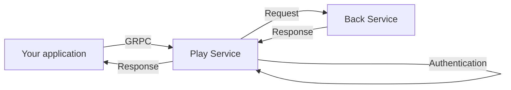

# Room API front

## What is the Room API and what can I use it for?

The Room API is a gRPC-based API that allows an external server to connect to a room and to perform actions such as reading/modifying/listening to a room variable.

The Room API is a **server to server** API. If you are looking for a "client to server" API (for instance to add a dynamic behavior to a map), look at the scripting API.

The Room API is **not** designed to create rooms or to manage members or authorizations on who can enter a room. If you are looking for an API to do this, look for the AdminAPI (in self-hosted mode) or the [inbound](/developer/inbound-api) or [outbound API](/developer/outbound-api) if you are using the WorkAdventure SAAS version.

In WorkAdventure, the state of a room is stored in [variables](/developer/map-scripting/references/variables). You can bind those variables to some objects state (for instance to the fact that a door is closed or opened). Or you can use the scripting API to react to variables change.

The Room API lets you monitor those room variables, but also allows you to edit them. Through variables, you can therefore establish a 2-ways data channel between your server and what happens in a WorkAdventure room.

## Protocol

You connect to the Room API using gRPC over HTTP2.

## Why gRPC?

The Room API must be able to read and edit variables, but must also be able to listen in real-time to variables changes. The real-time aspect of the Room API makes a classic REST API not very well suited. We could have designed the API on Websockets or using Server-Sent Events, but those are hard to standardize.

The [gRPC protocol](https://grpc.io/) provides an API that is self-documented (using `.proto` files), strictly typed, real-time and extremely performant.

## Setup on self hosting

If you want to use the API on your self-hosted WorkAdventure server you must define the following environment variable in your .env file :

| Variable name | Description | Example |
| ------- | -------- | -------- |
| `ROOM_API_SECRET_KEY` | `Secret key used to authenticate in the Room API (if this key is not defined, the API will not start)` | `My AWESOME KEY` |

## Hostname and port to access the API

The hostname and the port to access the Room API depends on your setup :
| Setup                                      | Hostname | Port |
|-|-|-|
| WorkAdventure SAAS | `room-api.workadventu.re` | 443 |
| Self-hosted | Depends on your setup. See your `docker-compose.yaml` file.
| Local environment (dev) | `room-api.workdventure.localhost` | 80 |

> **Note**
> The "Room API" is served by the "play" container, on a dedicated port, configured by the `ROOM_API_PORT` environment variable (port 50051 by default). If you are using the default "single-domain" self-hosted install, the hostname to the Room API is `[your-domain]/room-api`.

## Authentication
Authentication to the API is done by passing a **X-API-Key** header in the gRPC metadata on each call to the API.

Depending if you are using a self hosted install or the SAAS version of WorkAdventure, you will use a different method to authenticate.

If you are using the SAAS please refer to the [SAAS Room API authentication documentation](/developer/room-api).

If you are using a self-hosted WorkAdventure server, you have just to send the secret key defined on the **ROOM_API_SECRET_KEY** environnement variable, on the **X-API-Key** GRPC metadata on each call.

## Client libraries
  - **TypeScript / JavaScript** : [@workadventure/room-api-client](https://www.npmjs.com/package/@workadventure/room-api-client)

  You want to contribute or create a new client ? Please check the [existing clients](../../libs/room-api-clients/) before.

## Protobuf file

The Protobuf file is available [here](../../messages/protos/room-api.proto).
