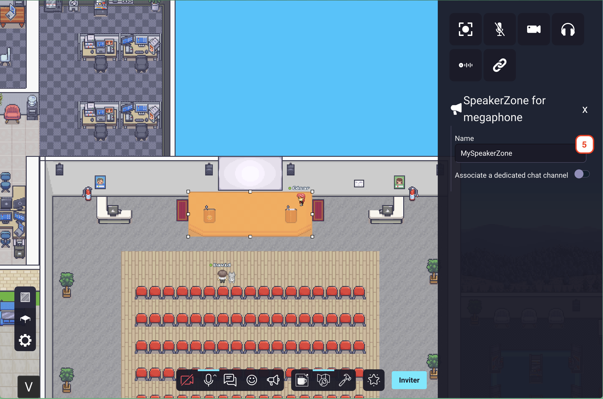
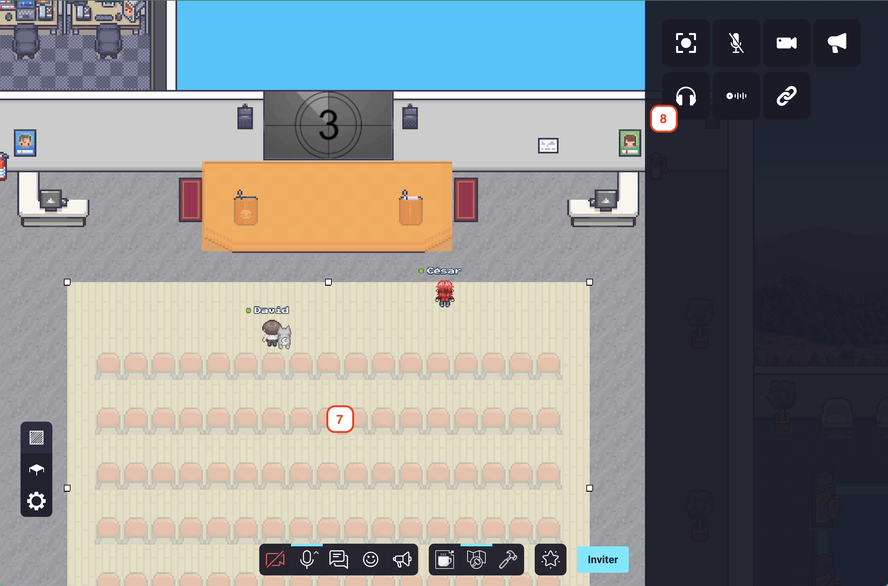

---

sidebar_position: 30

---

# Podium / Stage / Presentation Zones

Use the podium feature to build stages (aka. speaker zones / presentation zones) to stream your video / audio / screen to anyone
in the corresponding audience (aka. listener zone / auditorium / presentation zone).

You typically use this feature to build a stage where a speaker can present to an audience.
The stage is the **podium**. Anyone walking on the stage will be able to stream their video / audio / screen.
To listen to the speakers, you go in to **audience** zone. Anyone walking in the audience will be able to see and hear the speaker(s)
on the podium.

Please note that [access to the map editor](../index.md) is required to perform the following steps.

#### Creating a podium

1. Open the map editor.
2. Access the "area map editor" section.
3. Create an area by clicking on the map directly or by selecting a zone.
4. Click on the "podium" icon.

5. Name your podium zone. (a unique name, and this name will be used in the audience) If you use the same name for multiple 
   podiums, they will be linked together and speakers in any of these podiums will be heard/seen in all the associated podiums and audience zones.
6. (Optional) You can also create a chat channel for this zone. This forum will be used to chat with the people on the podium.

#### Creating an "audience" zone

7. Create a new area by clicking on the map directly or by selecting a zone.
8. Click on the "audience" icon.

9. Select the name of the podium that you already created in the "podium name" selector.
10. (Optional) You can also create a chat channel for this zone. This channel will be used to chat with the people in the audience.

:::note
If you enable "associate a dedicated chat channel" in both areas, both chats will be merged and can be used by users in the podium and in the audience.
:::

You're done ! Now, anyone in the audience will be able to hear/see the speakers that are on the podium/stage.
When a user will enter the podium, he will trigger the megaphone directly and will stream to the audience associated with the podium.
