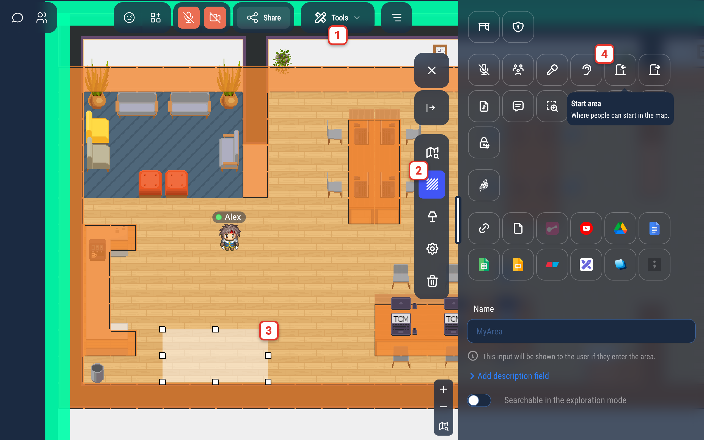
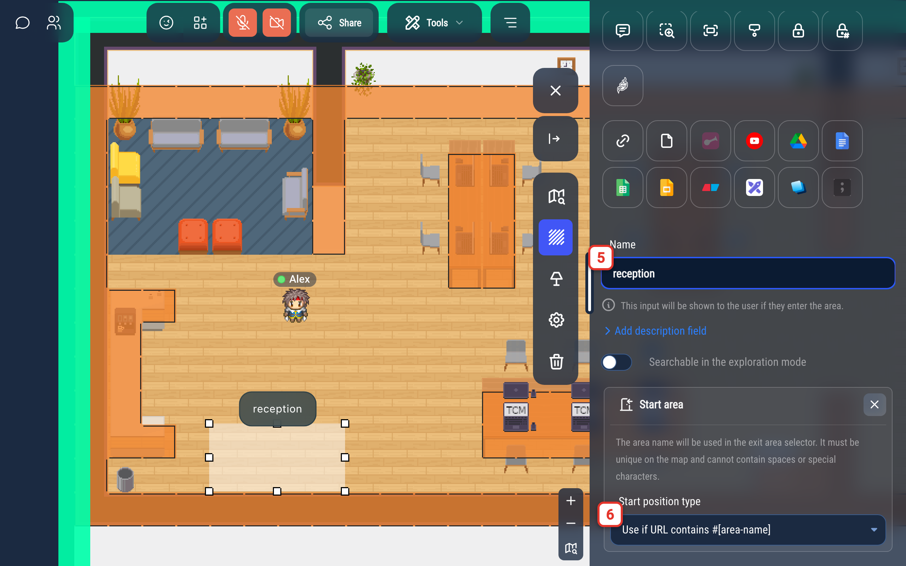
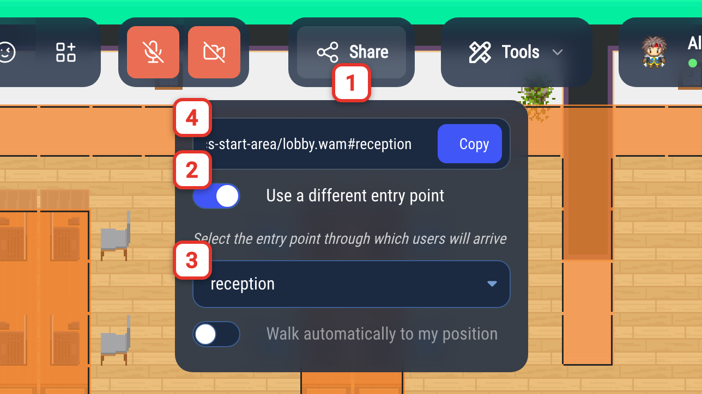
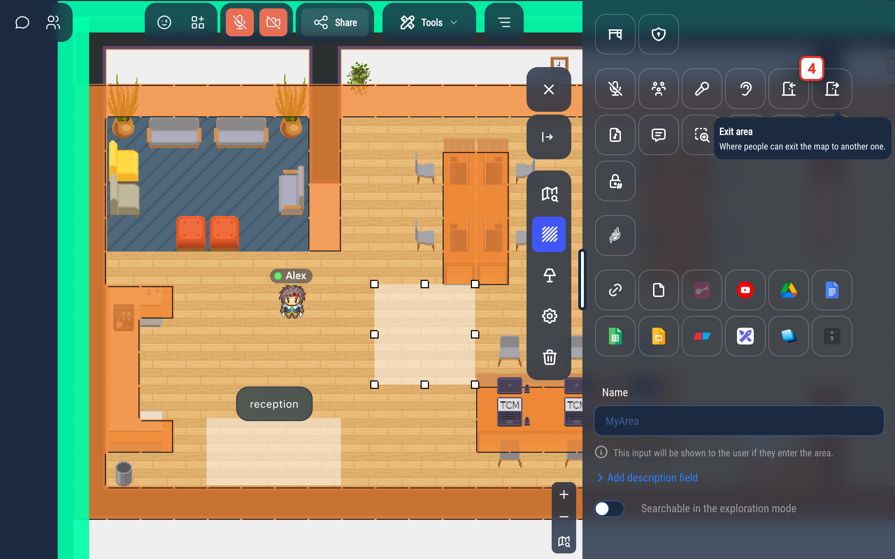
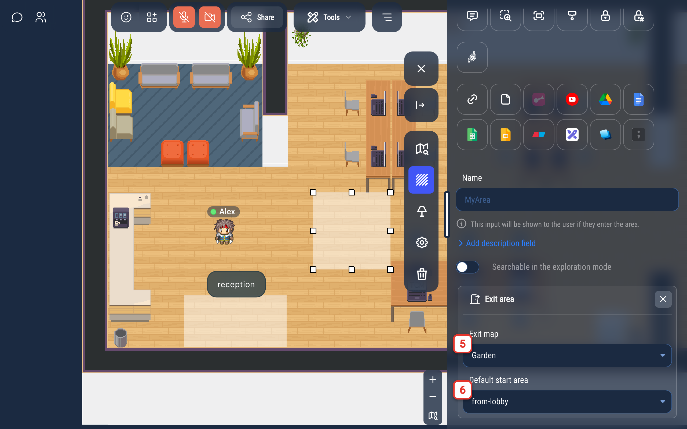

---

sidebar_position: 40

---

# Start and exit areas

A **start area** is where people appear when they arrive on your map. An **exit area** sends people to another map
(or to another place of the same map) as soon as they walk into it.

## Create a start area

1. Open the map editor: **Tools** > **Map editor**.
2. Select the **Area editor tool**.
3. Draw a zone on the map.
4. Click the **Start area** icon.



5. Give your area a **name**. The name is used in the URL of the map and in the exit area selector, so it must be unique
   on the map. Use lowercase letters, digits and dashes (for instance `reception` or `main-hall`).
6. Choose the **Start position type**:
    - **Use by default**: people who open the map with a plain link (no `#` at the end) appear in this area, unless
      they have a personal desk on the map. If several areas are "used by default", one of them is picked at random.
    - **Use if URL contains #[area-name]**: people only appear in this area when the link contains `#` followed by
      the area name (see [below](#send-people-to-a-specific-start-area)).



:::info Pro tip
If you expect many people to connect to your map at the same time (for instance, if you are organizing a big event), consider making a large start area. This way, users will not all appear at the same position and will not pop randomly in a chat with someone connecting at the same moment.
:::

:::info
If your map already has start positions defined in Tiled, areas defined in the map editor will take precedence.
:::

## Send people to a specific start area

To make people arrive in a given start area, add `#` followed by the name of the area at the end of the link of your map:

```
https://play.workadventu.re/@/my-organization/my-world/my-map#reception
```

Anyone opening this link appears in the `reception` start area instead of the default one.

- This works with **every** start area, whatever its type. The "Use if URL contains #[area-name]" type only means the
  area is never used when the link has no `#`.
- The name after the `#` must match the area name exactly (it is case-sensitive).
- When you select the "Use if URL contains #[area-name]" type, and whenever you rename such an area, the editor makes
  the name usable in a link: it converts it to lowercase, removes accents, replaces spaces with dashes and removes any
  character other than letters, digits, `-` and `_` (`Main Hall` becomes `main-hall`, `Réception` becomes `reception`).
- If no start position of the map (in the map editor or in Tiled) has this name, people arrive as if there was no `#`.

### Get the link from the Share menu

You do not have to build the link by hand:

1. Click **Share**.
2. Turn on **Use a different entry point**.
3. Select the start area.
4. Click **Copy**. The link contains `#` followed by the name of the area. If **Walk automatically to my position** is
   turned on, your coordinates follow the name, for example `#reception&moveTo=320,640`.



See [Invite people to your map](../../invite.md) for the other options of this menu.

## Create an exit area

1. Open the map editor: **Tools** > **Map editor**.
2. Select the **Area editor tool**.
3. Draw a zone on the map.
4. Click the **Exit area** icon.



5. In **Exit map**, select the map people are sent to.
6. In the second selector, choose where they arrive on that map:
    - **Default start area**: they arrive as if they had opened the plain link of that map;
    - a start area name: they arrive in this start area. The list shows the start areas of the selected map.



An exit area uses the same mechanism as a link: walking into the area above opens the "Garden" map with
`#from-lobby` at the end of its URL.
