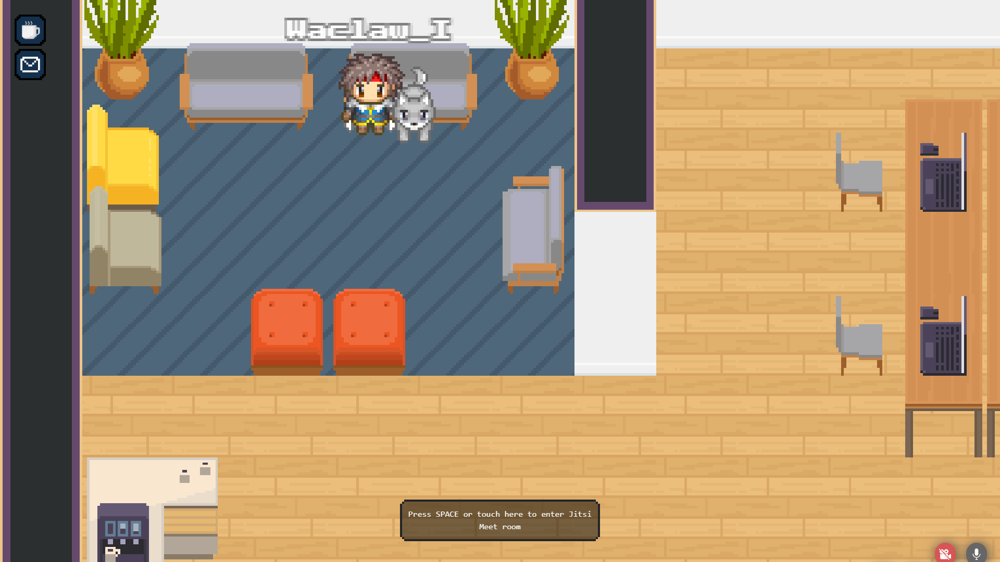

# Focusable property

When you make an area "focusable", the camera will automatically zoom on the area when the user enters it.
Apply this on a meeting room, for instance, to make the camera show the complete meeting room.

Focusable areas have one property: the "zoom margin".
If your focusable area is small, we advise you to set a zoom margin. The camera will zoom out a little bit from
the area. This allows zooming too much and can give a better rendering.

## Setting focusable area :

1. When editing an area, you can add the focusable property to it. You must click on the "focusable" icon.
   
2. You can define the zoom level of the camera when the player enters the area.!
   
