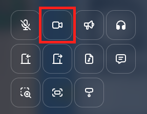
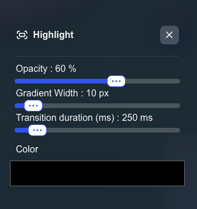

---

sidebar_position: 52

---

# Highlight property

On your map, you can define special zones with a visual highlight effect that appears when a user enters the area.
This feature allows you to draw attention to specific areas with customizable visual effects.

## Setting highlight area

When editing an area, you can add the highlight property to it. You must click on the "Highlight" icon.

You can configure various visual parameters to customize the highlight effect

## Highlight configuration

### Basic settings

- **Opacity**: Control the transparency of the highlight effect (0-100%)
- **Gradient width**: Define the width of the gradient border effect
- **transition duration**: Set how long the highlight effect takes to appear/disappear when entering/leaving the zone (in milliseconds)
- **Color**: Choose the color of the highlight effect

