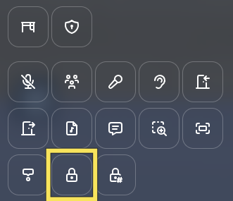
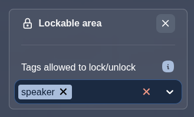
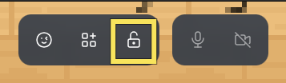

---

sidebar_position: 75

---

# Lockable area

## Description

A lockable area is a zone that users inside it can temporarily lock, preventing anyone outside from entering. When locked, the area acts as a collision zone and players trying to enter it will hit an invisible wall. This is useful for creating spaces like private meeting rooms or breakout zones that a group can claim temporarily.

If a user leaves a locked area, they cannot re-enter until the area is unlocked by one of the users inside the area.

The lock is **ephemeral**. When all users leave a locked area, it is automatically unlocked.

## Create a lockable area

While editing an area, select the lockable area option.

You can optionally define which user tags are allowed to lock and unlock the area. If no tags are specified, any user inside the area can lock or unlock it.

## Locking and unlocking

When a user enters a lockable area, a lock button appears in the action bar at the top of the screen.

Clicking the lock button locks the area. The area briefly flashes red to give visual feedback to all users.

Clicking the button again unlocks the area, allowing others to enter freely.

If the user does not have the required tags to lock or unlock the area, the lock button is displayed but disabled.

## Blocked users

When a user outside the area tries to enter a locked area, their movement is blocked at the area boundary. A message is displayed: **"This area is locked. You cannot enter."**

:::info
Users with the `admin` tag can force-unlock a locked area. When an admin tries to enter a locked area, a prompt is displayed allowing them to press the space key to unlock the area.
This is useful for cases where a user locks an area and forgets to lock the area before walking away from their computer.
:::

## Auto-unlock

When the last user leaves a locked area, the area is automatically unlocked. This means a lockable area never stays locked permanently with no one inside.
