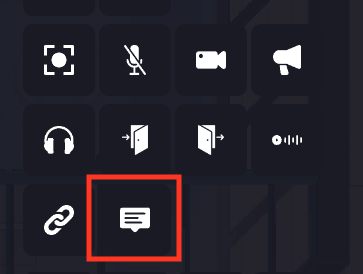
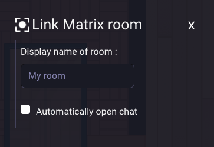

---

sidebar_position: 110

---

# Matrix Chat Room Property

You can link a Matrix chat room to a specific area on your map, allowing users to enter a chat directly when they move into the designated area. This feature requires a Matrix server to function.

## Setting a Matrix Chat Room Area

When editing an area or an entity, you can add the Matrix chat room property by clicking on the "Matrix chat" icon.

1. **Matrix Server Required**: Ensure you have access to a Matrix server to use this feature.

   

2. You must define a **display name** for the Matrix chat room. For example:
   
3. Choose how the chat room is triggered when entering the area:
   - **Automatically open chat**: If this option is selected, the chat will open immediately when the user enters the area.

4. If not selected, the chat can be manually opened by the user from the interface.

## Matrix Chat Room Functionality

A Matrix chat room linked to an area works with specific privacy and message history rules:

- **Area-Based Access**: Only users who are inside the designated area can see and participate in the Matrix chat room. People outside the area will not have access to the chat or its messages.
  
- **Conversation History**: When a user enters the area, they can only view the messages sent during the time they are present in the area. This means that users do not have access to previous chat history from times they were not in the area. Once they leave, they will no longer be able to see new messages until they re-enter the area.

This ensures that the chat room provides real-time communication specifically for users present within the designated area, maintaining a localized and private interaction zone.