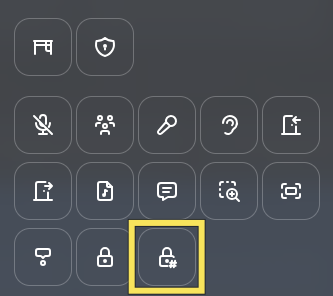
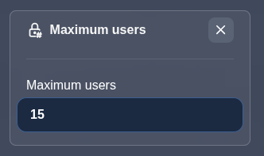

---

sidebar_position: 76

---

# Maximum users in area

## Description

The maximum users property lets you set an occupancy limit on an area. When the number of users inside the area reaches the limit, the area becomes blocked and new users are physically prevented from entering. Once someone leaves and the count drops below the limit, the area becomes accessible again.

This is useful for meeting rooms, workshop zones, or any space where you want to control crowd size.

## Create a maximum users area

While editing an area, select the "Maximum users" option.

A numeric input field appears where you can set the maximum number of users allowed in the area.

## Blocked users

When a user tries to enter an area that has reached its maximum occupancy, their movement is blocked at the area boundary. A message is displayed: **"This area is full. You cannot enter."** The area briefly flashes red to provide visual feedback.
