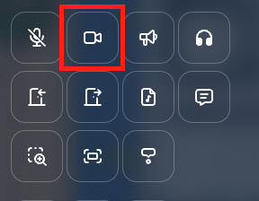
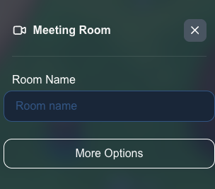
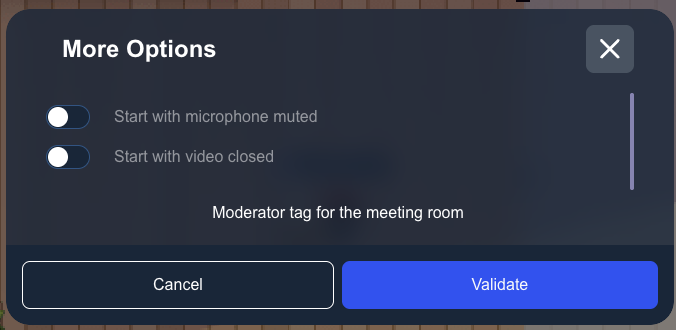

---

sidebar_position: 51

---

# Meeting room property

On your map, you can define special zones where a meeting room will be opened when a user enters the area.

## Setting meeting room area

When editing an area, you can add the meeting room property to it. You must click on the "Meeting room" icon.

You can define a name for the meeting room. If you set the same name for two meeting rooms in the same map, those meeting rooms will behave as one big meeting room.

## Additional options

In the "More options" section, you can configure the default state when entering the meeting room:

- **Camera off**: Check this option to enter the meeting room with the camera disabled by default
- **Microphone off**: Check this option to enter the meeting room with the microphone disabled by default

Use these options if you expect a big number of participants in your meeting room (for instance for a small meetup). For big meetings, we advise to use a podium instead.

