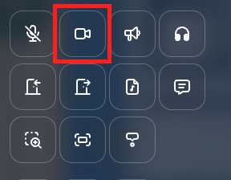
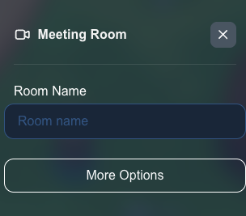
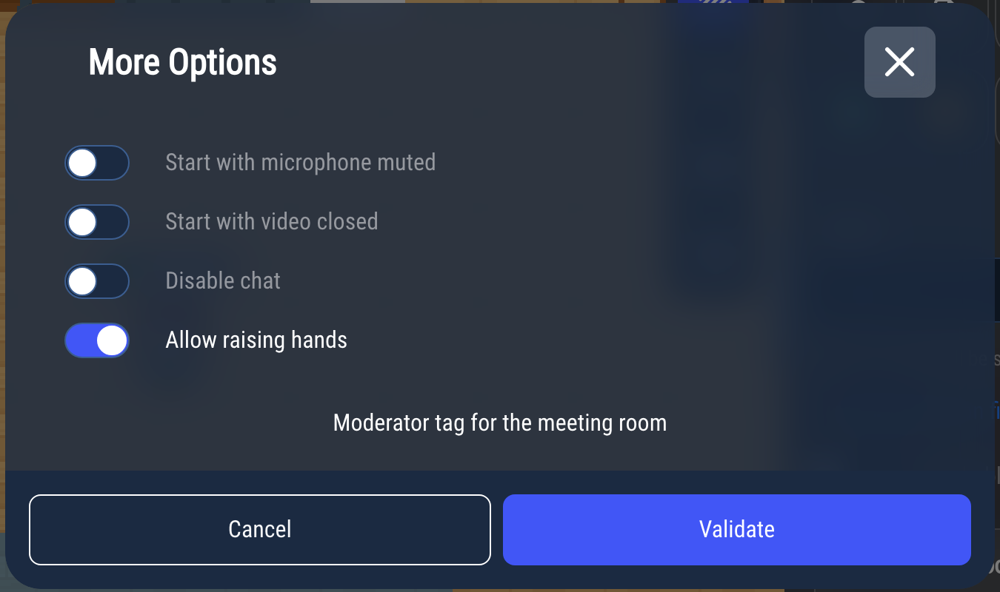

---

sidebar_position: 51

---

# Meeting room property

On your map, you can define special zones where a meeting room will be opened when a user enters the area.

## Setting meeting room area

When editing an area, you can add the meeting room property to it. You must click on the "Meeting room" icon.

You can define a name for the meeting room. If you set the same name for two meeting rooms in the same map, those meeting rooms will behave as one big meeting room.

If you leave the name empty, the area is its own meeting room. The name only links meeting rooms of the same map.

**Highlight area on enter** adds a highlight to the area, so people see where the meeting room is when they enter it (it is added automatically when you create the meeting room).

## Additional options

Click **More Options** to configure the meeting room:

- **Start with microphone muted**: when someone enters, their microphone is turned off (only if it was on). It is turned back on when they leave, unless they changed it inside.
- **Start with video closed**: the same for the camera.
- **Disable chat**: turns off the chat of the meeting room. If the area also has a [Matrix chat room](matrix-chat-zone.md), this switch is greyed out and the meeting room chat is off: people use the Matrix room instead.
- **Allow raising hands**: Turn this off so that participants can no longer [raise their hand](/user/raise-hand) in this meeting room. It is on by default. Participants can still lower a hand they already raised, and raise their hand in another conversation, such as a discussion bubble.

The **Moderator tag for the meeting room** field is not used yet: users with the `admin` tag moderate meeting rooms.

The first two options help when many people come and go during a meeting: arrivals do not interrupt the speaker. For large events where only a few people speak, use a [podium](broadcast.md) instead.

