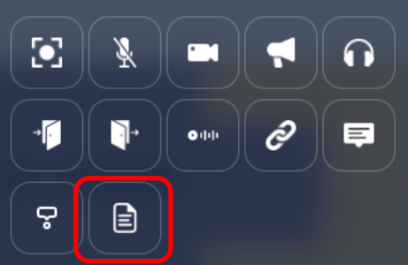
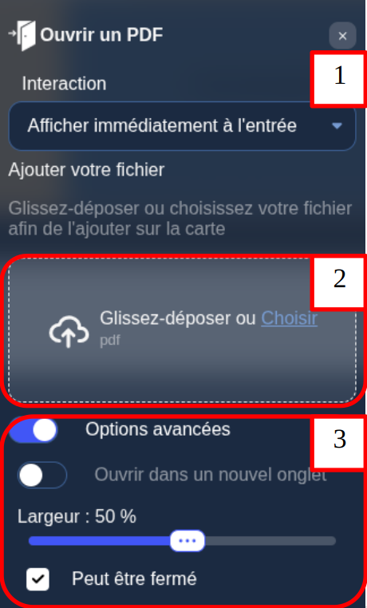

# Open document property

On your map, you can define special zones that open a document when a user enters the area.
From the map editor, you can upload the documents to be displayed.

:::note
The uploaded documents format can be PDF files, or images.
:::

## Configuring a open document area

While editing an area, click the "file" icon.

1. You can define the way the action is triggered.
2. You can drag and drop or select the PDF/image that will be opened when the player enters the area.
3. Those settings are related to the way the action is triggered. You can choose to open the pdf in a new tab, or in a cowebsite, the size of the cowebsite, if it can be closed, etc ...

## A note about security

The files you upload are stored in a special secured section of our map-storage servers. By default, only the users that have access to your map can download your files.
You can restrict access to your files further by adding a "Restricted area" property in addition to your "file" property. If you do so, users will need to have the tags specified in the "Restricted area" property in order to download your file.
