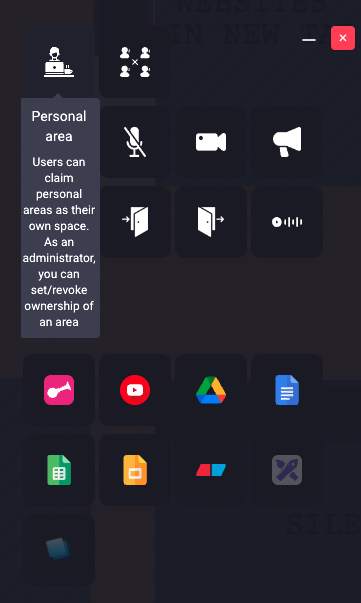
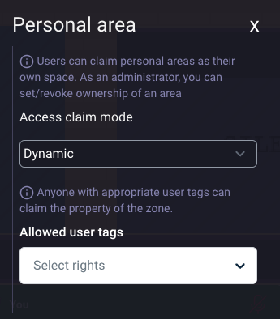
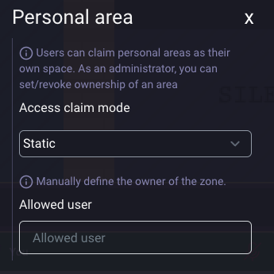
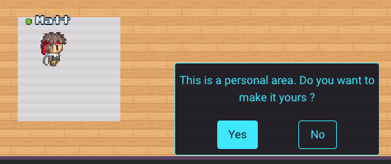
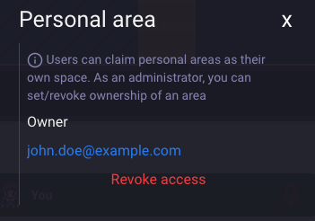
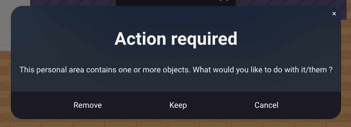

# Personal area

## Description

A personal area is a designated zone where a user can claim ownership or has been assigned as the owner. This feature allows a user to add objects to their area and display their visit card when they are away. Essentially, it serves as the user's virtual office space.

## Create a personal area

While editing an area, select the personal area option.

Then define how users can claim this area. 
There are two options :

- Dynamic claim mode : Users with specific tags can walk through the area and claim access.
- Static claim mode : A specified user is set as the area owner.

 
_Dynamic claim mode: Enter user tags in the "allowed user tags" input field._

 
_Static claim mode: Search for the user's email or name to assign ownership._

## Claim personal area access

If the personal area is set to dynamic access mode, users with the allowed tags can claim the area by walking through it. A pop-up message will appear, inviting the user to claim or decline the area. 
 

Once the area is claimed, the owner can add items to their personal space.

## Revoke personal area access

As an authorized user, you can manage personal area properties in the map editor. If an area is claimed, you have the option to revoke access, making the area available for others to claim.

If the area contains objects, a warning message will prompt you to decide how to manage these items.

 

## Visit card and message

:::info
This feature is not available in the self-hosted version of WorkAdventure.
:::
When a user walks through a personal area and the owner is away, the owner's visit card will be displayed. From there, visitors can leave a message in the chat.
