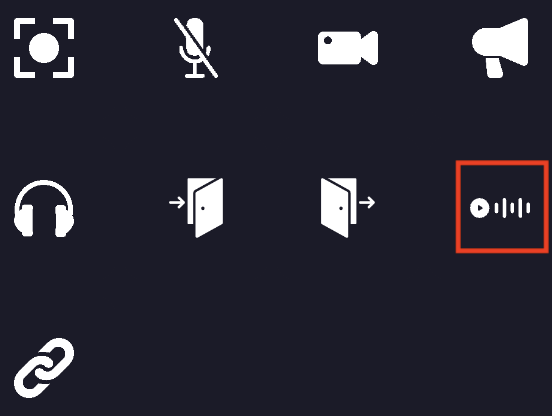

# Play sound property

On your map, you can define special zones where a sound will be played when a user enters the area.
Also, you can define an entity that will trigger a sound.

## Setting play sound area

When editing an area or an entity, you can add the play sound property to it. You must click on the "play sound" icon.

1. You must define the URL of the sound that will be played when the player enters the area.
2. You can define the volume of the sound. (0 to 1)
3. You can define the label of the button that will be displayed to the user. (optional)

