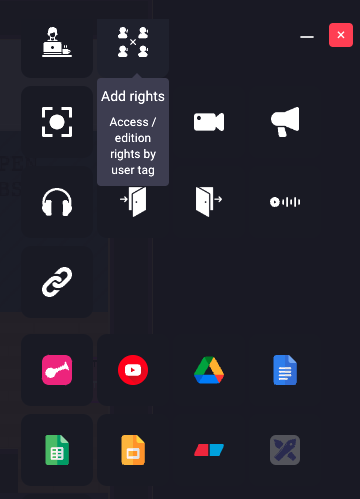
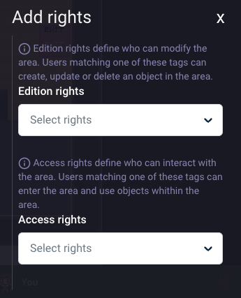
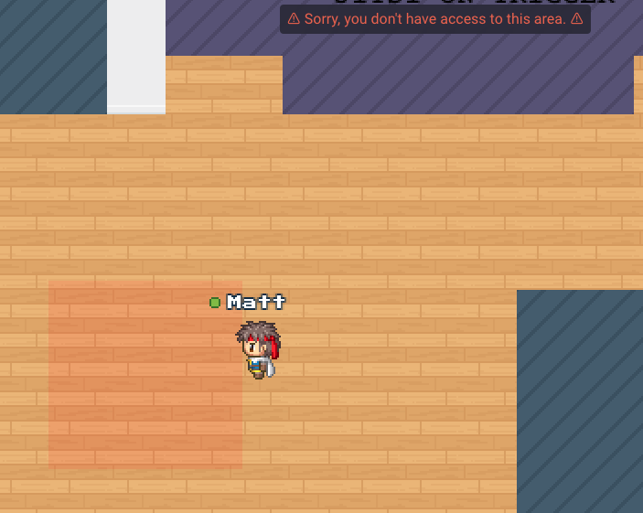
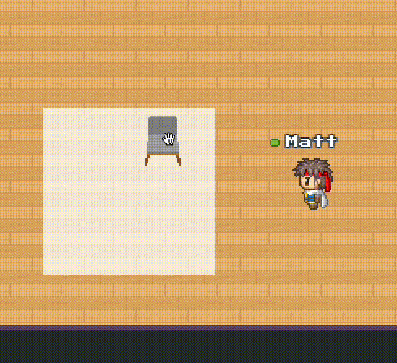

# Restricted area

## Description

An area with rights access is a restricted area. In this kind of area, allowed user can add objects in it, read object
and access the area.

## Create a restricted area

While editing an area, select the area rights option.

You can now define editing and access rights by specifying the user tags you want to allow.

## User without area access

A user without access to an area will be stopped near the restricted zone. A message will appear, and the restricted area will be highlighted in red.

## Place object for allowed user

An allowed user can place an object inside the area. They will have access to the entity editor and will be guided to place the object in the appropriate zone.

Only users with edition access tag can place object inside the area. Users with read access tag can only read object property and access the area.
