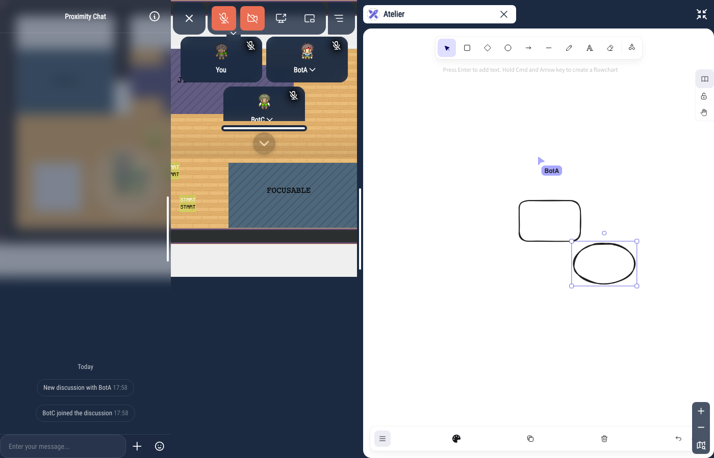

---

sidebar_position: 95

---

# Whiteboard

## Description

The whiteboard property attaches a collaborative whiteboard to an area. Everybody standing in the area draws on the same board, sees the others' drawings as they draw, and sees their cursors with their names.

The whiteboard is [Excalidraw](https://excalidraw.com), drawn by WorkAdventure itself in the side panel: there is no external website and no extra service to install. Drawings go through the WorkAdventure server only.

## Add a whiteboard to an area

While editing an area, select the "Whiteboard" property. You can choose when the board opens:

- **Show immediately on enter**: the board opens as soon as somebody walks into the area.
- **On action**: a message invites the user to press a key to open it. You can customize that message.

## Who can draw

The whiteboard follows the [Rights](restricted-area.md) property of the area:

- Without rights, everybody in the area draws.
- With rights, the users holding one of the **write tags** draw. The users holding only a **read tag** see the board but cannot change it.
- An area that only restricts who comes in (read tags, no write tags) lets everybody who is in draw.

The server checks these rights on every change, not only when the board opens.

## Following someone

Click the avatar of another user in the top right corner of the board to follow them: your view moves with theirs. Scroll or zoom to stop following.

## Clearing a board

While editing the area, the "Clear the whiteboard" button empties the board for everybody. Click it twice: the first click only asks for confirmation.

## Self-hosting

The whiteboard is enabled by the `WHITEBOARD_ENABLED` environment variable of the `play` container. On WorkAdventure SaaS, it is enabled per world with the "Excalidraw" application.
