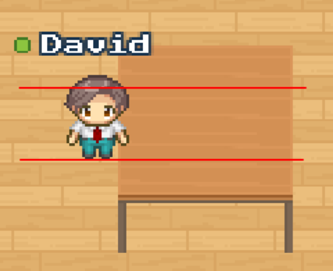
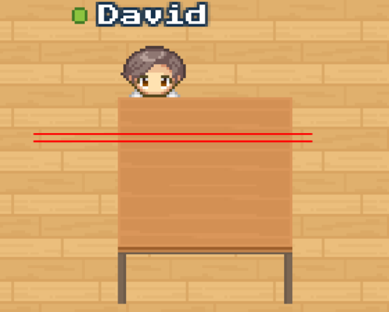

---

sidebar_position: 50

---

# Entity collections file format

Entity collections are JSON files that describe a collection of entities that can be placed on a map using the inline
map editor.

Each WAM file (the WorkAdventure map file format) can refer to one or more entity collections.

Typical extensions for entity collections are `.json` (though we might come up with a better extension name in the future).

There is currently no inline editor for entity collections (though this will come in the future). For now, you have to write the JSON file by hand.

## Example

```json
{
    "collectionName":"basic furniture",
    "tags":["furniture","office"],
    "collection":[
        {
            "name":"Basic Chair",
            "tags":["seat","basic"],
            "imagePath":"Furniture/Chair/ChairGreyDown.png",
            "direction":"Down",
            "color":"grey"
        },
        {
            "name":"Basic Chair",
            "tags":["seat","basic"],
            "imagePath":"Furniture/Chair/ChairBlueDown.png",
            "direction":"Down",
            "color":"blue"
        },
        {
            "name":"Basic Wood Table",
            "tags":["basic", "table"],
            "collisionGrid": [
                [ 0, 0 ],
                [ 1, 1 ],
                [ 1, 1 ]
            ],
            "depthOffset": -64,
            "imagePath":"Furniture/Table/TableBrown.png",
            "direction":"Down",
            "color":"orange"
        }
    ]
}
```

As you can see in this example, an entity collection has a name, a list of tags, and a list of entities.

## Entity properties

Each entity has the following properties:

- `name`: the name of the entity. This is the name that will be displayed in the Map Editor UI.
- `tags`: a list of tags that can be used to filter entities in the Map Editor UI.
- `imagePath`: the path to the image file that will be used to display the entity in the Map Editor UI (absolute URL, or relative to the entity collection file).
- `direction`: the direction of the entity. Valid directions are `Up`, `Down`, `Left` and `Right`.
- `color`: the color of the entity. This is the color that will be used to display the entity in the Map Editor UI.
- `collisionGrid`: a 2D array of numbers that describes the collision grid of the entity. This is used to determine if a player can walk through the entity or not. See the section below for more details.
- `depthOffset`: the depth offset of the entity. This is used to determine the order in which entities are displayed. See the section below for more details.

## Entity size

The size of the image loaded for an entity is not constrained. You do not have to stick to 32x32.
However, if your entity is "collidable" (i.e. if it has a collision grid), then the width and height should be multiples of 32.

## Entity variants

Entities with the same name will be grouped together in the Map Editor UI. Each variant of the entity can have a different color
and a different direction. Valid directions are `Up`, `Down`, `Left` and `Right`.

The entity "color" field must be a valid [CSS color name](https://www.w3.org/wiki/CSS/Properties/color/keywords) (like 
`red`, `blue`, `green`, `yellow`, `orange`, `purple`, `pink`, `grey`, `black`, `white`), or a valid CSS color code (like `#ff0000`).

## Collision grid

The collision grid is defined as a 2D array of zeros and ones. Each number represents a 32x32 pixel square in the entity image.

For instance, with the collision grid:

```json
"collisionGrid": [
    [ 0, 0 ],
    [ 1, 1 ],
    [ 1, 1 ]
],
```

the top third of the entity is not collidable, and the bottom two thirds are collidable (they cannot be traversed).

## Depth offset

The depth offset is used to alter the order in which entities are displayed.

Out of the box, the z-index of a sprite is set relative to the bottom y coordinate of the sprite.

 

This works well with mostly "vertical" objects like trees. When the feet of your Woka are "lower" than the trunk of the
tree, your Woka appears on top of the tree. Otherwise, the Woka is hidden behind the tree.

However, this does not work well with "horizontal" objects like tables.
For those, you will want to define a depth offset. The depth offset is a number that is added to the z-index of the sprite.

 

For “flat” objects, you often want to set the z-index to the y coordinate of the bottom of the rear feet.
In the example above, the table is 96 pixels high, a depth offset of -64 is a good value. It allows the Woka to be
behind the table when its feet are above the rear feet of the table. The Woka is in front of the table when its feet
are below the rear feet of the table.

## Referencing an entity collection in a WAM file

In order to be able to use your entity collection, you need to register it.

As of now, entity collections are registered in your map file (the `wam` file).

```json
{
  // ...
  "entityCollections": [
    {
        "url": "https://my-domain.com/collections/my-collection.json",
        "type": "file"
    }
  ]
}
```

The "entityCollections" property is an array of objects. Each object has two properties:

- `url`: the URL of the entity collection file. This can be an absolute URL, or a relative URL to the map file.
- `type`: the type of the entity collection. The only supported type so far is `file`.
