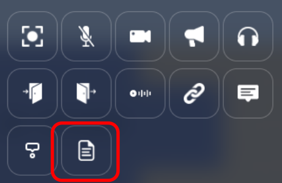
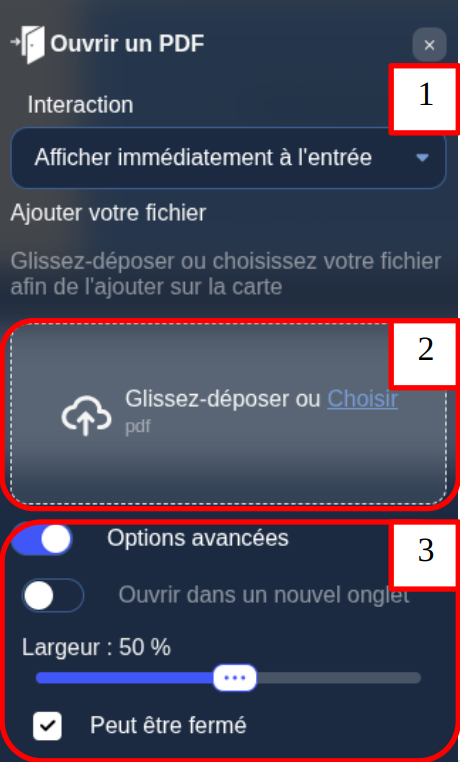

# Open document property

On your map, you can define entities that open a document when a user press space after comming to the entity.
From the map editor, you can upload the documents to be displayed.

:::note
The uploaded documents format can be PDF files, or images.
:::

## Configuring a open document entity

While editing an entity, click the "file" icon.

1. You can define the way the action is triggered.
2. You can drag and drop or select the PDF/image that will be opened when the player enters the entity.
3. Those settings are related to the way the action is triggered. You can choose to open the pdf in a new tab, or in a cowebsite, the size of the cowebsite, if it can be closed, etc ...

