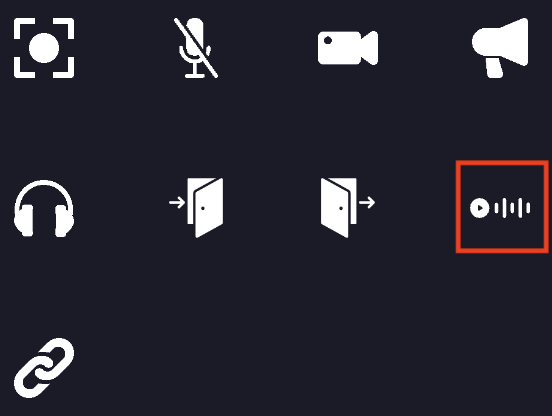
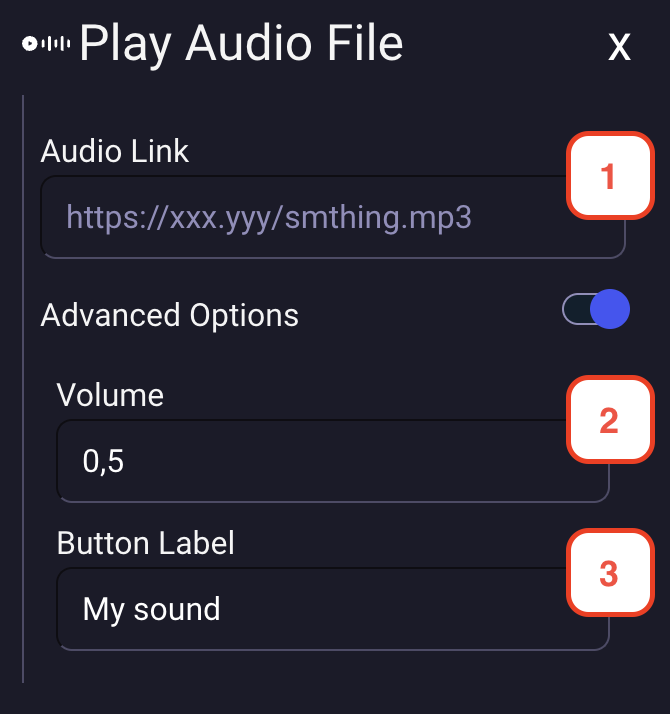

---

sidebar_position: 70

---

# Play sound property

On your map, you can define special zones where a sound will be played when a user enters the area. 
Also, you can define an entity that will trigger a sound.

## Setting play sound area

When editing an area or an entity, you can add the play sound property to it. You must click on the "play sound" icon.

1. You must define the URL of the sound that will be played when the player interacts with the entity or enters the area.
2. You can define the volume of the sound. (0 to 1)
3. You can define the label of the button that will be displayed to the user. (optional)

## Playing a sound for everyone

By default the sound is only heard by the player who triggers it. On an **entity**, the advanced
options offer a "Play for all users on the map" switch: every player of the map then hears the
sound, wherever they are standing. This is what turns an object into a gong or a jukebox.

When the switch is on, you can also set an **audible radius**, in pixels. Players further away than
this radius from the object hear nothing, and the sound fades as the radius is approached. Leave it
empty for the sound to be heard everywhere on the map.

The volume set on the property is applied on top of the radius, and each player keeps control of
their own audio player, so anyone can stop the sound on their side.

This option is not offered on areas: a sound played for everyone whenever anybody walks into a zone
would be a nuisance rather than a feature.
