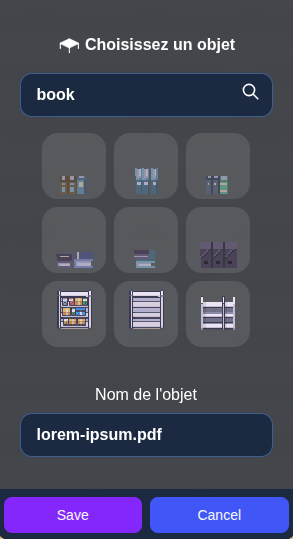

---

sidebar_position: 80

---

# Drag and drop files

:::note
This will create an entity to open the document you want to drop. If you want the entity to be the image you dropped, see: [custom entity](./index.md#uploading-an-object)
:::

You can create entities with a simple drag and drop of a file on the map.
It is a shortcut to create an entity with the [open document property](./open-file.md).

:::info
The uploaded documents format can be PDF files, or images.
:::

## Creating an open document entity

First, drop a file on the map.

1. First, choose the entity you will drop on the map. The first input lets you filter the entities.
2. After choosing the entity or keeping the default one you can change the name of the entity.
3. Finally you can save and click to place the entity wherever you want.

If you want to change the settings later, you can do it as described in the [open document property](./open-file.md#open-document-property).
