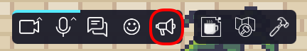

# Megaphone

Use the megaphone feature to stream your video / audio / screen to anyone from anywhere in the map.

:::info
This feature will typically be reserved to administrators and moderators that will be able to broadcast a message
to all participants in the map.
:::

## Configuring the megaphone

To configure the megaphone feature in WorkAdventure, follow the steps below.
Please note that [access to the map editor](index.md) is required to perform these configurations.

Megaphone settings will affect the entire map.

1. Open the map editor.
2. Click the "configure my room" icon. A configuration modal will appear.
3. Navigate to the megaphone tab.
4. Toggle the megaphone on or off.
5. Assign a unique name to your megaphone.
6. Define the scope of your megaphone. The scope can be set as "room" or "world". If you choose "room", the megaphone's range will be limited to the current room. If you select "world", the megaphone's reach will extend across multiple rooms. Individuals in any room configured with the same "space name" will be able to hear you when the megaphone is enabled.
7. Manage the megaphone's usage by applying rights restrictions. You can limit the megaphone's access to specific users or user groups using tags.

## How do I use the megaphone?

Click the megaphone icon in the action bar.
One click will enable the megaphone, and a second click will disable it.

## Frequently Asked Questions

### How do I know if the megaphone is enabled?

When the megaphone is enabled, the megaphone icon will be highlighted in orange and your camera feedback in the top right corner is highlighted in yellow.
Your Woka will have a little megaphone icon next to its head.

### I can't see the megaphone icon. How do I enable it?

If you can't see the megaphone icon in the action bar, please check:

- that the megaphone feature is enabled in the map editor (see [Configuring the megaphone](#content-configuring-the-megaphone))
- that you are logged in with an account that has one of the tags necessary to operate the megaphone (see [Configuring the megaphone](#content-configuring-the-megaphone))

### I have several rooms in my world. I want the megaphone to broadcast in part of the rooms but not in the others. How do I do that?

You can configure the megaphone to work in specific rooms by setting the megaphone's scope to "world" and by giving the same "space name" to all the rooms where you want the megaphone to work.
