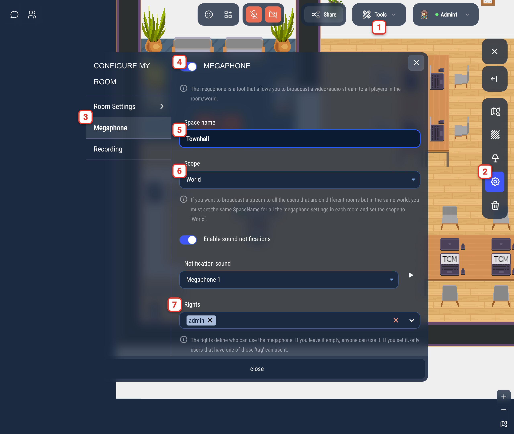
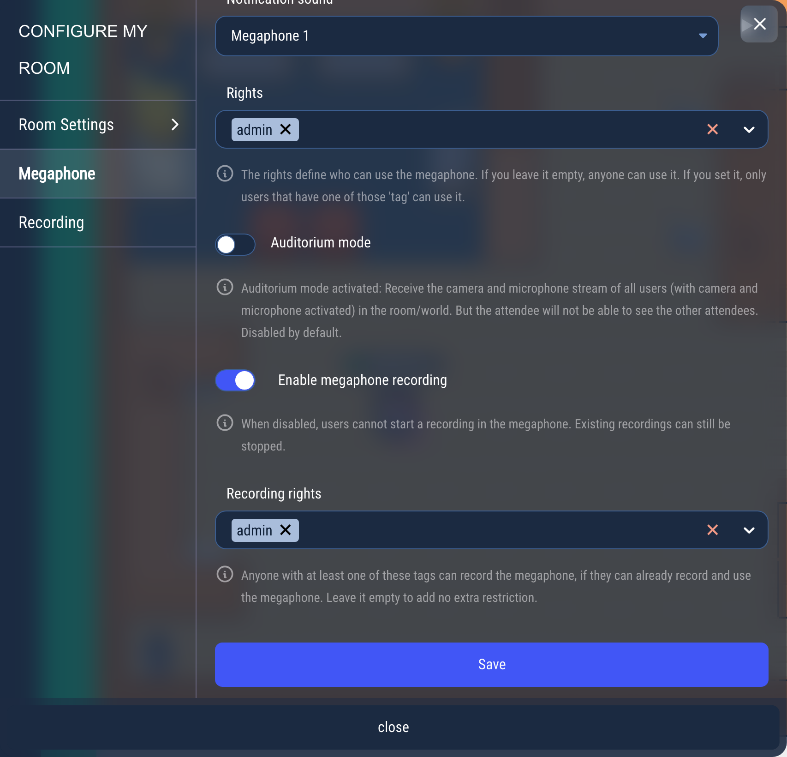
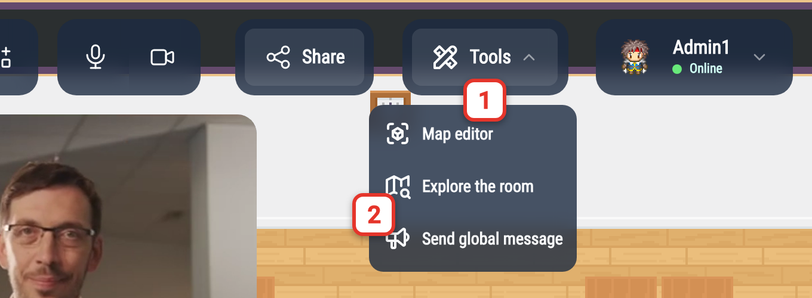
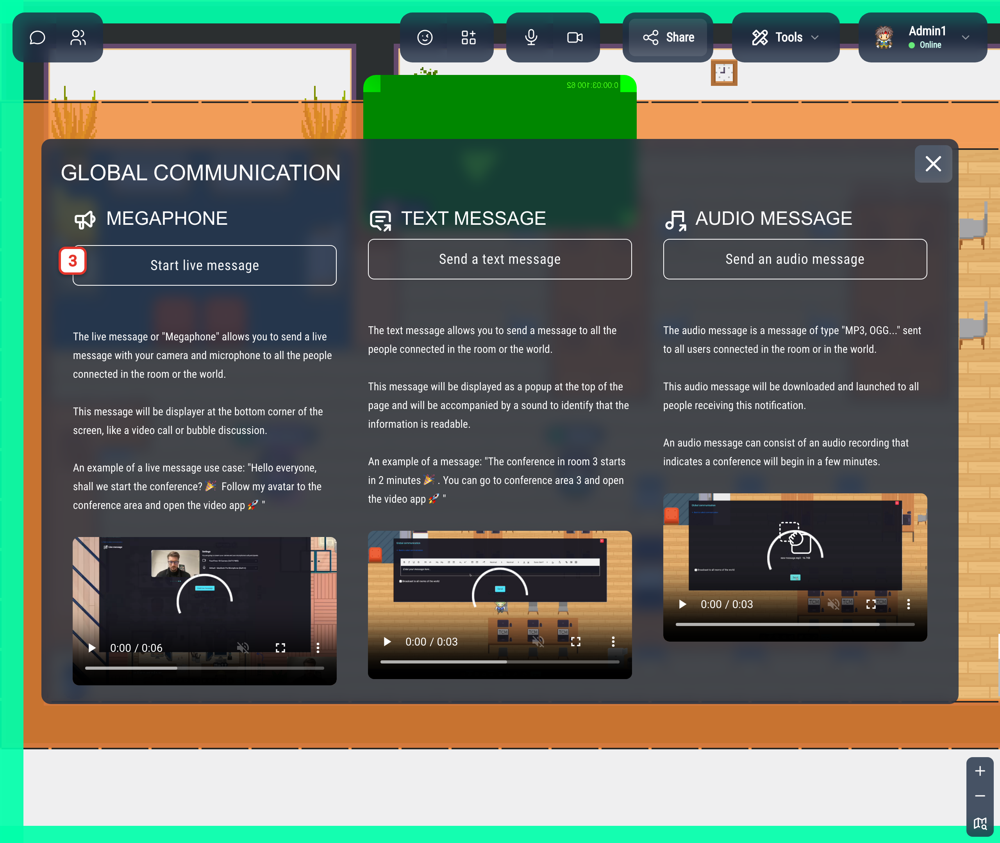
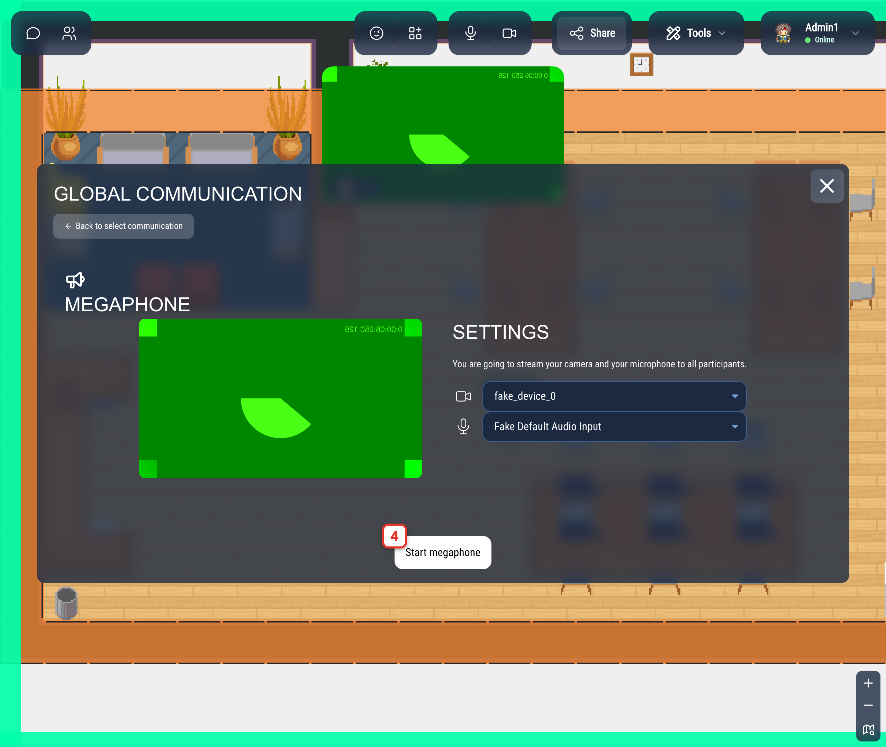
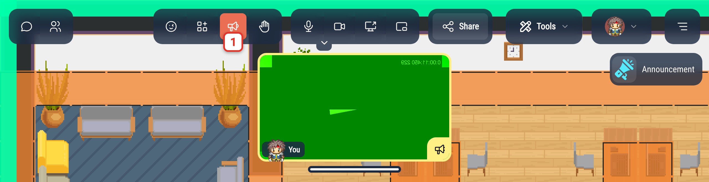
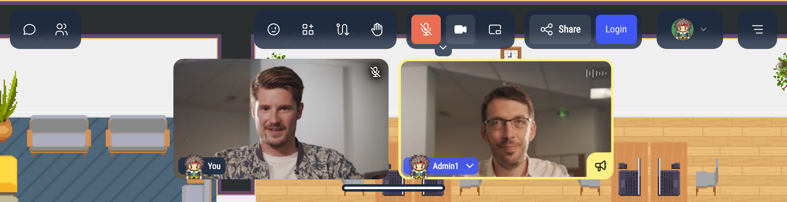

---

sidebar_position: 40

---

# Megaphone

Use the megaphone to stream your camera, microphone and screen to everyone in the room or the world, wherever they are on the map.

:::info
The megaphone is typically reserved to administrators and moderators, to broadcast a live message to all participants.
:::

:::tip
To stream only to the people in one part of the map (a stage and its audience), use a [podium](area-editor/broadcast.md) instead.
:::

## Configuring the megaphone

Megaphone settings are stored in the map: they apply to everyone in this room.
Please note that [access to the map editor](index.md) is required to perform these configurations.

1. Open the map editor (**Tools** > **Map editor** in the action bar).
2. Click the "configure my room" icon. A configuration modal will appear.
3. Navigate to the **Megaphone** tab.
4. Toggle the megaphone on or off.
5. Give a name to your megaphone in **Space name**.
6. Choose the **Scope**:
   - **Room**: the megaphone reaches everyone in the current room only.
   - **World** (default): the megaphone reaches every room of the world that has the megaphone enabled with the same space name and the **World** scope.
7. In **Rights**, choose the tags of the users allowed to use the megaphone. If you leave it empty, anyone can use it.

The tab also offers the following options:

- **Enable sound notifications** (on by default): a sound is played to everyone when someone starts broadcasting through the megaphone.
  Choose the sound in **Notification sound**. The sound is not played to users whose status mutes notifications.
- **Auditorium mode** (off by default): the person broadcasting sees the camera of every participant who has their camera on.
  The participants do not see each other, and nobody in the audience is heard: only the person broadcasting speaks.
- **Enable megaphone recording** (off by default): allows recording what is broadcast through the megaphone.
  In **Recording rights**, you can restrict recording to some tags. The user must also be allowed to record in the room
  (see the **Recording** tab) and to use the megaphone. Turning recording off does not stop a recording in progress.

Click **Save** to apply the settings.

:::caution
The megaphone settings belong to each map. To broadcast to several rooms of a world, configure the megaphone in each of
them with the same space name, the **World** scope and the same **Auditorium mode** setting.
Rooms where the megaphone is disabled do not receive the broadcast.
:::

## How do I use the megaphone?

1. Click **Tools** in the action bar.
2. Click **Send global message**.

3. In the **Megaphone** section, click **Start live message**.

4. Turn on your camera, your microphone and/or your screen sharing (at least one of them), choose your camera and microphone if needed,
   then click **Start megaphone**.

Everyone in the room or the world now sees and hears you, like in a video call.
Your video is framed in yellow with a megaphone badge, and the megaphone button appears in the action bar, highlighted.

To stop, click the megaphone button in the action bar (1), or **Stop megaphone** in the **Global communication** window.

The participants see your video framed in yellow, with the same megaphone badge:

From the same window, administrators can also send a **text message** or an **audio message** to everyone.

### Raising a hand

While you are broadcasting, participants can raise their hand. Their raised hand appears in a **Raised hands** panel
that only you and the administrators see. From this panel, you can lower hands or **Give the floor** to someone:
their camera and microphone are then broadcast to everyone, until you click **Take back the floor** or they give it back.

### Recording the megaphone

If megaphone recording is enabled and you have the rights, click the record button in the action bar to record the broadcast.
If you are also in a discussion you can record, choose **Record megaphone**.

## Frequently Asked Questions

### How do I know if the megaphone is enabled?

While you are broadcasting, the megaphone button of the action bar is highlighted in orange and your video is framed in yellow, with a megaphone badge.
Participants get an "Announcement" notification and, if sound notifications are enabled, hear a sound when the broadcast starts.

### I can't see the "Send global message" button. How do I enable it?

If you can't see **Send global message** in the **Tools** menu, please check:

- that the megaphone is enabled in this room (see [Configuring the megaphone](#configuring-the-megaphone))
- that you are logged in with an account that has one of the tags allowed to use the megaphone (see [Configuring the megaphone](#configuring-the-megaphone))

Administrators always see the button, but **Start live message** stays unavailable if the megaphone is disabled or if they don't have one of the allowed tags.

### I have several rooms in my world. I want the megaphone to broadcast in some of the rooms but not in the others. How do I do that?

Set the scope to **World** and give the same space name to the megaphone of every room that should receive the broadcast.
Rooms with another space name, or with the megaphone disabled, will not receive it.

### Some participants don't hear the megaphone. Why?

Check that every room of the world is configured the same way: megaphone enabled, same space name, **World** scope and
same **Auditorium mode** setting. Participants in a room configured differently may not receive the broadcast.
