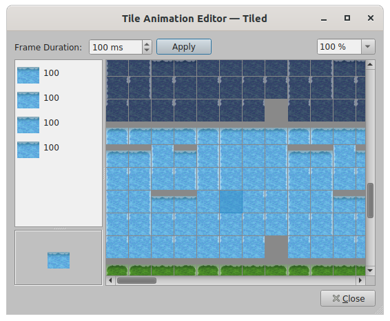

# Animating WorkAdventure maps

A tile can run an animation in loops, for example to render water or blinking lights. Each animation frame is a single
32x32 tile. To create an animation, edit the tileset in Tiled and click on the tile to animate (or pick a free tile to
not overwrite existing ones) and click on the animation editor:

You can now add all tiles that should be part of the animation via drag and drop to the "playlist" and adjust the frame duration:

The tile animation editor

You can preview animations directly in Tiled, using the "Show tile animations" option:

The Show Tile Animations option

:::info Tip
The engine does tile-updates every 100ms, animations with a shorter frame duration will most likely not look that good or may even do not work.
:::
