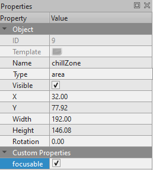
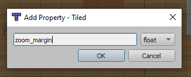
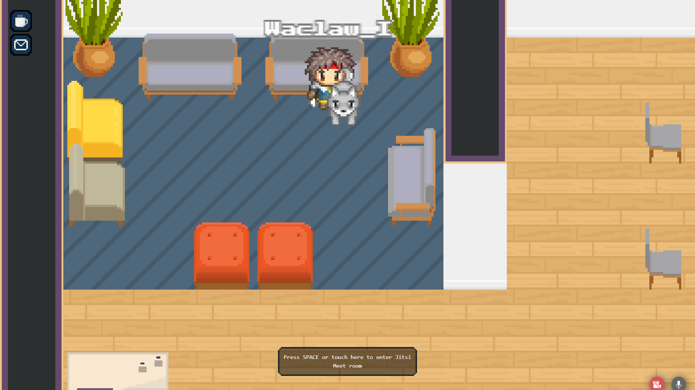

# Working with camera

## Focusable Area

It is possible to define special regions on the map that can make the camera zoom and center on themselves. We call them "Focusable Area". When player gets inside, his camera view will be altered - focused, zoomed and locked on defined area, like this:

### Adding new **Focusable Area**:

1. Make sure you are editing an **Object Layer**

   

2. Select **Insert Rectangle** tool

   

3. Define new object wherever you want. For example, you can make your chilling room event cosier!

   

4. Make sure your object is of class "area"!

   

5. Edit this new object and click on **Add Property**, like this:

   

6. Add a **bool** property of name _focusable_:

   

7. Make sure it's checked! :)

   

All should be set up now and your new **Focusable Area** should be working fine!

### Defining custom zoom margin:

If you want, you can add an additional property to control how much should the camera zoom onto focusable area.

1. Like before, click on **Add Property**

   

2. Add a **float** property of name _zoomMargin_:

   

3. Define how much (in percentage value) should the zoom be decreased:

   

   For example, if you define your area as a 300x200 rectangle, setting this property to 0.5 _(50%)_ means the camera will try to fit within the viewport the entire area + margin of 50% of its dimensions, so 450x300.

   - No margin defined

     

   - Margin set to **0.35**

     
