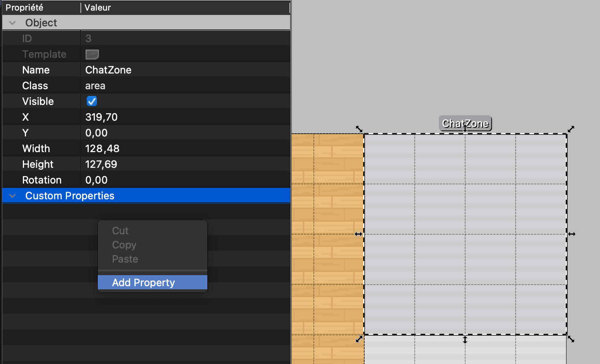
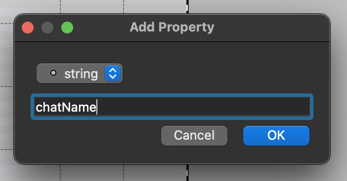
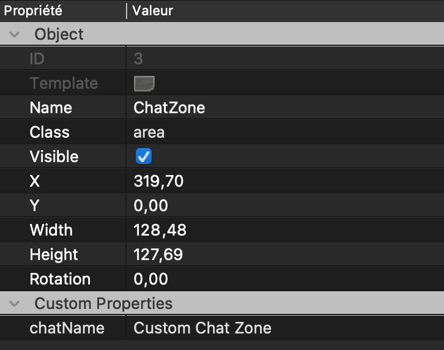
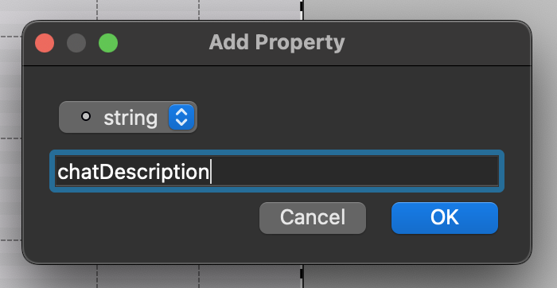
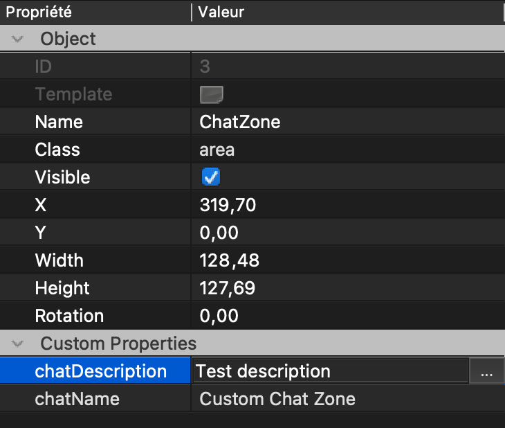

---

sidebar_position: 100
title: Chat zones

---

# Working with chat

## Chat zones

It is possible to define special regions (zones) on the map that can allow any user who is inside to access a specified chat. We call them "chat zones". When player gets inside, a new room will be added in his chat :

import ReactPlayer from 'react-player'

<ReactPlayer width="100%" loop={true} playing controls url='/docs/map-building/images/chat/zones/0_chat_zones.mp4' />

### Adding new **chat zone**

1. Make sure you are editing an **Object Layer**

2. Select **Insert Rectangle** tool

3. Define new object wherever you want.

4. Make sure your object is of class "area" !

5. Edit this new object and click on **Add Property**, like this :

6. Add a **string** property of name *chatName*

7. Make sure you defined a name for your Chat

8. Add a **string** property of name *chatDescription*

9. Make sure you defined a description for your Chat

All should be set up now and your new **chat zone** should be working fine!