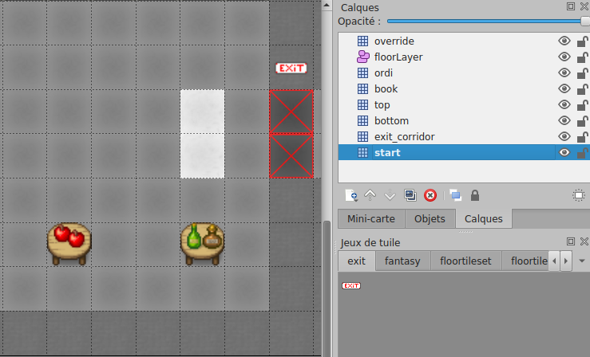
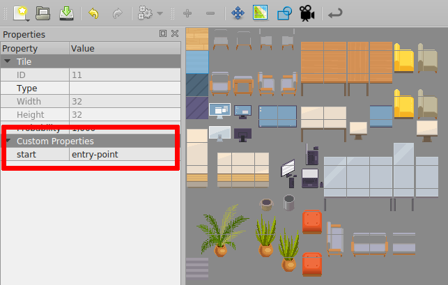

---

sidebar_position: 30

---

# Entries and exits

:::caution Important
While the information below is still valid, we recommend you to use the new [inline map editor](editor/) to define entries and exits.
The inline map editor is easier to use and can be accessed directly from WorkAdventure.
:::

<iframe width="100%" height="480" src="https://www.youtube.com/embed/MuhVgu8H7U0" title="Building your map - Defined entries and exits" frameborder="0" allow="accelerometer; autoplay; clipboard-write; encrypted-media; gyroscope; picture-in-picture; web-share; fullscreen" allowfullscreen></iframe>

## Defining a default entry point

In order to define a default start position, you MUST create a layer named "`start`" on your map. This layer MUST contain at least one tile. The players will start on the tile of this layer. If the layer contains many tiles, the players will start randomly on one of those tiles.



In the screenshot above, the start layer is made of the 2 white tiles. These tiles are not visible to the end user because they are hidden below the "bottom" layer that displays the floor of the map.

:::info Pro tip
If you expect many people to connect to your map at the same time (for instance, if you are organizing a big event), consider making a large start zone. This way, users will not all appear at the same position and will not pop randomly in a chat with someone connecting at the same moment.
:::

## Defining exits

In order to place an exit on your scene that leads to another scene:

*   You must create a specific layer. When a character reaches ANY tile of that layer, it will exit the scene.
*   In layer properties, you MUST add "`exitUrl`" property. It represents the URL of the next scene. You can put relative or absolute URLs.
*   If you want to have multiple exits, you can create many layers. Each layer has a different key `exitUrl` and has tiles that represent exits to another scene.


:::caution Note
In older releases of WorkAdventure, you could link to a map file directly using properties `exitSceneUrl` and `exitInstance`. Those properties are now **deprecated**. Use "`exitUrl`" instead.
:::

## Understanding map URLs in WorkAdventure

There are 2 kinds of URLs in WorkAdventure:

*   Public URLs are in the form `https://play.workadventu.re/_/[instance]/[server]/[path to map]`
*   Private URLs (used in paid accounts) are in the form `https://play.workadventu.re/@/[organization]/[world]/[map]`

Assuming your JSON map is hosted at "`https://example.com/my/map.json`", then you can browse your map at "`https://play.workadventu.re/_/global/example.com/my/map.json`". Here, "global" is a name of an "instance" of your map. You can put anything instead of "global" here. People on the same instance of the map can see each others. If 2 users use 2 different instances, they are on the same map, but in 2 parallel universes. They cannot see each other.

## Defining several entry points

Often your map will have several exits, and therefore, several entry points. For instance, if there is an exit by a door that leads to the garden map, when you come back from the garden you expect to come back by the same door. Therefore, a map can have several entry points. Those entry points are "named" (they have a name).

In order to create a named entry point:

You can create a new layer for your entry point or use an existing layer with named tiles.

*   If you don't use the layer named "`start`", you MUST add a boolean "`startLayer`" property to the layer properties. It MUST be set to true.
*   If you use this method, when a character enters the map by this entry point, it will enter randomly on ANY tile of that layer. The name of the entry point is the name of that layer.


You can also use the tiles properties to create entry point.

*   To do that, you will need to have a layer named "`start`" or with the "`startLayer`" property. Then you MUST add a string "`start`" property to a tile than you use in that layer. The name of the entry point is the value that property.
*   If you use this method, when a character enters the map by this entry point, it will enter on ANY tile of the same kind in that layer.



Notes :

*   Two tiles with a string "start" property with different value can be in the same layer of entries.
*   A tile with a string "start" property that is not in a layer of entries won't usable as an entry point.

How to use entry point :

*   To enter via this entry point, simply add a hash with the entry point name to the URL ("#[_entryPointName_]"). For instance: "`https://workadventu.re/_/global/mymap.com/path/map.json#my-entry-point`".
*   You can of course use the "#" notation in an exit scene URL (so an exit scene URL will point to a given entry scene URL)

## Defining destination point with moveTo parameter

We are able to direct a Woka to the desired place immediately after spawn. To make users spawn on an entry point and then, walk automatically to a meeting room, simply add `moveTo` as an additional parameter of URL:

*Use default entry point*
```
.../my_map.json#&moveTo=exit
```
*Define entry point and moveTo parameter like this...*
```
.../my_map.json#start&moveTo=meeting-room
```
*...or like this*
```
.../my_map.json#moveTo=meeting-room&start
```
*...or even like this!*
```
.../my_map.json#start&moveTo=200,100
```

For this to work, moveTo must be equal to the x and y position, layer name, or object name of interest. Layer should have at least one tile defined. In case of layer having many tiles, user will go to one of them, randomly selected.

