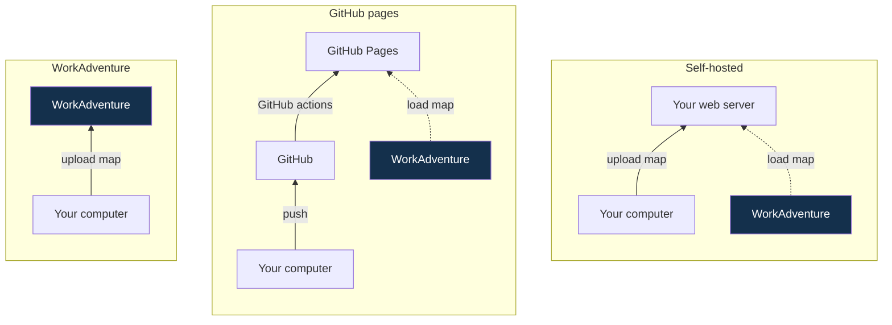

# Publishing your map

You have several options to host your map.

- [**Upload your map to the WorkAdventure server**](./wa-hosted) (_recommended_): we recommend this option as it is the easiest to
  set up. Note that you can upload the map to the WorkAdventure server either locally, or from a CI/CD pipeline (if you are a developer)
- [**Host your map on GitHub Pages**](./github-pages): when using this option, you push your map on a GitHub repository and GitHub
  will host your map for you. This is a good option if you are a developer and do not have a web server.
- [**Host your map on a self-hosted web server**](./hosting): if you want maximum freedom, or if you have special
  privacy needs, you can host your map on your own web server. WorkAdventure will load your map wherever your map is hosted.

