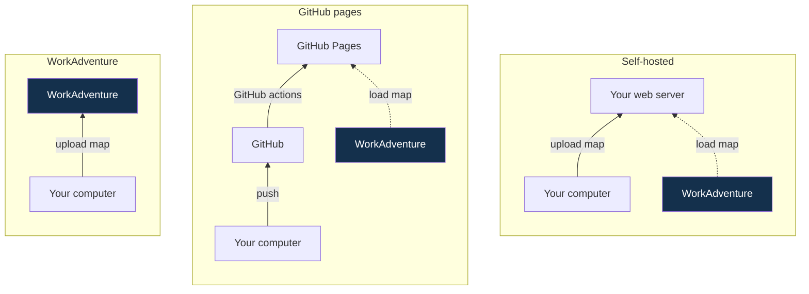

---

sidebar_position: 11

---

# Publishing your map

You have three ways to host your map, but only one is recommended for new projects.

## Recommended (start here) 

[Upload your map to the WorkAdventure server](./wa-hosted).
This is the easiest setup and the supported path going forward, whether you upload locally or from a CI/CD pipeline.

    <a href="./wa-hosted" class="button button--primary">Upload your map to the WorkAdventure server &gt;</a>

## Legacy options

In the past, WorkAdventure could not host maps directly on its server. Therefore, we had to rely on third-party websites for map hosting.
These options are still supported, but they are not recommended for new projects. They are more complex to set up and maintain, and they do not offer any significant advantage over hosting on the WorkAdventure server.

- [**Host your map on GitHub Pages**](./github-pages): push your map to a GitHub repository and GitHub hosts it for you.
- [**Host your map on a self-hosted web server**](./hosting): host on your own web server for maximum freedom or special privacy needs.

