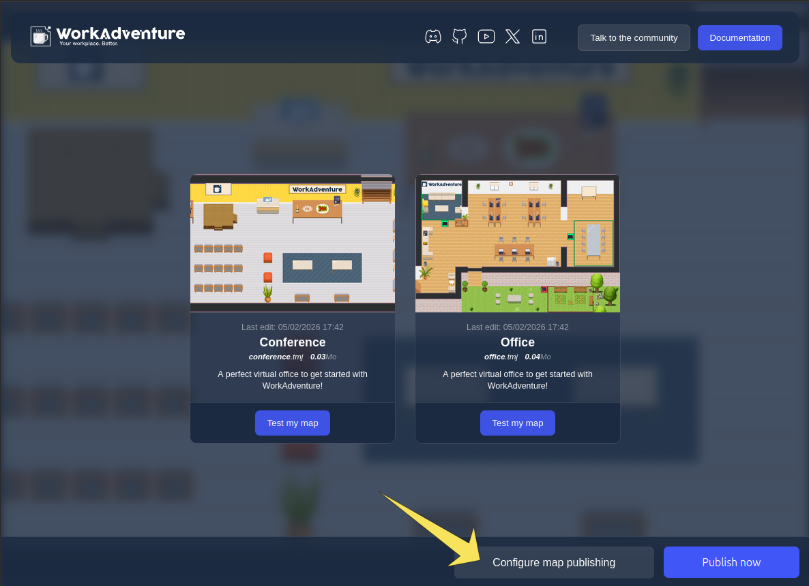
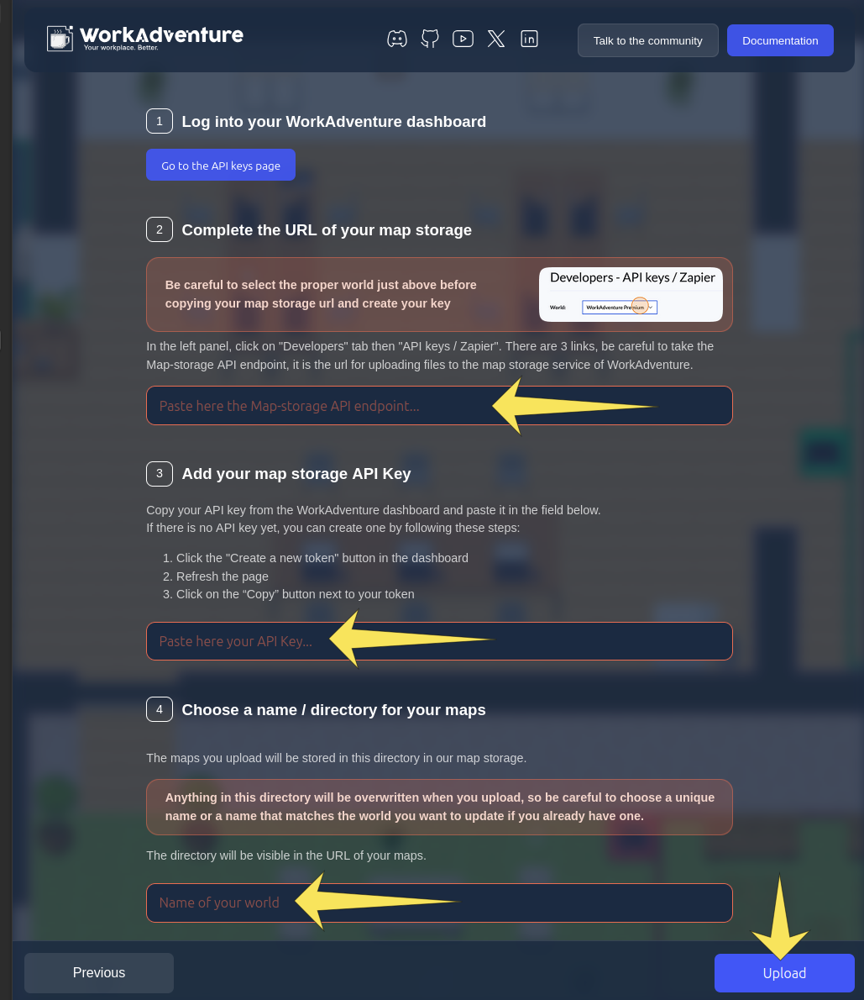

import Tabs from '@theme/Tabs';
import TabItem from '@theme/TabItem';

# Upload your Map to WorkAdventure

:::info
As of May 2024, this is the recommended way of hosting your maps
:::

<iframe width="100%" height="480" src="https://youtube.com/embed/WNcbEHm2Hlg" title="Upload your map - With the script" frameborder="0" allow="accelerometer; autoplay; clipboard-write; encrypted-media; gyroscope; picture-in-picture; web-share; fullscreen" allowfullscreen></iframe>

In the following sections, we will explain how to upload your maps to the WorkAdventure 'map storage' server from [the starter-kit web app](#using-the-starter-kit-web-app), from [the command line](#using-the-command-line) or [from a CI/CD pipeline](#using-github-and-a-cicd-pipeline).

## Getting your credentials

Whatever the method you choose, you will need to provide 2 important pieces of information:

- The URL of your map storage: this is the URL of the server where your map files will be stored.
- Your Map Storage API Key: this is a secret token that allows you to upload files to the map storage. Anyone with this token can upload files to your map storage, so keep it safe!

Where you get this information depends on the kind of WorkAdventure version you are using (SaaS version or self-hosted).

Where you get this depends on the kind of WorkAdventure server you are using.
If you are using the SaaS version of WorkAdventure, then you will find the information on the Admin panel.
If you are self-hosting WorkAdventure, then you will have to configure the map storage yourself.

<Tabs>
<TabItem label="SaaS version" value="saas" default>

1. **The URL of your map storage:**
   You can find it in [your admin account](https://admin.workadventu.re).
   Log in.
   In the left panel, click on "Developers" tab then "API keys / Zapier".
   There are 3 links, be careful to take the `Map-storage API endpoint`, it is the url for uploading files to the map storage service of WorkAdventure.

   
   

   :::info Select the World
   Be careful to select the proper world just above before copying your map storage url and create your key
   :::
   

2. **Your Map Storage API Key:**
   You can find it in the same section.
   There you can create a new token and use it as your API Key.

</TabItem>

<TabItem label="Self-hosted" value="self-hosted">

**Your API Key:**

The system administrator that installed the WorkAdventure server should have provided you with an API key.

- For **docker-compose deployements**, it is the value of the `MAP_STORAGE_AUTHENTICATION_TOKEN` environment variable.
  Also, be sure to have the `MAP_STORAGE_ENABLE_BEARER_AUTHENTICATION` set to `"true"` in your `.env` file.
- For **Helm deployments** , it is the value of the `mapstorage.env.AUTHENTICATION_TOKEN` value in your `values.yaml` file.
  Also, be sure to have the `mapstorage.env.ENABLE_BEARER_AUTHENTICATION` set to `"true"` in your `values.yaml` file.

**The URL of your map storage:**

The map storage URL depends on your install.

- For **docker-compose deployments**, it should be `https://[workadventure-server]/map-storage/` if you are using the default configuration.
- For **Helm deployments**, it should also be `https://[workadventure-server]/map-storage/` if you are using `singleDomain: true` in your `values.yaml` file,
  or `https://mapstorage.[workadventure-server]` if `singleDomain: false` in your `values.yaml` file.

</TabItem>
</Tabs>

## Using the starter-kit web app

The map starter kit comes with a web app that allows you to test your map locally and then to upload your maps to the 
WorkAdventure server. This is the simplest way to upload your maps.

:::info
Before running the commands below, please ensure you installed the required tools and followed the instructions in the [Build your Map with Tiled](../) documentation.
:::

You probably already started the web app to test your map locally. If not, you can start it by running the following command in your terminal:

```bash
npm run start
```

A web page will open with the list of your maps.

In the bottom right corner, click the "**Configure map publishing**" button.



This will start the configuration process. Follow along the instructions and fill in the required information (map storage URL, API key, upload directory).

import image1 from './images/configure-step-1.png';
import image2 from './images/configure-step-2.png';

<table class="table">
    <tr>
        <td>

        </td>
        <td>

        </td>
    </tr>
</table>




A click on the upload button will trigger the upload of your map to the WorkAdventure server. Please be patient as before the
upload takes place, the map will be optimized and built. This can take from a few seconds to a few minutes for big maps.

## About the upload "directory"

When you upload your map, you can specify a "directory" where your map files will be stored in the WorkAdventure server.

:::info
When you upload your files, all the maps in your "starter-kit" project will be uploaded to the WorkAdventure server at once.
You cannot decide to upload only one map of your project. So the "directory" is not a directory for a single map, but a directory for the whole project.
:::

:::caution Uploading maps overwrites existing files!
When you upload files to the WorkAdventure server, all the files previously uploaded in the same directory will be removed
and replaced by your new files. If you keep the "directory" empty, this means that
all the files in your world will be removed and replaced by your new files.
:::

Note that even if the files are replaced, the customization you did to the map in the inline map-editor are kept.

:::info
You can have several projects (started from several starter kits), stored in different directories, uploaded to the same WorkAdventure world.
This can be useful if you want to have different versions of your map (for instance a "test" version and a "production" version) or if you want to work on several maps at the same time.
:::

The directory name appear in the URL of your map. Be sure to pick a good name for it, as it will be visible by your users.

When the upload is done, you will either be redirected to the list of your maps in the admin dashboard (SaaS version), or will be shown a list of all your
uploaded maps (self-hosted version). You can click on any of these maps to access them in WorkAdventure.

## Using the command line

If you don't like UIs and prefer using the command line, you can also upload your maps using a command line tool.

:::info
Before running the commands below, please ensure you installed the required tools and followed the instructions in the [Build your Map with Tiled](../) documentation.
:::

In order to use this package run the command in your terminal:

```bash
npm run upload
```

Know that you can also use this command with flags:

- -u for the URL of the Map storage
- -k for the API KEY
- -d for the Upload directory

Here is how you can use flags :

```bash
npm run upload -- -u your-map-storage-url -k your-api-key  -d your-directory
```

If you do so, keep in mind that these secret variables will not be saved in `.env` and `.env.secret` files.

So on the first run (without flags), the command will ask you the URL of your world's map storage, your API Key and a directory to put your files.

After answering these questions, the script will start to upload your files. To make sure it worked, uou need to see something like this at the end: `Upload done successfully!`.

:::info
Your settings have been saved in a `.env` file (and the API Key in the `.env.secret` file). If you need to change them, you can edit these files.
:::

Now, for every change you want to make public, you just have to run the command again!

### Accessing your map

<Tabs>
<TabItem label="SaaS version" value="saas" default>

Once the upload is done, the easiest way to access your map is to go to your admin dashboard at [admin.workadventu.re](https://admin.workadventu.re).
From here, you will see your map listed in the "world" section. Just click the map you want to access, and it will open in WorkAdventure.

The URL of your map will be:

```
https://play.workadventu.re/@/[organization-name]/[world-name]/[upload-directory]/[path-to-your-map-directory]/[map-name].wam
```

For instance, if your organization name is `my-org`, your world name is `my-world`, if when uploading your map, you decided
to upload it in the `/` directory and if your Tiled map file is `/map/my-map.tmj`, the URL of your map will be:

```
https://play.workadventu.re/@/my-org/my-world/map/my-map.wam
```

Note that the `.tmj` file extension is replaced by a `.wam` extension when uploaded. This is because for each `.tmj` file
you uploaded, WorkAdventure will create a `.wam` file that contains the map data and any modifications made to the map
using the WorkAdventure Map Editor.

:::info Custom domain
If you are using a [custom domain](/admin/rebranding#using-a-custom-domain), the URL will be slightly different. It will be:

```
https://[custom-domain]/@/[upload-directory]/[path-to-your-map-directory]/[map-name].wam
```
:::

</TabItem>

<TabItem label="Self-hosted" value="self-hosted">

Once the upload is done, your map URL will be:

```
https://[workadventure-server/~/[upload-directory]/[path-to-your-map-directory]/[map-name].wam
```

For instance, if your Tiled map file is `/map/my-map.tmj`, and if when you upload your map, you uploaded it in the `/` directory,
the URL of your map will be:

```
https://play.workadventu.re/~/map/my-map.wam
```

Note that the `.tmj` file extension is replaced by a `.wam` extension when uploaded. This is because for each `.tmj` file
you uploaded, WorkAdventure will create a `.wam` file that contains the map data and any modifications made to the map
using the WorkAdventure Map Editor.

</TabItem>
</Tabs>


## How it works

When you run the `npm run upload` command, the following things happen:

1. First, your map files are "built". During the build phase:
   1.1. The tilesets of your map are optimized and chunked. Any tile that is not used is removed. This is done to reduce the total size of the map and results in faster loading time.
   1.2. The scripts of your map are compiled and bundled. This happens if you developed some specific features on your map using the Scripting API. The compilation phase translates files from Typescript to Javascript. The bundling phase takes all the Javascript files and merges them into a single file.
   1.3. The result of the build is written in the dist directory.
   1.4. The content of the public directory is copied to the dist directory.
2. Then, a ZIP file of the dist directory is created and sent to the WorkAdventure "map-storage" server. This server is in charge of hosting the map files. When it receives the ZIP file, it unzips it and stores the files in the directory you configured as 'Upload directory'. For each `.tmj` file the server finds, it will check if there exists a matching `.wam` file. If not, it will create one. WAM files are used to store any part of the map edited by the Map editor of WorkAdventure (like the list of objects or areas, the microphone settings, etc.)

:::danger Backup your original files!
If you're uploading on WorkAdventure server, it only stores the "build" you send to it. It does not store the original files you used to create the map. If you want to update your map, you need to update the original files on your computer and run the `npm run upload` command again. So do not think you can get back the original files from the WorkAdventure server. It is your responsibility to store the original map files in a safe place in case you want to modify those (like GitHub).
:::

:::info Wrapping things up
In this chapter, we saw how to upload your map from your computer to the WorkAdventure server using a command line.
This works well and for small projects, this is probably the best way to go.
In the next chapter, a more robust way to store and work on your map files: GitHub's CI/CD.
:::

## Using GitHub and a CI/CD pipeline

<iframe width="100%" height="480" src="https://youtube.com/embed/FvS63eHeKi0" title="Upload your map using GitHub CI/CD" frameborder="0" allow="accelerometer; autoplay; clipboard-write; encrypted-media; gyroscope; picture-in-picture; web-share; fullscreen" allowfullscreen></iframe>

A great place to store your original files is in a Git repository (like GitHub or Gitlab). If you are a developer, you probably already know about these. A Git repository offers the following advantages:

- you store your files **in a safe place**
- you can **work with other people** on the same map
- you can **track the changes** you made to the map
- you can **revert to a previous version** of the map if you made a mistake
- you can use a **CI/CD pipeline** (like "GitHub Actions") to automatically upload your map to the WorkAdventure server when you push changes to the repository.

The map starter kit comes with a GitHub Actions workflow that is designed to upload your map to the WorkAdventure server when you push your changes to the `master` branch of your repository. It also means you can now have a private repository instead of a public one, because we won't use GitHub Pages anymore (GitHub free hosting).

:::caution Git is complex
Git is a powerful tool, but it can be complex to use and is very targeted at developers. If you are not familiar with Git, you should probably start with the "command line" solution explained in the previous chapter.
:::

## Configuring your project for CI/CD

If you used the command line solution explained in the previous chapter, you will notice that the upload command generates
2 files:

- `.env` that contains the URL of the Map storage
- `.env.secret` that contains the API Key

The `.env` file can be commited to your Git repository. However, the `.env.secret` file should **never** be commited.
Indeed, it contains your map storage API Key, and if someone gets access to it, they could upload files to your map storage!

Instead, you should use the "secrets" feature of GitHub to store your private information. This way, the API key is not stored in the repository.

<details>
  <summary>Learn how to configure a secret in GitHub</summary>
<div>

- Go to your GitHub repository
- Click on the "Settings" tab
  
- Click on the "Secrets and variables" link in the left panel
  
- Click on the "Actions" link
  
- Finally, click on the "New repository secret" button
  

</div>
</details>

You should create a secret named `MAP_STORAGE_API_KEY` and paste your map storage API Key there. See the [previous section](#using-the-command-line) to know how to get your API key.

*Note that you can optionally create a `MAP_STORAGE_URL` and a `UPLOAD_DIRECTORY` as well and completely bypass the `.env` file, if you need to.*
*If you have both, the variables from GitHub secrets will be used in priority when uploading via the CI.*

Now, for every change you want to make public, you just have to commit and push to your repository! Just wait a few minutes, and your map will be propagated automatically on your server.

## Troubleshooting

### Typescript error

If you are doing some development with the Scripting API, you may encounter Typescript errors when you run the `npm run upload` command.
Indeed, the `npm run upload` command first performs a build of your Typescript files. If there is a Typescript error, the build will fail.

The error message will be displayed in your terminal. You should fix the error and run the `npm run upload` command again.

:::note
When testing your script locally, you are using Vite. Vite is only transpiling Typescript files. It turns them into Javascript without doing any
actual type checking. This is why you can have **a script working locally but failing to build**.
:::

### Checking the dist directory

Remember the map(s) uploaded to the WorkAdventure server is the content of the `dist` directory. If things are working locally, but act strangely on the server (sound files not playing, HTTP 404 errors, etc...), you should check the content of the `dist` directory.

You can trigger a build of your map by running the following command:

```bash
npm run build
```

Do not forget that if you want to put random files in the `dist` directory, you should put them in the `public` directory.
The content of the `public` directory is copied 'as is' to the `dist` directory during the build phase.

### My map is not updated (using GitHub)

When you push changes to your repository, the GitHub Actions workflow is triggered. It will build your map and upload it to the WorkAdventure server.
If you see that your map is not updated, you should check the "Actions" tab of your repository to see if the workflow was triggered and if it failed.

Common reasons for the workflow to fail:

- the API key is not set in the secrets of your repository
- the URL of the map storage is not set in the secrets of your repository or in the .env file
- the build of the map failed (Typescript error, etc...)
- the workflow did not trigger (you are not pushing to the `master` branch, etc...)

## Need some help?

WorkAdventure is a constantly evolving project and there is plenty of room for improvement regarding map editing.
If you are facing any troubles, do not hesitate to seek help in [our Discord server](https://discord.gg/G6Xh9ZM9aR) or open an issue in the [GitHub WorkAdventure project](https://github.com/workadventure/workadventure/issues).
If the issue is linked to the upload feature itself, feel free to open an issue in the [Map upload package](https://github.com/workadventure/upload-maps/issues) directly.
