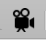
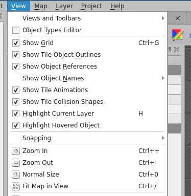

{.section-title.accent.text-primary}
# Animating WorkAdventure maps

A tile can run an animation in loops, for example to render water or blinking lights. Each animation frame is a single 
32x32 tile. To create an animation, edit the tileset in Tiled and click on the tile to animate (or pick a free tile to 
not overwrite existing ones) and click on the animation editor:

    

You can now add all tiles that should be part of the animation via drag and drop to the "playlist" and adjust the frame duration:

    <figure class="figure">
        
        <figcaption class="figure-caption">The tile animation editor</figcaption>
    </figure>

You can preview animations directly in Tiled, using the "Show tile animations" option:

    <figure class="figure">
        
        <figcaption class="figure-caption">The Show Tile Animations option</figcaption>
    </figure>

{.alert.alert-info}
**Tip:** The engine does tile-updates every 100ms, animations with a shorter frame duration will most likely not look that good or may even do not work.
