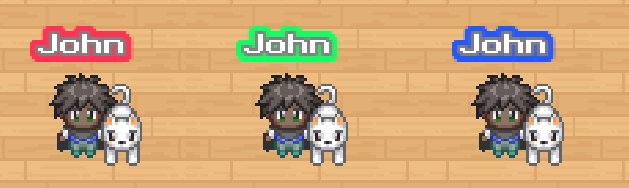

{.section-title.accent.text-primary}
# API Player functions Reference

### Get the player name

```
WA.player.name: string;
```

The player name is available from the `WA.player.name` property.

{.alert.alert-info}
You need to wait for the end of the initialization before accessing `WA.player.name`

```typescript
WA.onInit().then(() => {
    console.log('Player name: ', WA.player.name);
})
```

### Get the player ID

```
WA.player.id: string|undefined;
```

The player ID is available from the `WA.player.id` property.
This is a unique identifier for a given player. Anonymous player might not have an id.

{.alert.alert-info}
You need to wait for the end of the initialization before accessing `WA.player.id`

```typescript
WA.onInit().then(() => {
    console.log('Player ID: ', WA.player.id);
})
```

### Get the player language

```
WA.player.language: string;
```

The current language of player is available from the `WA.player.language` property.

{.alert.alert-info}
You need to wait for the end of the initialization before accessing `WA.player.language`

```typescript
WA.onInit().then(() => {
    console.log('Player language: ', WA.player.language);
})
```

### Get the tags of the player

```
WA.player.tags: string[];
```

The player tags are available from the `WA.player.tags` property.
They represent a set of rights the player acquires after login in.

{.alert.alert-warn}
Tags attributed to a user depend on the authentication system you are using. For the hosted version
of WorkAdventure, you can define tags related to the user in the [administration panel](https://workadventu.re/admin-guide/manage-members).

{.alert.alert-info}
You need to wait for the end of the initialization before accessing `WA.player.tags`

```typescript
WA.onInit().then(() => {
    console.log('Tags: ', WA.player.tags);
})
```

### Get the position of the player
```
WA.player.getPosition(): Promise<Position>
```
The player's current position is available using the `WA.player.getPosition()` function.

`Position` has the following attributes :
* **x (number) :** The coordinate x of the current player's position.
* **y (number) :** The coordinate y of the current player's position.


{.alert.alert-info}
You need to wait for the end of the initialization before calling `WA.player.getPosition()`

```typescript
WA.onInit().then(() => {
    console.log('Position: ', WA.player.getPosition());
})
```


### Get the user-room token of the player

```
WA.player.userRoomToken: string;
```

The user-room token is available from the `WA.player.userRoomToken` property.

This token can be used by third party services to authenticate a player and prove that the player is in a given room.
The token is generated by the administration panel linked to WorkAdventure. The token is a string and is depending on your implementation of the administration panel.
In WorkAdventure SAAS version, the token is a JWT token that contains information such as the player's room ID and its associated membership ID.

If you are using the self-hosted version of WorkAdventure and you developed your own administration panel, the token can be anything.
By default, self-hosted versions of WorkAdventure don't come with an administration panel, so the token string will be empty.

{.alert.alert-info}
A typical use-case for the user-room token is providing logo upload capabilities in a map.
The token can be used as a way to authenticate a WorkAdventure player and ensure he is indeed in the map and authorized to upload a logo.

{.alert.alert-info}
You need to wait for the end of the initialization before accessing `WA.player.userRoomToken`

```typescript
WA.onInit().then(() => {
    console.log('Token: ', WA.player.userRoomToken);
})
```

### Get the position of the player
```
WA.player.getPosition(): Promise<Position>
```
The player's current position is available using the `WA.player.getPosition()` function.

`Position` has the following attributes :
* **x (number) :** The coordinate x of the current player's position.
* **y (number) :** The coordinate y of the current player's position.


{.alert.alert-info}
You need to wait for the end of the initialization before calling `WA.player.getPosition()`

```typescript
WA.onInit().then(async () => {
    console.log('Position: ', await WA.player.getPosition());
})
```


### Listen to player movement
```
WA.player.onPlayerMove(callback: HasPlayerMovedEventCallback): void;
```
Listens to the movement of the current user and calls the callback. Sends an event when the user stops moving, changes direction and every 200ms when moving in the same direction.

The event has the following attributes :
*   **moving (boolean):**  **true** when the current player is moving, **false** otherwise.
*   **direction (string):** **"right"** | **"left"** | **"down"** | **"top"** the direction where the current player is moving.
*   **x (number):** coordinate X of the current player.
*   **y (number):** coordinate Y of the current player.
*   **oldX (number):** old coordinate X of the current player.
*   **oldY (number):** old coordinate Y of the current player.

**callback:** the function that will be called when the current player is moving. It contains the event.

Example :
```javascript
WA.player.onPlayerMove(console.log);
```

## Player specific variables
Similarly to maps (see [API state related functions](api-state.md)), it is possible to store data **related to a specific player** in a "state". Such data will be stored using the local storage from the user's browser. Any value that is serializable in JSON can be stored.

{.alert.alert-info}
In the future, player-related variables will be stored on the WorkAdventure server if the current player is logged.

Any value that is serializable in JSON can be stored.

### Setting a property
A player property can be set simply by assigning a value.

Example:
```javascript
WA.player.state.toto = "value" //will set the "toto" key to "value"
```

### Reading a variable 
A player variable can be read by calling its key from the player's state. 

Example:
```javascript
WA.player.state.toto //will retrieve the variable
```

### Move player to position
```typescript
WA.player.moveTo(x: number, y: number, speed?: number): Promise<{ x: number, y: number, cancelled: boolean }>;
```
Player will try to find shortest path to the destination point and proceed to move there.
```typescript
// Let's move player to x: 250 y: 250 with speed of 10
WA.player.moveTo(250, 250, 10);
```
You can also chain movement like this:
```typescript
// Player will move to the next point after reaching first one
await WA.player.moveTo(250, 250, 10);
await WA.player.moveTo(500, 0, 10);
```
Or like this:
```typescript
// Player will move to the next point after reaching first one or stop if the movement was cancelled
WA.player.moveTo(250, 250, 10).then((result) => {
    if (!result.cancelled) {
        WA.player.moveTo(500, 0, 10);
    }
});
```
It is possible to get the information about current player's position on stop and if the movement was interrupted
```typescript
// Result will store x and y of Player at the moment of movement's end and information if the movement was interrupted
const result = await WA.player.moveTo(250, 250, 10);
// result: { x: number, y: number, cancelled: boolean }
```

### Set the outline color of the player
```
WA.player.setOutlineColor(red: number, green: number, blue: number): Promise<void>;
WA.player.removeOutlineColor(): Promise<void>;
```

You can display a thin line around your player's name (the "outline").

Use `setOutlineColor` to set the outline and `removeOutlineColor` to remove it.

Colors are expressed in RGB. Each parameter is an integer between 0 and 255.

```typescript
// Let's add a red outline to our player
WA.player.setOutlineColor(255, 0, 0);
```

When you set the outline on your player, other players will see the outline too (the outline color is shared across
browsers automatically).


