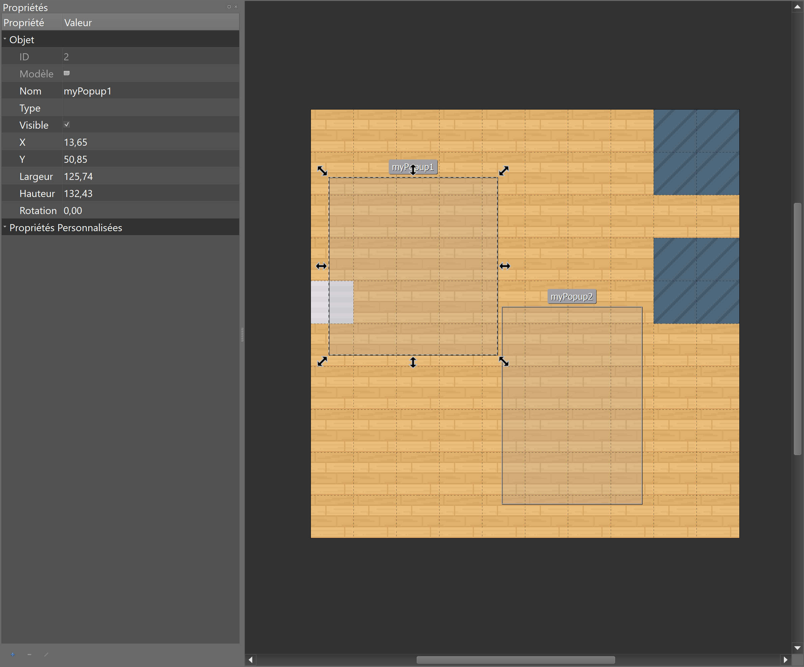
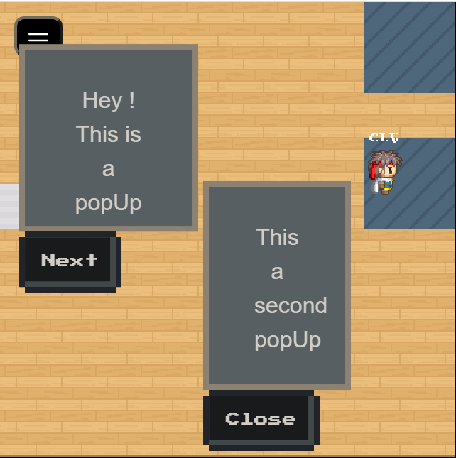
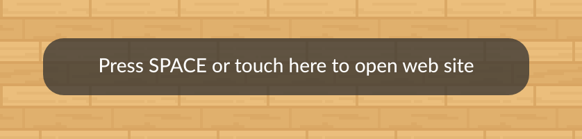
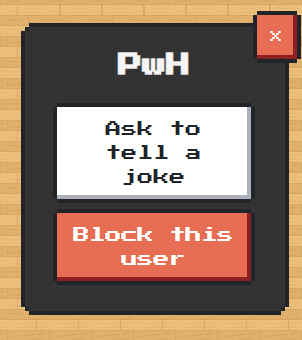
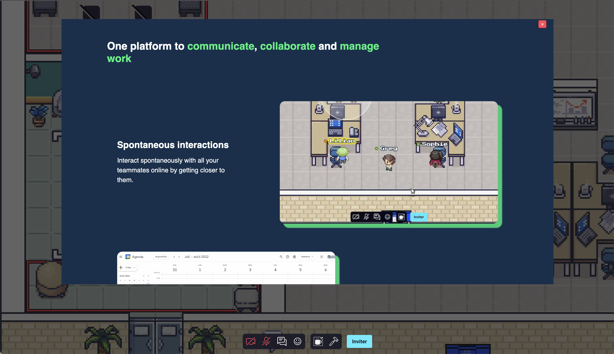
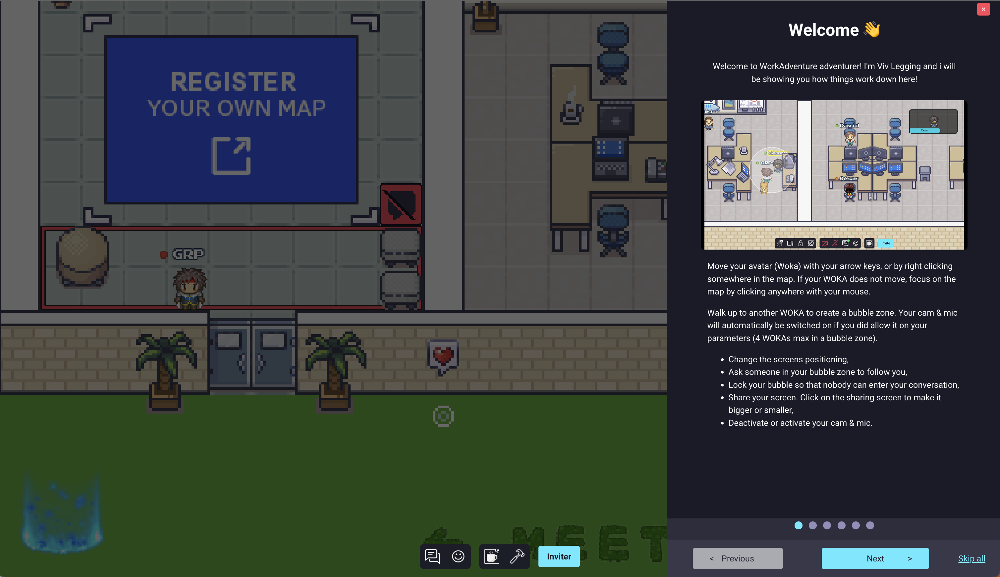
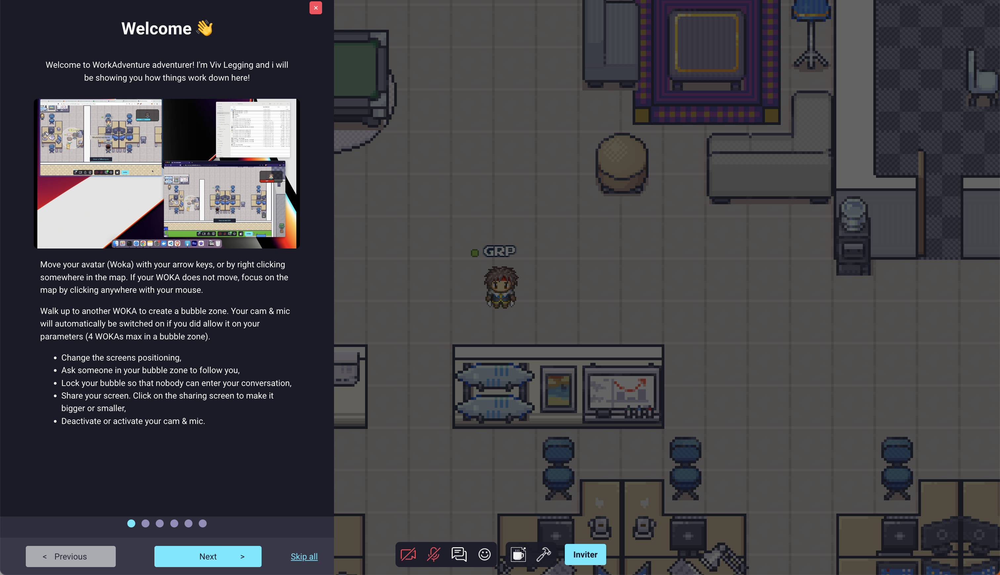
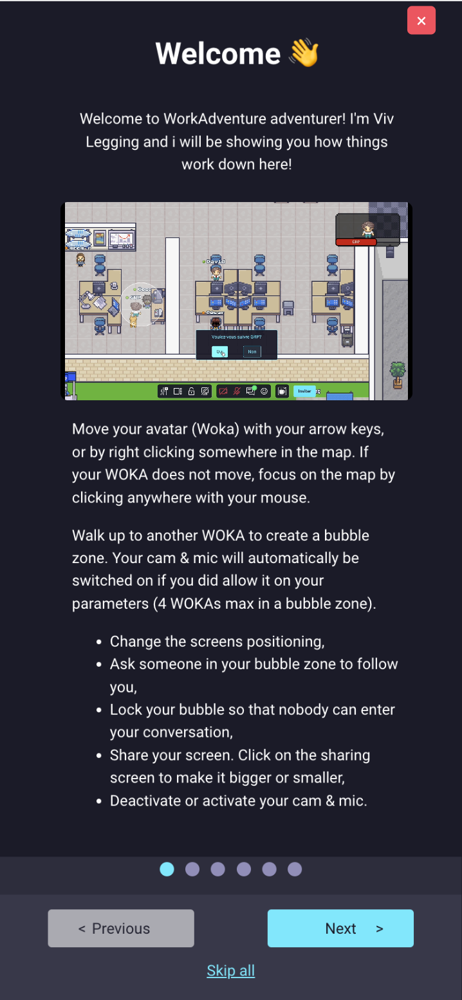
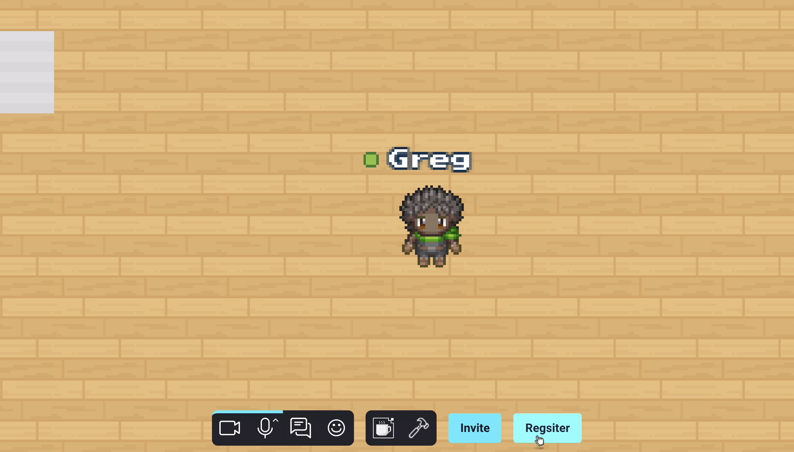

{.section-title.accent.text-primary}
# API UI functions Reference

### Opening a popup

In order to open a popup window, you must first define the position of the popup on your map.

You can position this popup by using a "rectangle" object in Tiled that you will place on an "object" layer.

<div class="row">
    <div class="col">
        
    </div>
    <div class="col">
        
    </div>
</div>

```
WA.ui.openPopup(targetObject: string, message: string, buttons: ButtonDescriptor[]): Popup
```

*   **targetObject**: the name of the rectangle object defined in Tiled.
*   **message**: the message to display in the popup.
*   **buttons**: an array of action buttons defined underneath the popup.

Action buttons are `ButtonDescriptor` objects containing these properties.

*   **label (_string_)**: The label of the button.
*   **className (_string_)**: The visual type of the button. Can be one of "normal", "primary", "success", "warning", "error", "disabled".
*   **callback (_(popup: Popup)=>void_)**: Callback called when the button is pressed.

Please note that `openPopup` returns an object of the `Popup` class. Also, the callback called when a button is clicked is passed a `Popup` object.

The `Popup` class that represents an open popup contains a single method: `close()`. This will obviously close the popup when called.

```ts
class Popup {
    /**
     * Closes the popup
     */
    close() {};
}
```

Example:

```ts
let helloWorldPopup;

// Open the popup when we enter a given zone
WA.room.onEnterLayer("myZone").subscribe(() => {
    helloWorldPopup = WA.ui.openPopup("popupRectangle", 'Hello world!', [{
        label: "Close",
        className: "primary",
        callback: (popup) => {
            // Close the popup when the "Close" button is pressed.
            popup.close();
        }
    }]);
});

// Close the popup when we leave the zone.
WA.room.onLeaveLayer("myZone").subscribe(() => {
    helloWorldPopup.close();
})
```

### Add custom menu

```
WA.ui.registerMenuCommand(commandDescriptor: string, options: MenuOptions): Menu
```
Add a custom menu item containing the text `commandDescriptor` in the navbar of the menu.
`options` attribute accepts an object with three properties :
- `callback : (commandDescriptor: string) => void` : A click on the custom menu will trigger the `callback`.
- `iframe: string` : A click on the custom menu will open the `iframe` inside the menu.
- `allowApi?: boolean` : Allow the iframe of the custom menu to use the Scripting API.

Important : `options` accepts only `callback` or `iframe` not both.

Custom menu exist only until the map is unloaded, or you leave the iframe zone of the script.

<div class="row">
    <div class="col">
        
    </div>
    <div class="col">
        
    </div>
</div>

Example:
```ts
const menu = WA.ui.registerMenuCommand('menu test',
    {
        callback: () => {
            WA.chat.sendChatMessage('test');
        }
    })

// Some time later, if you want to remove the menu:
menu.remove();
```

Please note that `registerMenuCommand` returns an object of the `Menu` class.

The `Menu` class contains a single method: `remove(): void`. This will obviously remove the menu when called.

```ts
class Menu {
	/**
	* Remove the menu
	*/
	remove() {};
}
```


### Awaiting User Confirmation (with space bar)

```ts
WA.ui.displayActionMessage({
    message: string,
    callback: () => void,
    type?: "message"|"warning",
}): ActionMessage
```

Displays a message at the bottom of the screen (that will disappear when space bar is pressed).

<div class="col">
    
</div>

Example:

```ts
const triggerMessage = WA.ui.displayActionMessage({
    message: "press 'space' to confirm",
    callback: () => {
        WA.chat.sendChatMessage("confirmed", "trigger message logic")
    }
});

setTimeout(() => {
    // later
    triggerMessage.remove();
}, 1000)
```

Please note that `displayActionMessage` returns an object of the `ActionMessage` class.

The `ActionMessage` class contains a single method: `remove(): Promise<void>`. This will obviously remove the message when called.

```ts
class ActionMessage {
    /**
     * Hides the message
     */
    remove() {};
}
```

### Adding custom ActionsMenu Action

When clicking on other player's WOKA, the contextual menu (we call it ActionsMenu) is displayed with some default Actions. It is possible to add custom actions right when player is clicked:

<div class="col">
    
</div>

To do that, we need to listen for the `onRemotePlayerClicked` stream and make use of the `remotePlayer` object that is passed by as a payload.

```ts
WA.ui.onRemotePlayerClicked.subscribe((remotePlayer: RemotePlayerInterface) => {
    remotePlayer.addAction('Ask to tell a joke', () => {
        console.log('I am NOT telling you a joke!');
    });
}
```

`remotePlayer.addAction(actionName, callback)` returns an Action object, which can remove itself from ActionsMenu:
```ts
const action = remotePlayer.addAction('This will disappear!', () => {
    console.log('You managed to click me!');
});
setTimeout(
    () => {
        action.remove();
    },
    1000,
);
```

## Manage fixed iframes

You can use the scripting API to display an iframe (so any HTML element) above the game. The iframe is positionned relative to the browser window (so unlike [embedded websites](website-in-map.md), the position of the iframe does not move when someone walks on the map).

<div class="col">
    
</div>

This functonnality creates an iframe positionned on the viewport.

### Display a UI website

```ts
WA.ui.website.open(website: CreateUIWebsiteEvent): Promise<UIWebsite>

interface CreateUIWebsiteEvent {
    url: string,            // Website URL
    visible?: boolean,      // The website is visible or not
    allowApi?: boolean,     // Allow scripting API on the website
    allowPolicy?: string,   // The list of feature policies allowed
    position: {
        vertical: "top"|"middle"|"bottom",,
        horizontal: "left","middle","right",
    },
    size: {                 // Size on the UI (available units: px|em|%|cm|in|pc|pt|mm|ex|vw|vh|rem and others values auto|inherit)
        height: string,
        width: string,
    },
    margin?: {              // Website margin (available units: px|em|%|cm|in|pc|pt|mm|ex|vw|vh|rem and others values auto|inherit)
        top?: string,
        bottom?: string,
        left?: string,
        right?: string,
    },
}

interface UIWebsite {
    readonly id: string,            // Unique ID
    url: string,                    // Website URL
    visible: boolean,               // The website is visible or not
    readonly allowApi: boolean,     // Allow scripting API on the website
    readonly allowPolicy: string,   // The list of feature policies allowed
    position: {
        vertical: string,           // Vertical position (top, middle, bottom)
        horizontal: string,         // Horizontal position (left, middle, right)
    },
    size: {                         // Size on the UI (available units: px|em|%|cm|in|pc|pt|mm|ex|vw|vh|rem and others values auto|inherit)
        height: string,
        width: string,
    },
    margin?: {                      // Website margin (available units: px|em|%|cm|in|pc|pt|mm|ex|vw|vh|rem and others values auto|inherit)
        top?: string,
        bottom?: string,
        left?: string,
        right?: string,
    },
    close(): Promise<void>,         // Close the current website instance
}
```

You can open a website with the `WA.ui.website.open()` method. It returns an `Promise<UIWebsite>` instance.

```ts
const myWebsite = await WA.ui.website.open({
    url: "https://wikipedia.org",
    position: {
        vertical: "middle",
        horizontal: "middle",
    },
    size: {
        height: "50vh",
        width: "50vw",
    },
});

myWebsite.position.vertical = "top";
```

### Close a UI website
You can close a website with the close function on the `UIWebsite` object

```ts
myWebsite.close();
```

### Get all UI websites
You can get all websites with the `WA.ui.website.getAll()` method. It returns an `Promise<UIWebsite[]>` instance.

```ts
WA.ui.website.getAll();
```

## The modal iframe API
### Open the modal iframe

```ts
WA.ui.modal.openModal({
    title: string,// mandatory, title of the iframe modal.
    src: string, // mandatory, url of the iframe modal.
    allow?: string, // optional by default null.
    allowApi?: boolean, // optional by default false.
    position?: string, // optional by default right. Reference for position: center / left / right.
    closeCallback?: Function // optionall, function when the user close the modal.
}): void
```


### Close the chat window

```ts
WA.ui.modal.closeModal(): void
```

### Example of mofal opened

```ts
WA.ui.modal.openModal({
    title: "WorkAdventure website",
    src: 'https://workadventu.re',
    allow: "fullscreen",
    allowApi: true,
    position: "center",
    () => {
        console.info('The modal was closed');
    }
});
```

Open modal to the center position:

<div class="row">
    <div class="col text-center">
        
    </div>
</div>

```ts
    WA.ui.modal.openModal({
        title: "WorkAdventure website",
        src: 'https://workadventu.re',
        allow: "fullscreen",
        position: "right"
    });
```

Open modal to the right position:

<div class="row">
    <div class="col text-center">
        
    </div>
</div>

Open modal to the left position:

```ts
    WA.ui.modal.openModal({
        title: "WorkAdventure website",
        src: 'https://workadventu.re',
        position: "left"
    });
```

<div class="row">
    <div class="col text-center">
        
    </div>
</div>

### Mobile example

If the user is in mobile definition, the modal will open in full screen:

<div class="row">
    <div class="col text-center">
        
    </div>
</div>

## Action bar button API

### Add a button in the action bar

```ts
WA.ui.actionBar.addButton(descriptor: {
    id: string, 
    label: string,
    clickCallback: (buttonActionBar: AddButtonActionBar) => void
}): void
```

- id: the id of the button action bar defined.
- label: the label to display in the button.
- clickCallback: function called when the user clicks on the button. The callback is passed a `AddButtonActionBar` instance in parameter.

With `AddButtonActionBar` defined as:
```ts
interface AddButtonActionBar {
    /* 
    *   the id of the button action bar defined.
    */
    id: string,

    /* 
    *   the label to display in button action bar.
    */
    label: string
}
```

### Remove a button from the action bar
```ts
    WA.ui.actionBar.removeButton(id: string);
```
- id: the id of the action bar button previously defined.

### Example of an action bar button
```ts
    // Add action bar button 'Register'.
    WA.ui.actionBar.addButton({
        id: 'register-btn',
        label: 'Register', 
        callback: (event) => {
            console.log('Button clicked', event);
            // When a user clicks on the action bar button 'Register', we remove it.
            WA.ui.actionBar.removeButton('register-btn');
        }
    });
```

<div class="row">
    <div class="col text-center">
        
    </div>
</div>
