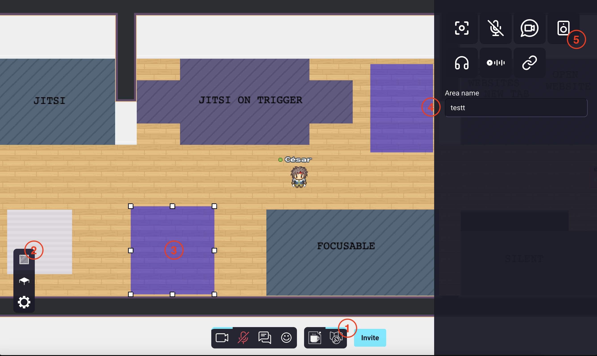
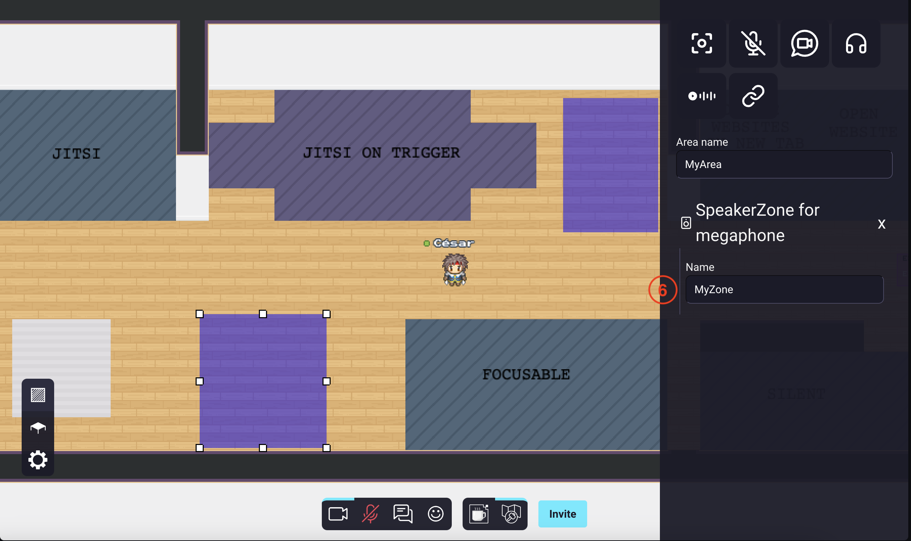

{.section-title.accent.text-primary}
# Broadcasting / Megaphone
Use the broadcast feature to stream your video / audio / screen to anyone.

### Configuring the global megaphone
To configure the global megaphone feature in WorkAdventure, follow the steps below. Please note that access to the map editor is required to perform these configurations.

Microphone settings will affect the entire map.

    

        
    

1. Open the map editor.
2. Access the "configure my room" modal.
3. Navigate to the megaphone tab.
4. Toggle the the general megaphone on or off.
5. Assign a unique name to your megaphone.
6. Define the scope of your megaphone. The scope can be set as "room" or "world". If you choose "room", the megaphone's range will be limited to the current room. If you select "world", the megaphone's reach will extend across multiple rooms. Individuals in any room configured with the same "space name" will be able to hear you when the megaphone is enabled.
7. Manage the megaphone's usage by applying rights restrictions. You can limit the megaphone's access to specific users or user groups using tags.

### Configuring an area megaphone (a podium with speaker and listener zones)
To configure areas megaphone in WorkAdventure, follow the steps below. Please note that access to the map editor is required to perform these configurations.

#### Creating a speaker zone

    

        
    

1. Open the map editor.
2. Access the "area map editor" section.
3. Create an area by clicking on the map directly or by selecting a zone.
4. Name your area in the right panel.
5. Click on the "speaker" icon.

    

        
    

6. Name your speaker zone. (a unique name, and this name will be used in the listener zone)

#### Creating a listener zone

    

        
    

7. Create a new area by clicking on the map directly or by selecting a zone.
8. Name your area in the right panel.
9. Click on the "listener" icon.

    

        
    

10. Put the name, of the speaker zone that you already created, in the "speaker zone name" field.

You're done ! Now, anyone in the listener zone will be able to hear/see the speakers that are in the speaker zone.
When a user will enter the speaker zone, he will trigger the megaphone directly and will stream to the listener zones associated with the speaker zone.