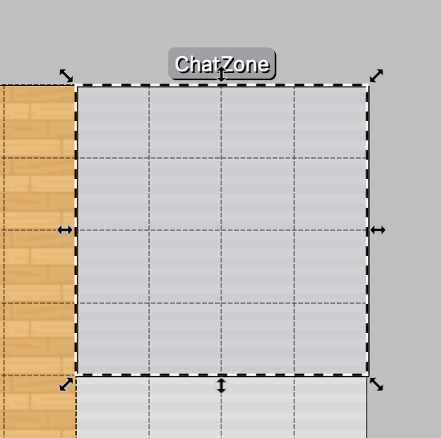
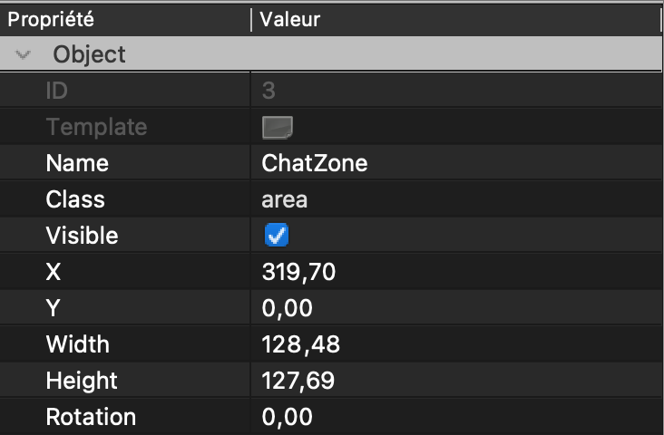

---

sidebar_position: 100
title: Chat zones

---

# Working with chat

## Chat zones

It is possible to define special regions (zones) on the map that can allow any user who is inside to access a specified chat. We call them "chat zones". When player gets inside, a new room will be added in his chat :

    <video class="document-img" src="images/chat/zones/0_chat_zones.mp4" autoplay loop muted></video>

### Adding new **chat zone**

1. Make sure you are editing an **Object Layer**

    

        
    

2. Select **Insert Rectangle** tool

    

        
    

3. Define new object wherever you want.

    

        
    

4. Make sure your object is of class "area" !

    

        
    

5. Edit this new object and click on **Add Property**, like this :

    

        
    

6. Add a **string** property of name *chatName*

    

        
    

7. Make sure you defined a name for your Chat

    

        
    

8. Add a **string** property of name *chatDescription*

    

        
    

9. Make sure you defined a description for your Chat

    

        
    

All should be set up now and your new **chat zone** should be working fine!