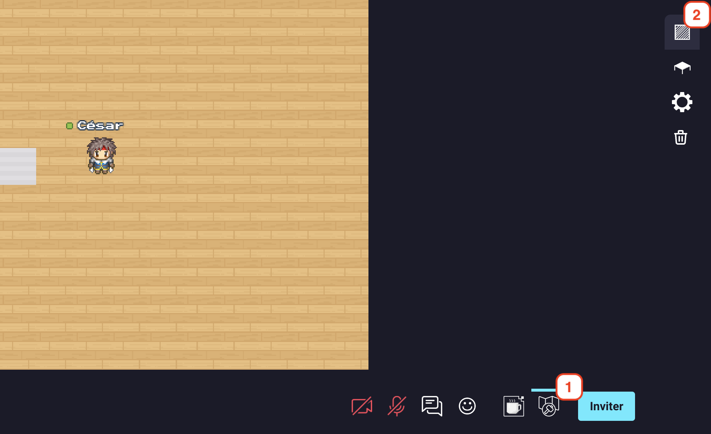

# Areas editor

## Create an area
To create an area, you must follow those instructions :
1. Open the map editor.
2. Access the "area map editor" section.

    

        
    

3. Create an area by clicking on the map directly or by selecting a zone.

    <video class="document-img" src="../images/editor/area_editor.mp4" autoplay loop muted></video>

## Edit an area
You can edit an area by clicking on it and then by adjusting the size with the little white square on the borderline, or the position by drag and drop the area.

## Delete an area
You can delete an area by clicking on it and then by clicking on the trash icon or on the delete key.

## Trigger action when entering the area
You can trigger an action when a user enters an area. There is a list of possible properties :
- [Focusable](property/focusable.md)
- [Silent](property/silent.md)
- [Jitsi meeting](property/jitsi.md)
- [Start/ Exit](property/entry-exit.md)
- [Play sound](property/play-sound.md)
- [Open a link](property/open-link.md)
<!-- - [Broadcast](property/broadcast.md)-->

You can add multiple "Play sound" and "Open a link" actions to an area.