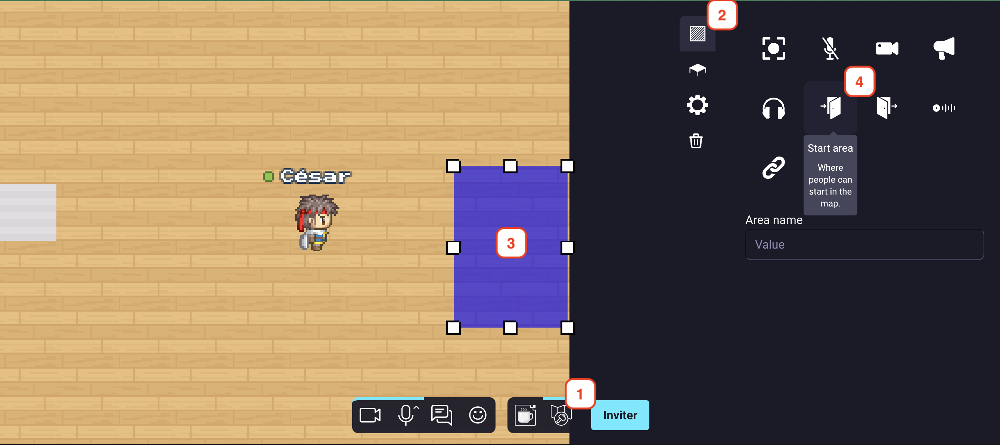
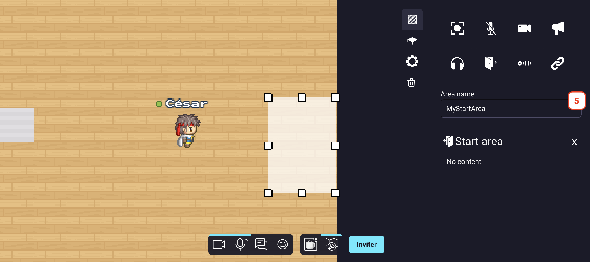
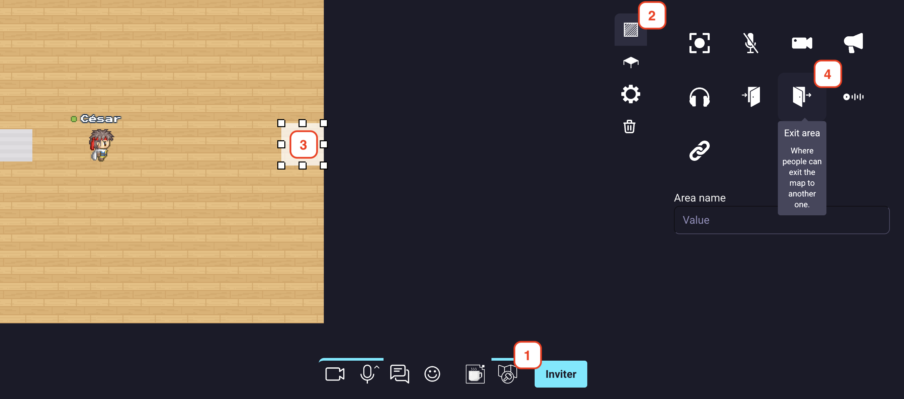
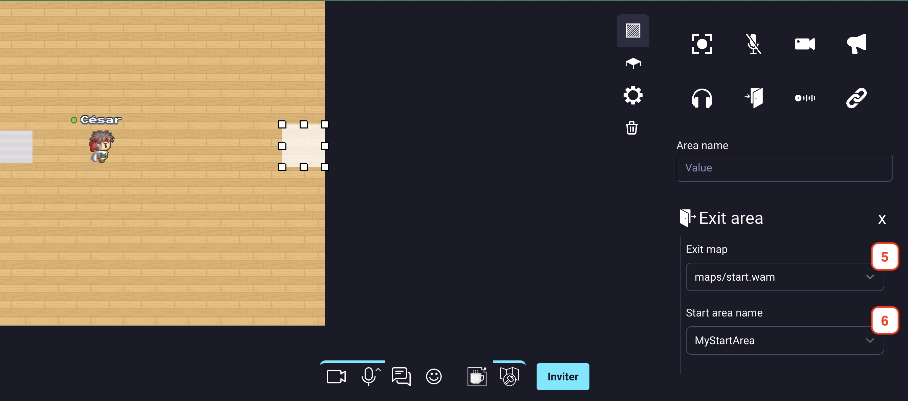

# Creating start and exits

## Create a start area
In order to let user spawn on your map in a defined area you will need to create a start area.
To do that, you must follow those instructions :
1. Open the map editor.
2. Access the "area map editor" section.
3. Create an area by clicking on the map directly or by selecting a zone.
4. Click on the "start" icon.

    

        
    

5. Name your area. (a unique name, and this name will be used in the exit zone)

    

        
    

{.alert.alert-info}
**Pro tip**: if you expect many people to connect to your map at the same time (for instance, if you are organizing a big event), consider making a large start area. This way, users will not all appear at the same position and will not pop randomly in a chat with someone connecting at the same moment.

## Create an exit area
In order to let user leave your map in a defined area you will need to create an exit area.
To do that, you must follow those instructions :
1. Open the map editor.
2. Access the "area map editor" section.
3. Create an area by clicking on the map directly or by selecting a zone.
4. Click on the "exit" icon.

    

        
    

5. In the "Exit map" selector, select the map where you want to redirect the user.
6. In the "Start area name" selector, select the start area of the previous selected map you want to redirect the user.

    

        
    

Note: If you want to create a link to share this map to other user, you can use the [invite feature](../invite.md).
