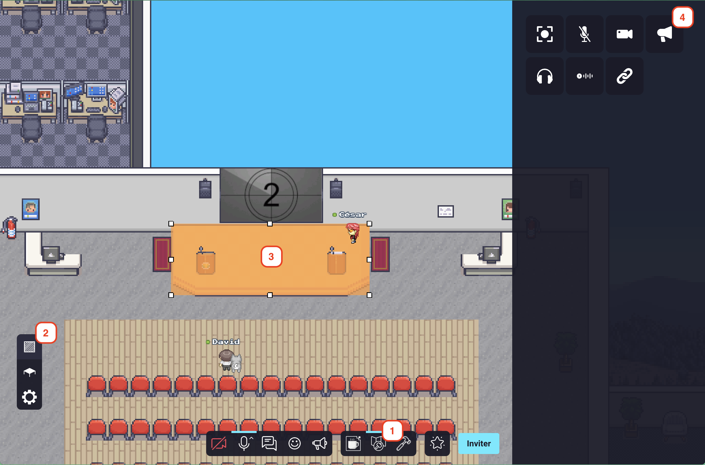
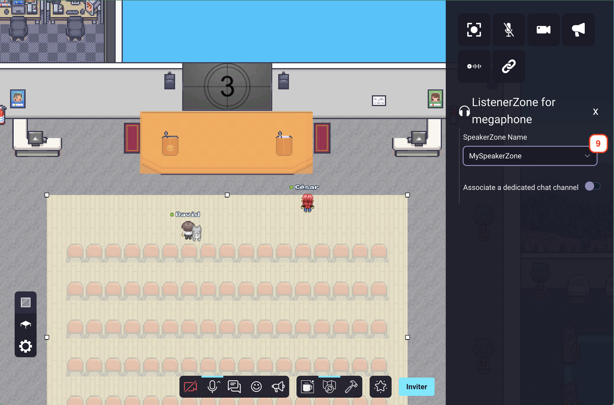

{.section-title.accent.text-primary}
# Broadcasting / Presentation zones

Use the broadcast feature to build speaker zones (aka. podiums) to stream your video / audio / screen to anyone
in the corresponding listen zone.

You typically use this feature to build a stage where a speaker can present to an audience.
The stage is the **speaker zone**. Anyone walking on the stage will be able to stream their video / audio / screen.
The audience is the **listening zone**. Anyone walking in the audience will be able to see and hear the speaker(s) in
the speaker zone.

Please note that [access to the map editor](../access.md) is required to perform the following steps.

#### Creating a speaker zone

    

        
    

1. Open the map editor.
2. Access the "area map editor" section.
3. Create an area by clicking on the map directly or by selecting a zone. 
4. Click on the "speaker" icon.

    

        
    

5. Name your speaker zone. (a unique name, and this name will be used in the listener zone)
6. (Optional) You can also create a chat channel for this zone. This forum will be used to chat with the people in the speaker zone.

#### Creating a listener zone

    

        
    

7. Create a new area by clicking on the map directly or by selecting a zone.
8. Click on the "listener" icon.

    

        
    

9. Select the name, of the speaker zone that you already created, in the "speaker zone name" selector.
10. (Optional) You can also create a chat channel for this zone. This forum will be used to chat with the people in the listener zone.

> **_NOTE :_** If you enable the "associate a dedicated chat channel" in both area, the both chat will be merged can be used by users that are in the speaker zone AND in the listener zone.

You're done ! Now, anyone in the listener zone will be able to hear/see the speakers that are in the speaker zone.
When a user will enter the speaker zone, he will trigger the megaphone directly and will stream to the listener zones associated with the speaker zone.