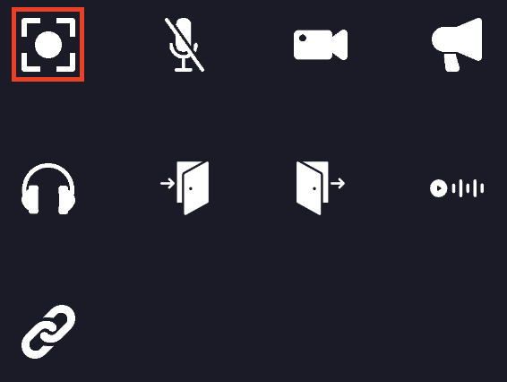

## Focus property
It is possible to define special regions on the map that can make the camera zoom and center on themselves. We call them "Focusable Area". When player gets inside, his camera view will be altered - focused, zoomed and locked on defined area, like this:

    

        
    

## Adding new Focusable Area :
1. When editing an area, you can add the focusable property to it. You must click on the "focusable" icon.

    

        
    

2. You can define the zoom level of the camera when the player enters the area.

    

        
    

