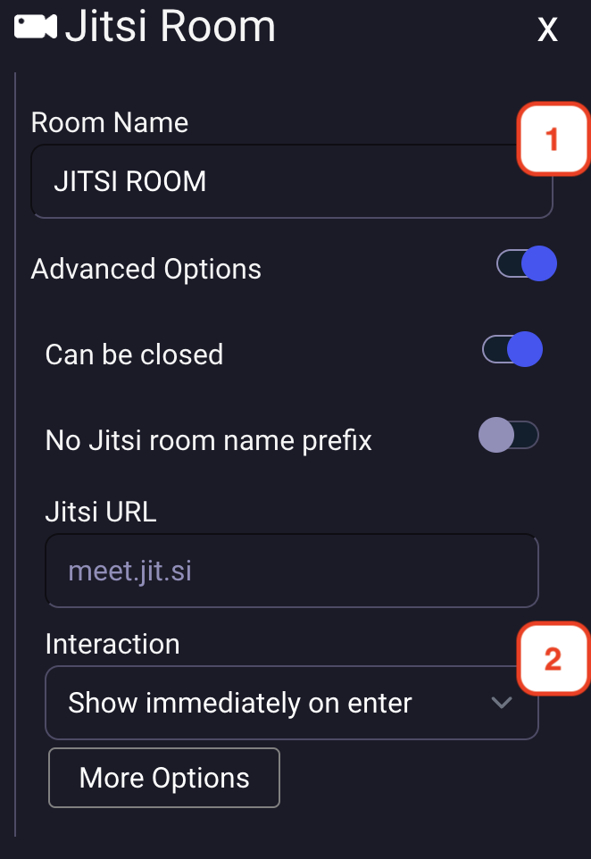

## Jitsi meeting property
On your map, you can define special zones where a Jitsi meeting will be opened when a user enters the area.
YOu can also define an entity that will be trigger a Jitsi meeting room.

## Setting Jitsi meeting area :
When editing an area or an entity, you can add the Jitsi meeting property to it. You must click on the "Jitsi meeting" icon.

    

        
    

1. You must define a name for the jitsi meeting room.
2. You can choose the way the action is triggered :
   1. Show immediately on enter
   2. Start as minimized in bottom bar
   3. Show action toast with message

    

        
    

